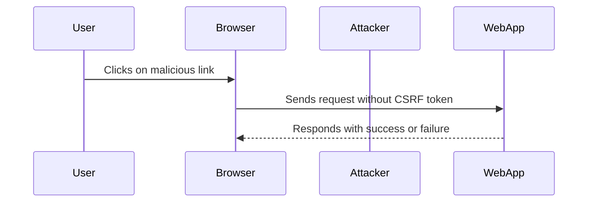

## Finding CSRF Vulnerabilities

### Methodology

To effectively identify CSRF vulnerabilities, a systematic approach is necessary. Here’s a step-by-step methodology:

1. **Identify Actions**: List all actions that can be performed on the web application, such as form submissions, API calls, and URL parameters.
2. **Check for CSRF Tokens**: Verify if the application uses CSRF tokens to protect against CSRF attacks.
3. **Test for Vulnerability**: Attempt to replicate the actions without a valid CSRF token to see if the application allows the request.

### Tools and Techniques

Several tools and techniques can help in identifying CSRF vulnerabilities:

- **Burp Suite**: A popular tool for web application security testing that includes features for detecting and exploiting CSRF vulnerabilities.
- **OWASP ZAP**: Another powerful tool for identifying security issues, including CSRF vulnerabilities.

### Example Using Burp Suite

1. **Intercept Requests**: Use Burp Suite to intercept and modify requests sent to the web application.
2. **Remove CSRF Token**: Remove any CSRF tokens from the request and send it to the server.
3. **Observe Response**: Check the server's response to determine if the request was successful.

---
<!-- nav -->
[[06-Exploiting CSRF Vulnerabilities|Exploiting CSRF Vulnerabilities]] | [[Web Security (PortSwigger)/04-Cross-Site Request Forgery (CSRF)/01-Cross Site Request Forgery CSRF Complete Guide/00-Overview|Overview]] | [[Web Security (PortSwigger)/04-Cross-Site Request Forgery (CSRF)/01-Cross Site Request Forgery CSRF Complete Guide/08-Hands-On Labs|Hands-On Labs]]
