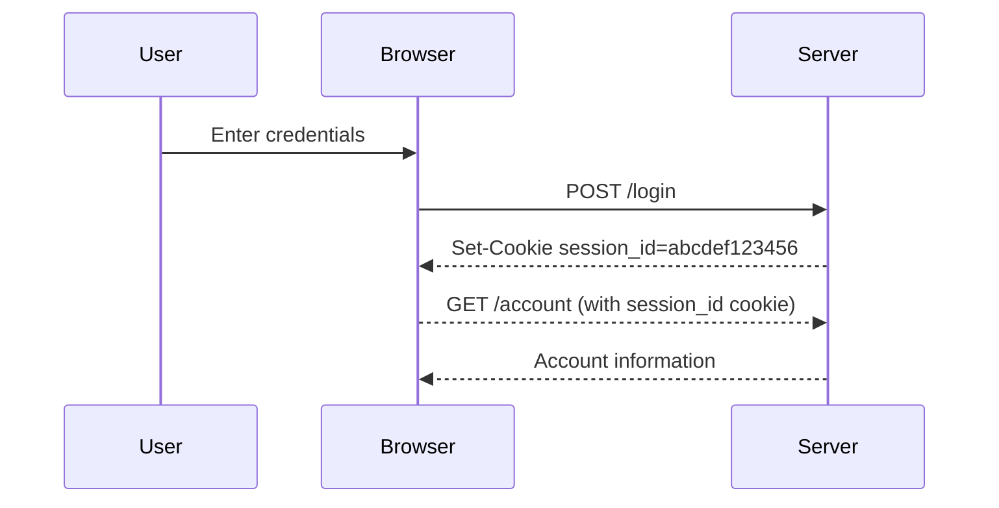

## Session Handling and Management

### Background Theory

Session handling and management are fundamental concepts in web application security. They involve maintaining the state of a user's interaction with a web application across multiple requests. This is typically achieved through the use of session identifiers, often stored in cookies, which are sent back and forth between the client and the server.

A **session** is a temporary connection between a client and a server, allowing the server to remember the client's actions during a series of interactions. In web applications, sessions are commonly managed using cookies, which are small pieces of data stored on the client's browser. These cookies contain session identifiers that uniquely identify the user's session on the server.

### Example: Banking Application

Let's consider a banking application to illustrate how session handling works. Suppose a user wants to log into their account. The process involves the following steps:

1. **User Authentication**: The user provides their credentials (username and password) to the banking application.
2. **Server Verification**: The server verifies these credentials against its database.
3. **Session Creation**: Upon successful authentication, the server creates a new session for the user and generates a unique session identifier.
4. **Cookie Setting**: The server sends a cookie containing the session identifier to the client's browser.
5. **Subsequent Requests**: For each subsequent request, the client includes the session identifier in the cookie, allowing the server to recognize the user and maintain state across requests.

Here is an example of the HTTP request and response involved in setting a session cookie:

```http
POST /login HTTP/1.1
Host: bank.example.com
Content-Type: application/x-www-form-urlencoded
Content-Length: 26

username=admin&password=admin
```

```http
HTTP/1.1 200 OK
Set-Cookie: session_id=abcdef123456; HttpOnly; Secure
Content-Type: text/html

<!DOCTYPE html>
<html>
<head>
    <title>Login Successful</title>
</head>
<body>
    <h1>Welcome, Admin!</h1>
</body>
</html>
```

In this example, the server responds with a `Set-Cookie` header, setting a `session_id` cookie with a value of `abcdef123456`. The `HttpOnly` and `Secure` flags ensure that the cookie cannot be accessed via JavaScript and is transmitted over HTTPS, respectively.

### Types of Cookies

Cookies can vary in terms of the information they store. There are two main types:

1. **Stateless Cookies**: These cookies contain a session identifier that is meaningless on its own. The server maintains a mapping of session identifiers to user states. This is the most common approach and is used in the banking application example above.

2. **Stateful Cookies**: These cookies contain user-specific information such as the username, roles, or other attributes. While this approach simplifies session management on the server side, it poses significant security risks.

#### Stateful Cookie Example

Consider a stateful cookie that contains the user's username and role:

```http
HTTP/1.1 200 OK
Set-Cookie: user_info=admin|admin_role; HttpOnly; Secure
Content-Type: text/html

<!DOCTYPE html>
<html>
<head>
    <title>Login Successful</title>
</head>
<body>
    <h1>Welcome, Admin!</h1>
</body>
</html>
```

In this example, the `user_info` cookie contains the username (`admin`) and role (`admin_role`). This approach is less secure because it exposes sensitive information directly in the cookie.

### Pitfalls of Stateful Cookies

Using stateful cookies can lead to several security issues:

1. **Information Leakage**: Sensitive information such as usernames and roles can be exposed to attackers.
2. **Tampering**: Attackers can modify the cookie contents, potentially gaining unauthorized access or elevated privileges.
3. **Cross-Site Scripting (XSS)**: If the cookie is not marked as `HttpOnly`, it can be accessed via JavaScript, leading to potential XSS attacks.

### How to Prevent / Defend

To mitigate the risks associated with session handling, follow these best practices:

1. **Use Stateless Cookies**: Store minimal information in cookies, relying on the server to maintain session state.
2. **Secure Cookies**: Always set the `HttpOnly` and `Secure` flags on cookies to prevent access via JavaScript and ensure transmission over HTTPS.
3. **Regenerate Session IDs**: After successful authentication, regenerate the session ID to prevent session fixation attacks.
4. **Monitor Session Activity**: Implement mechanisms to detect and respond to suspicious session activity, such as repeated login attempts or unusual access patterns.

#### Secure Code Fix Example

Here is an example of a vulnerable session handling implementation and its secure counterpart:

**Vulnerable Implementation**

```python
# Vulnerable implementation
def login(request):
    username = request.POST['username']
    password = request.POST['password']
    
    if authenticate(username, password):
        response = HttpResponse("Login successful")
        response.set_cookie('user_info', f"{username}|{get_user_roles(username)}")
        return response
    else:
        return HttpResponse("Invalid credentials")
```

**Secure Implementation**

```python
# Secure implementation
def login(request):
    username = request.POST['username']
    password = request.POST['password']
    
    if authenticate(username, password):
        session_id = generate_session_id()
        save_session(session_id, username)
        response = HttpResponse("Login successful")
        response.set_cookie('session_id', session_id, httponly=True, secure=True)
        return response
    else:
        return HttpResponse("Invalid credentials")
```

In the secure implementation, the session ID is generated and stored on the server, and only the session ID is sent to the client in a secure cookie.

### Real-World Examples

Recent breaches and vulnerabilities related to session handling include:

1. **CVE-2021-21972**: A vulnerability in the Jenkins CI/CD platform allowed attackers to bypass authentication and execute arbitrary commands. This was due to improper session handling and lack of proper validation.
2. **CVE-2020-14882**: A vulnerability in the WordPress REST API allowed attackers to perform unauthorized actions by manipulating session tokens.

These examples highlight the importance of robust session handling and management practices in preventing security breaches.

### Practice Labs

For hands-on practice with session handling and management, consider the following labs:

- **PortSwigger Web Security Academy**: Offers interactive labs on session management and related vulnerabilities.
- **OWASP Juice Shop**: Provides a vulnerable web application for practicing various security concepts, including session handling.

By understanding and implementing secure session handling practices, developers can significantly enhance the security of web applications and protect against various attacks, including Cross-Site Request Forgery (CSRF).

### Next Steps

Now that we have covered the basics of session handling and management, we will delve into the specifics of Cross-Site Request Forgery (CSRF) vulnerabilities. Understanding how session handling works is crucial for comprehending how CSRF attacks can occur and how to defend against them.

### Summary Diagram

Below is a summary diagram illustrating the session handling process:



This diagram shows the flow of a typical session handling process, from user authentication to subsequent requests using the session identifier.

### Conclusion

Understanding session handling and management is essential for securing web applications. By following best practices and implementing secure coding techniques, developers can mitigate the risks associated with session handling and protect against various security threats. In the next section, we will explore how these concepts relate to Cross-Site Request Forgery (CSRF) vulnerabilities.

---
<!-- nav -->
[[12-Real-World Examples of CSRF Attacks|Real-World Examples of CSRF Attacks]] | [[Web Security (PortSwigger)/04-Cross-Site Request Forgery (CSRF)/01-Cross Site Request Forgery CSRF Complete Guide/00-Overview|Overview]] | [[14-Session Management and Cookies|Session Management and Cookies]]
