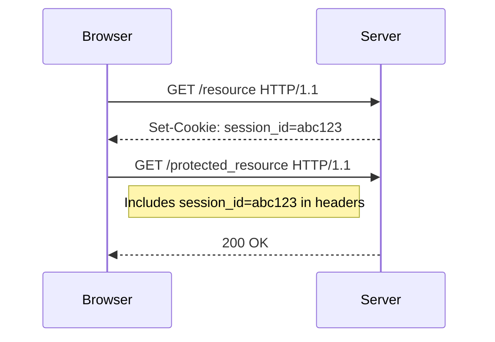

## Session Management and Cookies

### What is Session Management?

Session management is a critical aspect of web application security. It refers to the process by which a server maintains the state of a user's interaction with a website. This is typically achieved through the use of session identifiers, often stored in cookies, which allow the server to recognize and track a user across multiple requests.

### How Does Session Management Work?

When a user logs into a web application, the server generates a unique session identifier and sends it back to the client in the form of a cookie. This cookie is stored in the user's browser and is automatically included in subsequent requests to the server. The server uses this session identifier to retrieve the user's session data and determine their identity and permissions.

#### Example of Session Management

Consider a simple login scenario:

1. **User Accesses Login Page**: The user navigates to the login page of a web application.
2. **User Submits Credentials**: The user submits their username and password.
3. **Server Authenticates User**: The server verifies the credentials and creates a new session for the user.
4. **Server Sends Session Cookie**: The server responds with a `Set-Cookie` header containing the session identifier.
5. **Browser Stores Cookie**: The browser stores the session cookie.
6. **Subsequent Requests Include Cookie**: On subsequent requests, the browser includes the session cookie in the request headers.

```http
HTTP/1.1 200 OK
Set-Cookie: session_id=abc123; Path=/; HttpOnly

GET /protected_resource HTTP/1.1
Host: example.com
Cookie: session_id=abc123
```

### Role of Cookies in Session Management

Cookies are small pieces of data stored on the client-side (browser) that are sent back to the server with each request. They are essential for maintaining state between HTTP requests, which are inherently stateless.

#### Types of Cookies

- **Session Cookies**: These are temporary cookies that are deleted when the browser is closed.
- **Persistent Cookies**: These remain on the client's device until they expire or are manually deleted.

### How Cookies Are Sent with Requests

When a user makes a request to a server, the browser checks the cookie jar (the collection of cookies stored locally) to see if there are any cookies associated with the requested domain. If there are, the browser includes these cookies in the request headers.



### Permissions and Access Control

Once the server receives the session cookie, it checks which user is associated with that session. It then verifies whether the user has the necessary permissions to access the requested resource.

#### Example of Permission Check

```python
def check_permissions(user, resource):
    if user.has_permission(resource):
        return True
    else:
        return False

# Example usage
if check_permissions(current_user, requested_resource):
    return render_template('resource.html')
else:
    return "Access Denied", 403
```

### Pitfalls of Session Management

One major pitfall of session management is the potential for session hijacking. If an attacker can obtain a user's session identifier, they can impersonate the user and gain unauthorized access to the application.

### How to Prevent / Defend Against Session Hijacking

To mitigate the risk of session hijacking, several best practices should be followed:

1. **Use Secure and HttpOnly Flags**: Ensure that session cookies are marked as `Secure` and `HttpOnly`.
2. **Regenerate Session IDs**: Regenerate session IDs after successful authentication to prevent session fixation attacks.
3. **Implement Two-Factor Authentication (2FA)**: Add an additional layer of security by requiring users to provide a second form of verification.
4. **Monitor Session Activity**: Implement logging and monitoring to detect unusual activity that may indicate a compromised session.

#### Secure vs Insecure Cookie Example

```http
HTTP/1.1 200 OK
Set-Cookie: session_id=abc123; Path=/; HttpOnly; Secure

HTTP/1.1 200 OK
Set-Cookie: session_id=abc123; Path=/
```

### Real-World Examples of Session Management Vulnerabilities

Several high-profile breaches have been attributed to vulnerabilities in session management:

- **CVE-2019-11510**: A vulnerability in the WordPress REST API allowed attackers to bypass nonce validation and perform unauthorized actions.
- **CVE-2020-13776**: A session fixation vulnerability in the Apache Struts framework allowed attackers to hijack user sessions.

### Cross-Site Request Forgery (CSRF)

Cross-Site Request Forgery (CSRF) is a type of attack that tricks a victim into performing unwanted actions on a web application in which they are authenticated. This is possible because web browsers automatically include session cookies in requests to the server.

### How CSRF Works

In a CSRF attack, the attacker crafts a malicious request that, when executed by the victim, performs an action on behalf of the victim. Since the victim is already authenticated with the server, the server processes the request as if it were initiated by the victim.

#### Example of a CSRF Attack

Consider a banking application where a user can transfer funds using a POST request:

```http
POST /transfer HTTP/1.1
Host: bank.example.com
Content-Type: application/x-www-form-urlencoded
Cookie: session_id=abc123

amount=1000&to_account=attacker_account
```

An attacker could create a malicious HTML page that, when loaded by the victim, triggers this request:

```html
<html>
<body>
<form action="https://bank.example.com/transfer" method="POST">
<input type="hidden" name="amount" value="1000">
<input type="hidden" name="to_account" value="attacker_account">
</form>
<script>
document.forms[0].submit();
</script>
</body>
</html>
```

### How to Prevent / Defend Against CSRF

To defend against CSRF attacks, several techniques can be employed:

1. **CSRF Tokens**: Generate a unique token for each user session and include it in forms and AJAX requests. Verify the token on the server side.
2. **SameSite Attribute**: Use the `SameSite` attribute in cookies to restrict them from being sent with cross-site requests.
3. **Referer Header Validation**: Validate the `Referer` header to ensure that requests originate from trusted sources.
4. **Double Submit Cookie Pattern**: Use a cookie and a hidden form field with the same value to verify the origin of the request.

#### Example of CSRF Token Implementation

```python
from flask import Flask, request, session, redirect, url_for

app = Flask(__name__)
app.secret_key = 'your_secret_key'

@app.route('/login', methods=['POST'])
def login():
    session['csrf_token'] = generate_csrf_token()
    return redirect(url_for('index'))

@app.route('/transfer', methods=['POST'])
def transfer():
    if request.form.get('csrf_token') != session.get('csrf_token'):
        abort(403)
    # Process the transfer
    return "Transfer successful"

def generate_csrf_token():
    if '_csrf_token' not in session:
        session['_csrf_token'] = some_random_string()
    return session['_csrf_token']

def some_random_string():
    import os
    return os.urandom(16).hex()

@app.route('/')
def index():
    csrf_token = session.get('csrf_token')
    return f'''
    <form action="/transfer" method="POST">
    <input type="hidden" name="csrf_token" value="{csrf_token}">
    <input type="text" name="amount">
    <input type="text" name="to_account">
    <button type="submit">Transfer</button>
    </form>
    '''
```

### Real-World Examples of CSRF Attacks

Several notable breaches have involved CSRF vulnerabilities:

- **CVE-2019-11510**: A vulnerability in the WordPress REST API allowed attackers to bypass nonce validation and perform unauthorized actions.
- **CVE-2020-13776**: A session fixation vulnerability in the Apache Struts framework allowed attackers to hijack user sessions.

### Conclusion

Understanding session management and the risks associated with it is crucial for securing web applications. By implementing robust session management practices and defending against CSRF attacks, developers can significantly enhance the security of their applications.

### Practice Labs

For hands-on practice with CSRF vulnerabilities, consider the following labs:

- **PortSwigger Web Security Academy**: Offers detailed labs on CSRF and other web security topics.
- **OWASP Juice Shop**: A deliberately insecure web application for learning about various security vulnerabilities.
- **DVWA (Damn Vulnerable Web Application)**: A PHP/MySQL web application that demonstrates insecure coding practices.

These labs provide practical experience in identifying and mitigating CSRF vulnerabilities in real-world scenarios.

---
<!-- nav -->
[[13-Session Handling and Management|Session Handling and Management]] | [[Web Security (PortSwigger)/04-Cross-Site Request Forgery (CSRF)/01-Cross Site Request Forgery CSRF Complete Guide/00-Overview|Overview]] | [[15-Technical Details Behind CSRF Vulnerabilities|Technical Details Behind CSRF Vulnerabilities]]
