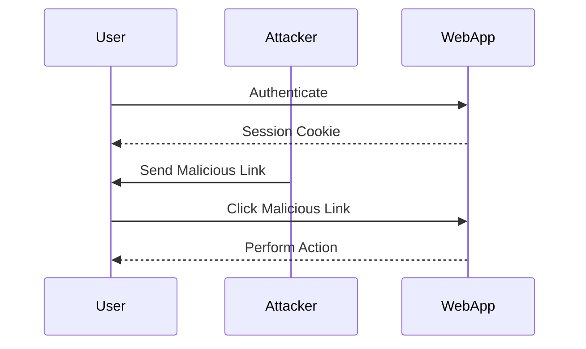
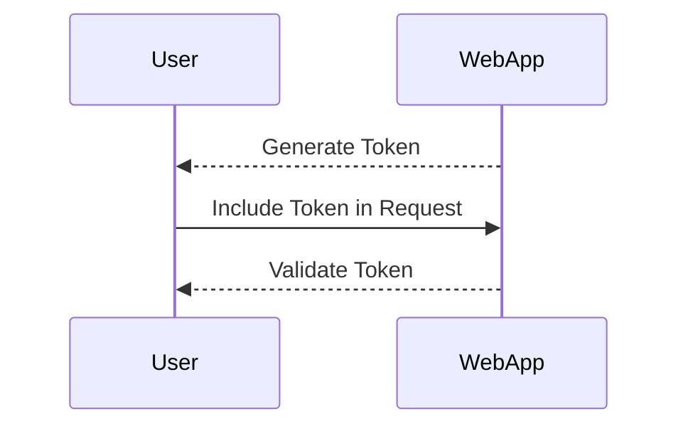

## Understanding Cross-Site Request Forgery (CSRF)

Cross-Site Request Forgery (CSRF) is a type of attack that tricks a user's browser into executing unwanted actions on a web application in which the user is currently authenticated. This attack leverages the trust that the web application places in the user's browser session. To understand CSRF, it's essential to delve into the underlying mechanisms and the conditions that make an action vulnerable to such an attack.

### What is CSRF?

CSRF occurs when an attacker crafts a malicious request that, when executed by the victim's browser, performs an unintended action on the web application. The key aspect of CSRF is that the victim is already authenticated with the web application, and the attacker exploits this authentication to perform actions on behalf of the victim.

#### Example Scenario

Consider a scenario where a user is logged into their bank's online portal. An attacker could craft a malicious link that, when clicked, transfers money from the user's account to the attacker's account. If the user clicks on this link, the bank's server would execute the transfer because the user is already authenticated.

### Conditions for CSRF Vulnerability

For an action to be vulnerable to CSRF, it must meet certain conditions:

1. **Authenticated Action**: The action must require the user to be authenticated. Unauthenticated actions cannot be exploited via CSRF.
2. **State-Changing Action**: The action should result in a change of state within the application, such as updating data or performing a transaction.
3. **Relevant Action**: The action must have significant consequences for the user. Actions that have minimal impact, such as changing the language setting, are not typically considered relevant for CSRF exploitation.

#### Irrelevant Actions

Actions like logging out or changing the language setting are generally not considered relevant for CSRF attacks. While an attacker might trick a user into clicking a link that logs them out, the user can simply log back in. Similarly, changing the language setting has minimal impact on the user's experience.



### Impact of CSRF Attacks

The impact of a CSRF attack depends on the functionality being exploited. For instance, if an attacker can change the user's email address, they can potentially take over the entire account. This is because many services use email addresses for password resets and other critical functions.

#### Real-World Examples

One notable example of a CSRF vulnerability is CVE-2019-11510, which affected WordPress versions prior to 5.2. This vulnerability allowed attackers to force users to change their email addresses, leading to potential account takeover. Another example is CVE-2018-17219, which affected the Jenkins Continuous Integration server, allowing attackers to execute arbitrary commands on the server.

### How to Prevent / Defend Against CSRF

Preventing CSRF attacks involves several strategies, including the use of anti-CSRF tokens, same-origin policy enforcement, and proper validation of user input.

#### Anti-CSRF Tokens

Anti-CSRF tokens are unique, unpredictable values that are generated by the server and sent to the client. These tokens are then included in subsequent requests to verify that the request originated from the legitimate user.



##### Implementation Example

Here’s an example of how to implement anti-CSRF tokens using a simple form submission:

**Vulnerable Code:**

```html
<form method="POST" action="/change-email">
    <input type="email" name="newEmail" value="attacker@example.com">
    <button type="submit">Change Email</button>
</form>
```

**Secure Code:**

```html
<form method="POST" action="/change-email">
    <input type="hidden" name="csrfToken" value="{{ csrfToken }}">
    <input type="email" name="newEmail" value="attacker@example.com">
    <button type="submit">Change Email</button>
</form>
```

**Server-Side Validation:**

```python
from flask import Flask, request, session

app = Flask(__name__)

@app.route('/change-email', methods=['POST'])
def change_email():
    csrf_token = request.form.get('csrfToken')
    if csrf_token != session['csrfToken']:
        return "Invalid CSRF token", 403
    new_email = request.form.get('newEmail')
    # Update email logic here
    return "Email changed successfully"
```

#### Same-Origin Policy Enforcement

The same-origin policy restricts how documents or scripts loaded from one origin can interact with resources from another origin. This helps prevent malicious scripts from making unauthorized requests to different origins.

##### Example Configuration

To enforce the same-origin policy, ensure that your web application sets appropriate headers:

```http
HTTP/1.1 200 OK
Content-Type: text/html
X-Frame-Options: DENY
Content-Security-Policy: default-src 'self'
```

#### Proper Input Validation

Always validate user input on the server side to ensure that it meets the expected criteria. This includes checking for valid email formats, ensuring that passwords meet complexity requirements, and verifying that submitted data does not contain malicious content.

##### Example Validation

```python
import re

def validate_email(email):
    if not re.match(r"[^@]+@[^@]+\.[^@]+", email):
        raise ValueError("Invalid email format")
    return email

@app.route('/change-email', methods=['POST'])
def change_email():
    new_email = request.form.get('newEmail')
    try:
        new_email = validate_email(new_email)
    except ValueError as e:
        return str(e), 400
    # Update email logic here
    return "Email changed successfully"
```

### Detection and Mitigation

Detecting CSRF vulnerabilities often involves automated tools and manual testing. Tools like Burp Suite, ZAP, and OWASP CSRFTester can help identify potential CSRF issues.

#### Automated Tools

- **Burp Suite**: A comprehensive toolkit for web application security testing that includes features for detecting and exploiting CSRF vulnerabilities.
- **ZAP (Zed Attack Proxy)**: An open-source web application security scanner that can detect CSRF vulnerabilities.

#### Manual Testing

Manual testing involves crafting malicious requests and observing the behavior of the web application. This can be done using tools like `curl` or a browser's developer tools.

##### Example Using `curl`

```sh
curl -X POST -H "Cookie: session=valid_session_id" \
     -d "newEmail=attacker@example.com" \
     http://example.com/change-email
```

### Practice Labs

To gain hands-on experience with CSRF vulnerabilities, consider the following practice labs:

- **PortSwigger Web Security Academy**: Offers interactive labs that cover various aspects of web security, including CSRF.
- **OWASP Juice Shop**: A deliberately insecure web application designed for security training and research.
- **DVWA (Damn Vulnerable Web Application)**: A PHP/MySQL web application that is riddled with vulnerabilities for educational purposes.

By thoroughly understanding the concepts, conditions, and preventive measures associated with CSRF, you can better protect web applications from these types of attacks.

---
<!-- nav -->
[[15-Technical Details Behind CSRF Vulnerabilities|Technical Details Behind CSRF Vulnerabilities]] | [[Web Security (PortSwigger)/04-Cross-Site Request Forgery (CSRF)/01-Cross Site Request Forgery CSRF Complete Guide/00-Overview|Overview]] | [[Web Security (PortSwigger)/04-Cross-Site Request Forgery (CSRF)/01-Cross Site Request Forgery CSRF Complete Guide/17-Conclusion|Conclusion]]
