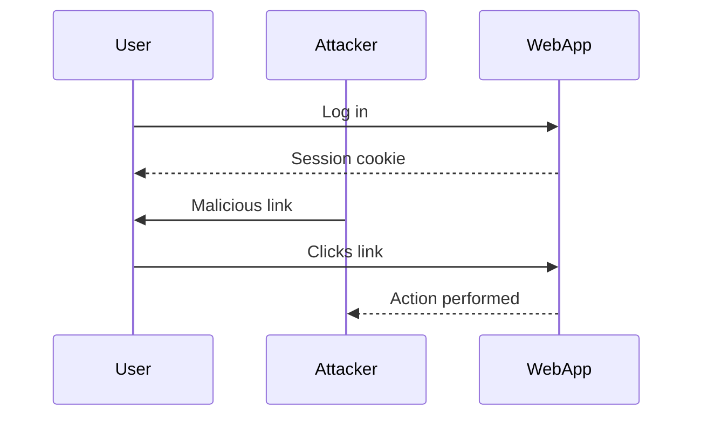
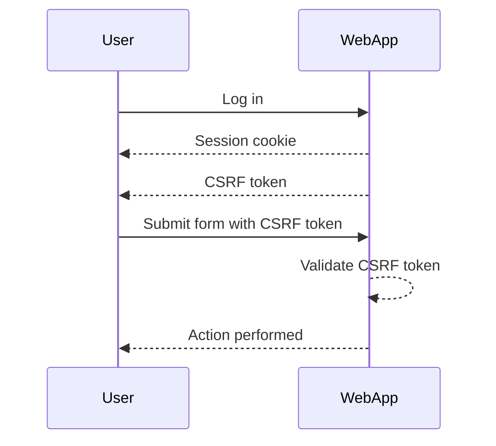

## Understanding Cross-Site Request Forgery (CSRF)

Cross-Site Request Forgery (CSRF) is a type of attack that tricks a victim into executing unwanted actions on a web application in which they are authenticated. This can lead to unauthorized transactions, data manipulation, or other malicious activities. The core issue with CSRF is that an attacker can leverage the victim's session cookies to perform actions on their behalf.

### What is CSRF?

CSRF occurs when an attacker crafts a malicious request that is executed by the victim's browser, often through social engineering techniques such as phishing emails or malicious websites. The attacker does not need to know the victim's credentials; they simply need to trick the victim into performing an action that the attacker desires.

#### Example Scenario

Consider a banking website where a user is logged in and has access to their account. An attacker could create a malicious link or embed a script in a webpage that, when clicked, sends a request to transfer money from the victim's account to the attacker's account. Since the victim is already authenticated, the bank's server will execute the transaction without further authentication.

### Why Does CSRF Matter?

CSRF attacks can have severe consequences, including financial loss, data theft, and reputational damage. They exploit the trust that web applications place in the user's session cookies, which are automatically sent with every request made by the browser.

#### Real-World Examples

- **CVE-2019-11510**: A CSRF vulnerability was found in the WordPress REST API, allowing attackers to delete posts or change settings without proper authorization.
- **CVE-2020-14182**: A CSRF vulnerability in the Cisco Webex Meetings Server allowed attackers to modify meeting settings, potentially leading to unauthorized access or disruption of meetings.

### How CSRF Works Under the Hood

To understand how CSRF works, let's break down the process:

1. **Victim Authentication**: The victim logs into a web application and receives a session cookie.
2. **Malicious Request**: The attacker crafts a malicious request that performs an action on the web application.
3. **Victim Execution**: The victim is tricked into executing the malicious request, often through social engineering techniques.
4. **Action Execution**: The web application processes the request using the victim's session cookie, performing the desired action.

#### Example Code

Let's consider a simple example where a user can change their email address on a web application. The following is a typical POST request to change the email address:

```http
POST /change-email HTTP/1.1
Host: example.com
Content-Type: application/x-www-form-urlencoded
Cookie: session=abc123

email=new.email@example.com
```

An attacker could craft a similar request and embed it in a malicious webpage:

```html
<form id="csrfForm" action="https://example.com/change-email" method="POST">
    <input type="hidden" name="email" value="attacker.email@example.com">
</form>
<script>
    document.getElementById('csrfForm').submit();
</script>
```

When the victim visits the malicious webpage, the form is automatically submitted, changing their email address to the attacker's email.

### Prevention and Defense

To prevent CSRF attacks, several defense mechanisms can be employed:

1. **Anti-CSRF Tokens**: These are unique, unpredictable tokens that are included in forms and validated on the server-side. This ensures that the request originated from the legitimate user and not an attacker.

2. **SameSite Cookie Attribute**: Setting the `SameSite` attribute on cookies can help mitigate CSRF attacks by preventing the browser from sending cookies with cross-site requests.

3. **HTTP Referer Header Validation**: Checking the `Referer` header to ensure that the request originates from the same origin can provide additional protection.

#### Secure Coding Practices

Here is an example of how to implement anti-CSRF tokens in a web application:

**Vulnerable Code:**

```html
<form action="/change-email" method="POST">
    <label>Email:</label>
    <input type="text" name="email">
    <button type="submit">Change Email</button>
</form>
```

**Secure Code:**

```html
<form action="/change-email" method="POST">
    <label>Email:</label>
    <input type="text" name="email">
    <input type="hidden" name="csrf_token" value="{{ csrf_token }}">
    <button type="submit">Change Email</button>
</form>

<script>
    // On server-side, validate the csrf_token before processing the request
</script>
```

### Detection and Mitigation

To detect and mitigate CSRF vulnerabilities, the following steps can be taken:

1. **Code Review**: Regularly review code for the presence of CSRF vulnerabilities.
2. **Penetration Testing**: Conduct penetration testing to identify potential CSRF attack vectors.
3. **Security Headers**: Implement security headers like `X-Frame-Options`, `Content-Security-Policy`, and `Strict-Transport-Security`.

### Hands-On Practice

For hands-on practice with CSRF vulnerabilities, consider the following labs:

- **PortSwigger Web Security Academy**: Offers a comprehensive set of labs covering various web security topics, including CSRF.
- **OWASP Juice Shop**: A deliberately insecure web application for practicing web security skills.
- **DVWA (Damn Vulnerable Web Application)**: A PHP/MySQL web application that is riddled with vulnerabilities for educational purposes.

### Conclusion

CSRF is a significant threat to web applications, but it can be effectively mitigated through the use of anti-CSRF tokens, the `SameSite` cookie attribute, and other security measures. By understanding the underlying mechanisms and implementing robust defenses, developers can protect their applications from these types of attacks.

### Mermaid Diagrams

#### CSRF Attack Chain



#### Anti-CSRF Token Flow



By thoroughly understanding and implementing these defenses, developers can significantly reduce the risk of CSRF attacks on their web applications.

---
<!-- nav -->
[[06-Lab Setup CSRF Vulnerability with No Defenses|Lab Setup CSRF Vulnerability with No Defenses]] | [[Web Security (PortSwigger)/04-Cross-Site Request Forgery (CSRF)/02-Lab 1 CSRF vulnerability with no defenses/00-Overview|Overview]] | [[Web Security (PortSwigger)/04-Cross-Site Request Forgery (CSRF)/02-Lab 1 CSRF vulnerability with no defenses/08-Practice Questions & Answers|Practice Questions & Answers]]
