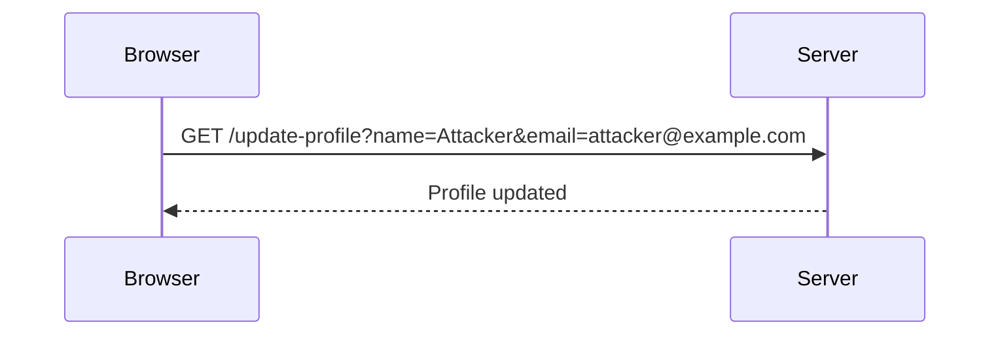
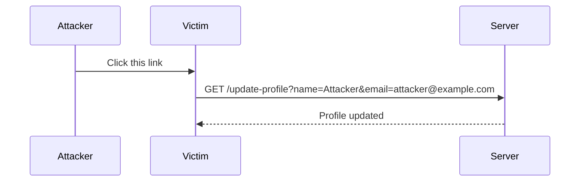

## Understanding Cross-Site Request Forgery (CSRF)

Cross-Site Request Forgery (CSRF) is a type of attack that tricks a victim into executing unwanted actions on a web application in which they are authenticated. This attack exploits the trust that a web application has in the user's browser. The attacker crafts a malicious request that appears to come from the victim, thereby bypassing the authentication mechanisms.

### Background Theory

To understand CSRF, let's break down the components involved:

1. **Web Application**: A server-side application that interacts with clients through HTTP requests and responses.
2. **Authenticated User**: A user who has successfully logged into the web application and has an active session.
3. **Malicious Attacker**: An entity that aims to trick the authenticated user into performing unintended actions on the web application.

#### How CSRF Works

When a user logs into a web application, the server typically sets a session cookie in the user's browser. This cookie contains information that identifies the user's session. When the user makes subsequent requests to the web application, the browser automatically includes this session cookie in the request headers.

A CSRF attack occurs when an attacker crafts a malicious request that the victim's browser sends to the web application. Since the browser includes the session cookie in the request, the web application treats the request as coming from the authenticated user and executes the action specified in the request.

### Example Scenario

Consider a banking application where a user can transfer money from their account to another account. The application might have an endpoint like `/transfer` that accepts POST requests with parameters such as `amount` and `recipient`.

```http
POST /transfer HTTP/1.1
Host: bank.example.com
Content-Type: application/x-www-form-urlencoded
Cookie: session=abc123

amount=100&recipient=attacker@example.com
```

If an attacker can trick the victim into sending a similar request, the bank will transfer money from the victim's account to the attacker's account.

### CSRF Tokens

To mitigate CSRF attacks, web applications often use CSRF tokens. These tokens are unique values generated by the server and sent to the client. The client must include the token in subsequent requests. The server validates the token to ensure that the request comes from the legitimate user.

#### Token Validation Based on Request Method

The transcript chunk mentions that CSRF tokens are typically set on POST requests but not on GET requests. This is because POST requests are generally used to send data to the server, whereas GET requests are used to retrieve data from the server.

However, if an application allows changing a POST request to a GET request and still sends data to the server, it may be vulnerable to CSRF attacks.

### Real-World Examples

Recent real-world examples of CSRF vulnerabilities include:

- **CVE-2021-21972**: A CSRF vulnerability was found in the WordPress REST API. Attackers could craft a malicious link that, when clicked by an authenticated user, would execute unintended actions on the WordPress site.
- **CVE-2020-14182**: A CSRF vulnerability was discovered in the Cisco Unified Communications Manager (UCM). Attackers could craft a malicious link that, when clicked by an authenticated user, would execute unintended actions on the UCM system.

### Detailed Example

Let's consider a detailed example where an application allows changing a POST request to a GET request and still sends data to the server.

#### Vulnerable Code

Suppose we have a web application with an endpoint `/update-profile` that updates the user's profile information. The application uses a CSRF token for POST requests but not for GET requests.

```python
# Vulnerable code
@app.route('/update-profile', methods=['GET', 'POST'])
def update_profile():
    if request.method == 'POST':
        # Validate CSRF token
        if not validate_csrf_token(request.form['csrf_token']):
            return "Invalid CSRF token", 400
        # Update profile
        update_user_profile(request.form['name'], request.form['email'])
        return "Profile updated", 200
    elif request.method == 'GET':
        # No CSRF token validation
        update_user_profile(request.args.get('name'), request.args.get('email'))
        return "Profile updated", 200
```

#### Malicious Attack

An attacker can craft a malicious link that changes the request method from POST to GET and still sends data to the server.

```html
<a href="https://example.com/update-profile?name=Attacker&email=attacker@example.com">Click here</a>
```

When the victim clicks the link, the browser sends a GET request to the server, updating the user's profile information without validating the CSRF token.

### How to Prevent / Defend

To prevent CSRF attacks, follow these best practices:

1. **Use CSRF Tokens**: Ensure that all requests that modify server state include a CSRF token. Validate the token on the server side.
2. **Token Validation for All Methods**: Validate CSRF tokens for all request methods, including GET, POST, PUT, DELETE, etc.
3. **Secure Coding Practices**: Follow secure coding practices to avoid introducing vulnerabilities. Use frameworks and libraries that provide built-in CSRF protection.
4. **Detection and Monitoring**: Implement logging and monitoring to detect suspicious activity. Analyze logs to identify potential CSRF attempts.
5. **User Education**: Educate users about the risks of clicking on links from untrusted sources.

#### Secure Code Example

Here is an example of secure code that validates CSRF tokens for all request methods:

```python
# Secure code
@app.route('/update-profile', methods=['GET', 'POST'])
def update_profile():
    # Validate CSRF token
    if not validate_csrf_token(request.headers.get('X-CSRF-Token')):
        return "Invalid CSRF token", 400
    if request.method == 'POST':
        # Update profile
        update_user_profile(request.form['name'], request.form['email'])
        return "Profile updated", 200
    elif request.method == 'GET':
        # Update profile
        update_user_profile(request.args.get('name'), request.args.get('email'))
        return "Profile updated", 200
```

### Mermaid Diagrams

#### Request Flow Diagram



#### CSRF Attack Sequence Diagram



### Hands-On Labs

For hands-on practice with CSRF vulnerabilities, consider the following labs:

- **PortSwigger Web Security Academy**: Offers a comprehensive lab on CSRF vulnerabilities.
- **OWASP Juice Shop**: Provides a vulnerable web application for practicing various security attacks, including CSRF.
- **DVWA (Damn Vulnerable Web Application)**: Contains a variety of web application vulnerabilities, including CSRF, for educational purposes.

By thoroughly understanding CSRF attacks and implementing robust defenses, you can protect your web applications from unauthorized actions initiated by malicious actors.

---
<!-- nav -->
[[09-Scripting the Exploit|Scripting the Exploit]] | [[Web Security (PortSwigger)/04-Cross-Site Request Forgery (CSRF)/03-Lab 2 CSRF where token validation depends on request method/00-Overview|Overview]] | [[Web Security (PortSwigger)/04-Cross-Site Request Forgery (CSRF)/03-Lab 2 CSRF where token validation depends on request method/11-Understanding the Lab Scenario|Understanding the Lab Scenario]]
