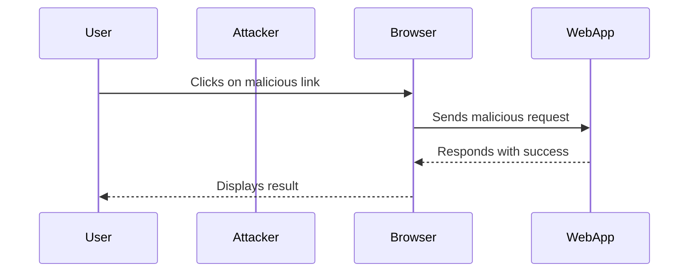

## Understanding the Lab Setup

In this lab, we will use Burp Suite to demonstrate a CSRF attack where token validation depends on the request method. The goal is to understand how CSRF works and how to mitigate it.

### Setting Up Burp Suite

To begin, we need to configure our browser to use Burp Suite as a proxy. This allows us to intercept and manipulate HTTP requests.

```markdown
1. Open Burp Suite.
2. Configure your browser to use Burp Suite as a proxy.
3. Navigate to the target web application.
```

### Logging In

Next, we need to log in to the web application using the provided credentials. This ensures that we are authenticated and can perform actions on behalf of the user.

```markdown
1. Navigate to the login page.
2. Enter the username and password.
3. Submit the login form.
```

### Identifying Vulnerable Functionality

Once logged in, we need to identify the functionality that can be exploited via CSRF. In this case, we are focusing on the email change functionality.

```markdown
1. Navigate to the account settings page.
2. Identify the form that allows changing the email address.
```

### Crafting the Malicious Request

Now that we have identified the vulnerable functionality, we need to craft a malicious request that will change the email address. This request will be sent to the server when the user clicks a link or visits a webpage controlled by the attacker.

```markdown
1. Intercept the request to change the email address.
2. Modify the request to include the desired email address.
3. Send the modified request to the server.
```

### Using Burp Repeater

Burp Repeater is a powerful tool that allows us to replay and modify HTTP requests. We will use it to send the crafted request to the server.

```markdown
1. Copy the intercepted request to Burp Repeater.
2. Modify the request as needed.
3. Send the request to the server.
```

### Analyzing the Request

Let's analyze the HTTP request that changes the email address. Here is an example of the request:

```http
POST /change-email HTTP/1.1
Host: vulnerable-app.com
User-Agent: Mozilla/5.0 (Windows NT 10.0; Win64; x64) AppleWebKit/537.36 (KHTML, like Gecko) Chrome/91.0.4472.124 Safari/537.36
Content-Type: application/x-www-form-urlencoded
Cookie: session=abc123
Content-Length: 28

email=test@test.com
```

#### Headers Explained

- **Host**: Specifies the target host.
- **User-Agent**: Identifies the client browser.
- **Content-Type**: Specifies the format of the data being sent.
- **Cookie**: Contains the session ID, which authenticates the user.
- **Content-Length**: Specifies the length of the body.

### Sequence Diagram

Here is a sequence diagram illustrating the steps involved in the CSRF attack:



---
<!-- nav -->
[[Web Security (PortSwigger)/04-Cross-Site Request Forgery (CSRF)/03-Lab 2 CSRF where token validation depends on request method/11-Understanding the Lab Scenario|Understanding the Lab Scenario]] | [[Web Security (PortSwigger)/04-Cross-Site Request Forgery (CSRF)/03-Lab 2 CSRF where token validation depends on request method/00-Overview|Overview]] | [[Web Security (PortSwigger)/04-Cross-Site Request Forgery (CSRF)/03-Lab 2 CSRF where token validation depends on request method/13-Understanding the Vulnerability|Understanding the Vulnerability]]
