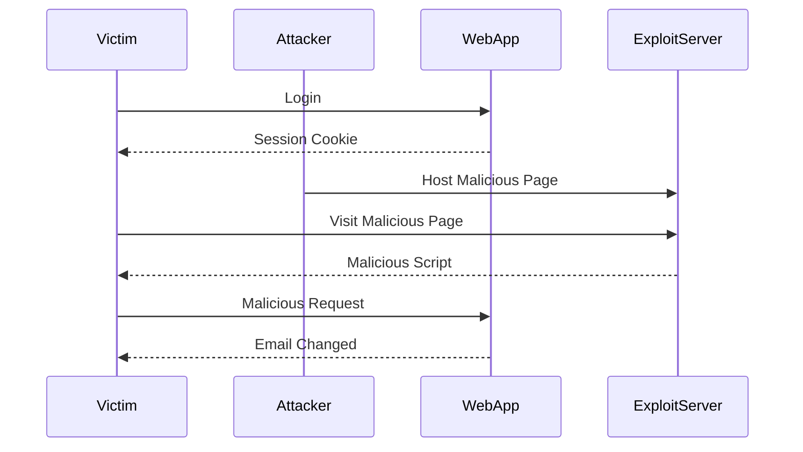

## Understanding the Vulnerability

### Email Change Functionality

The web application allows users to change their email addresses. This functionality is vulnerable to CSRF because the token validation mechanism is incomplete. Specifically, the token validation only applies to certain types of requests, leaving other methods susceptible to attacks.

### Token Validation Mechanism

The web application uses a token-based mechanism to prevent CSRF attacks. However, this mechanism is flawed because it only validates tokens for specific request methods (e.g., POST). Other methods, such as GET, may not be validated, allowing attackers to craft malicious requests that bypass the token check.

### Crafting the Exploit

To exploit this vulnerability, we need to craft an HTML page that triggers the email change functionality via a CSRF attack. The key steps are:

1. Identify the endpoint for changing the email address.
2. Craft a malicious request that changes the email address.
3. Host the HTML page on our exploit server.
4. Trick the victim into visiting the malicious page.

### Identifying the Endpoint

First, we need to identify the endpoint used for changing the email address. This can be done by inspecting the network traffic using Burp Suite.

#### Example Network Traffic

```http
POST /change-email HTTP/1.1
Host: vulnerable-app.com
Cookie: session=abc123
Content-Type: application/x-www-form-urlencoded

email=new.email@example.com&token=123456
```

From the above request, we can see that the endpoint `/change-email` is used to change the email address. The request includes a session cookie and a token for CSRF protection.

### Crafting the Malicious Request

Next, we need to craft a malicious request that changes the email address. Since the token validation only applies to certain request methods, we can use a method that is not validated (e.g., GET).

#### Example Malicious Request

```http
GET /change-email?email=new.email@example.com HTTP/1.1
Host: vulnerable-app.com
Cookie: session=abc123
```

This request changes the email address without including a token, exploiting the incomplete token validation mechanism.

### Hosting the Malicious Page

We will host the malicious HTML page on our exploit server. The HTML page will trigger the malicious request when the victim visits it.

#### Example Malicious HTML Page

```html
<!DOCTYPE html>
<html>
<head>
    <title>CSRF Attack</title>
</head>
<body>
    <h1>CSRF Attack</h1>
    <script>
        // Trigger the malicious request
        var xhr = new XMLHttpRequest();
        xhr.open("GET", "http://vulnerable-app.com/change-email?email=new.email@example.com", true);
        xhr.send();
    </script>
</body>
</html>
```

### Tricking the Victim

Finally, we need to trick the victim into visiting the malicious page. This can be done by sending the victim a link to the page or embedding the page in a trusted website.

### Sequence Diagram: Attack Flow



---
<!-- nav -->
[[12-Understanding the Lab Setup|Understanding the Lab Setup]] | [[Web Security (PortSwigger)/04-Cross-Site Request Forgery (CSRF)/03-Lab 2 CSRF where token validation depends on request method/00-Overview|Overview]] | [[Web Security (PortSwigger)/04-Cross-Site Request Forgery (CSRF)/03-Lab 2 CSRF where token validation depends on request method/14-Conclusion|Conclusion]]
