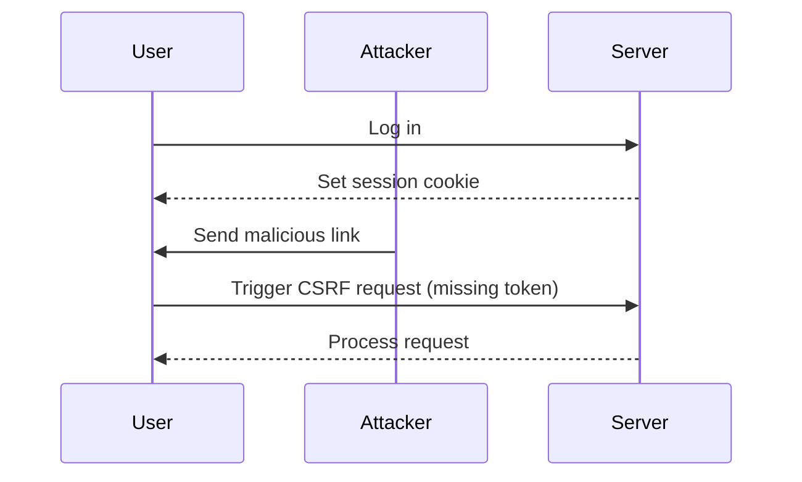

## CSRF Token Validation Flaw

In the given scenario, the web application is vulnerable to CSRF because the CSRF token is not mandatory. This means that even if the token is missing, the server will still process the request, effectively bypassing the intended protection mechanism.

### Background Theory

A CSRF token is a unique, unpredictable value that is generated by the server and sent to the client along with the form or AJAX request. When the client submits the form or makes the request, the token is included. The server then verifies the token to ensure that the request was initiated by the user and not an attacker.

However, if the server does not enforce the presence of the CSRF token, an attacker can simply omit the token and still execute the request. This is a critical flaw that undermines the entire purpose of using CSRF tokens.

### Detailed Explanation

Let's break down the steps involved in exploiting this vulnerability:

1. **Identify the Vulnerable Form**: The attacker identifies a form or endpoint that is vulnerable to CSRF due to the lack of mandatory token validation.
2. **Craft the Malicious Request**: The attacker crafts a request that omits the CSRF token. This can be done using HTML forms or JavaScript.
3. **Trigger the Request**: The attacker tricks the user into triggering the request, either through a malicious link, embedded image, or JavaScript injection.
4. **Server Processing**: The server processes the request, ignoring the missing token, and performs the intended action.

### Real-World Example: CVE-2020-14882

CVE-2020-14882 is a CSRF vulnerability found in the Atlassian Jira software. The vulnerability allowed attackers to perform various actions, such as creating new issues or modifying existing ones, by crafting a malicious request that omitted the CSRF token. This highlights the importance of ensuring that CSRF tokens are mandatory and properly validated.

### Code Example

Consider the following HTML form that is vulnerable to CSRF due to the lack of mandatory token validation:

```html
<form action="/change-email" method="POST">
    <input type="email" name="email" value="test3@test.ca">
    <input type="submit" value="Change Email">
</form>
```

The corresponding server-side code might look like this:

```python
@app.route('/change-email', methods=['POST'])
def change_email():
    email = request.form['email']
    # Change the user's email address
    return "Email changed successfully"
```

### Exploitation Using Burp Suite Professional

To exploit this vulnerability using Burp Suite Professional, follow these steps:

1. **Generate CSRF POC**:
    - Right-click on the request in Burp Suite.
    - Select `Engagement Tools` > `Generate CSRF POC`.
    - This will generate a proof-of-concept (POC) HTML page that can be used to trigger the CSRF attack.

2. **Manual Scripting**:
    - If you don't have Burp Suite Professional, you can manually create the HTML form.
    - Include the `auto-submit` script to automatically submit the form.

Here is an example of the generated HTML form:

```html
<html>
<body onload="document.forms[0].submit()">
<form action="http://example.com/change-email" method="POST">
    <input type="email" name="email" value="test3@test.ca">
    <input type="hidden" name="csrf_token" value="">
    <input type="submit" value="Change Email">
</form>
</body>
</html>
```

### Delivering the Exploit

To deliver the exploit to the victim:

1. **Host the Script**: Upload the HTML form to an exploit server.
2. **Trigger the Attack**: Send the victim a link to the exploit server, which will automatically submit the form when accessed.

### Mermaid Diagram

Here is a mermaid diagram illustrating the attack flow:



---
<!-- nav -->
[[Web Security (PortSwigger)/04-Cross-Site Request Forgery (CSRF)/04-Lab 3 CSRF where token validation depends on token being present/01-Introduction to Cross-Site Request Forgery (CSRF)|Introduction to Cross-Site Request Forgery (CSRF)]] | [[Web Security (PortSwigger)/04-Cross-Site Request Forgery (CSRF)/04-Lab 3 CSRF where token validation depends on token being present/00-Overview|Overview]] | [[03-Crafting a CSRF Attack|Crafting a CSRF Attack]]
