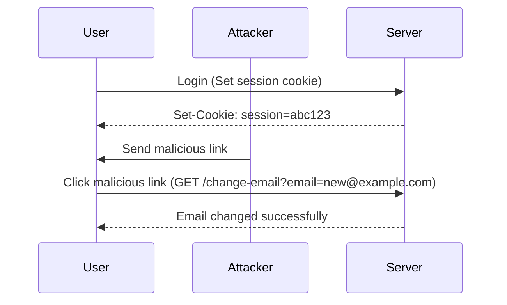
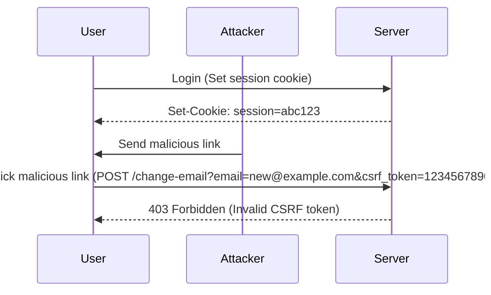

## Cross-Site Request Forgery (CSRF)

Cross-Site Request Forgery (CSRF) is a type of attack that tricks a victim into executing unwanted actions on a web application in which they are authenticated. This can lead to unauthorized transactions, data manipulation, or other malicious activities. Understanding CSRF and how to defend against it is crucial for maintaining the security of web applications.

### What is CSRF?

CSRF occurs when an attacker tricks a victim into performing an unintended action on a web application where the victim is already authenticated. For example, if a user is logged into their bank account, an attacker might craft a malicious link that, when clicked, transfers money from the user's account to the attacker's account.

#### How CSRF Works

1. **Victim Authentication**: The victim logs into a web application and receives a session cookie.
2. **Malicious Link**: The attacker crafts a malicious link or form that performs an action on the web application.
3. **Victim Interaction**: The victim clicks on the malicious link or submits a form, unknowingly sending a request to the web application.
4. **Action Execution**: Since the victim is already authenticated, the web application executes the action as if the victim intended it.

### Example Scenario

Consider a scenario where a user is logged into their bank account. An attacker sends the user a malicious link that, when clicked, transfers $1000 from the user's account to the attacker's account. The user clicks the link, and the bank's server processes the transaction because the user is already authenticated via their session cookie.

### Background Theory

To understand CSRF more deeply, let's break down the components involved:

1. **Session Management**: Web applications typically use cookies to manage user sessions. When a user logs in, the server sets a session cookie that identifies the user.
2. **HTTP Requests**: Web applications handle various types of HTTP requests, such as GET and POST. These requests can be used to retrieve data or perform actions.
3. **CSRF Tokens**: To mitigate CSRF attacks, many web applications use CSRF tokens. These tokens are unique per session and are included in forms and requests to ensure that the request originated from the legitimate user.

### Real-World Examples

#### Recent CVEs and Breaches

- **CVE-2021-33203**: A CSRF vulnerability was found in the WordPress plugin "WP Simple Pay." Attackers could trick users into changing payment settings, potentially leading to unauthorized transactions.
- **CVE-2022-22965**: A CSRF vulnerability in the "WordPress Gutenberg" plugin allowed attackers to modify post content without the user's knowledge.

These examples highlight the importance of implementing robust CSRF protections in web applications.

### Lab Scenario Analysis

Let's analyze the specific scenario described in the lecture transcript:

1. **Changing Email Address**: If an attacker can change the user's email address to one they control, they can reset the password and gain full access to the account.
2. **Cookie-Based Session Handling**: The application uses a session cookie named `session` to manage user sessions.
3. **Predictable Parameters**: The `email` parameter is predictable since it takes an email address.
4. **CSRF Token**: The application uses a CSRF token, which is a random number and thus unpredictable.

### Vulnerability Analysis

At first glance, the presence of a CSRF token might seem to protect against CSRF attacks. However, the implementation details matter. If the backend logic does not properly validate the CSRF token, the application may still be vulnerable.

#### Example Code

Here’s an example of how the application might handle the email change request:

```http
POST /change-email HTTP/1.1
Host: example.com
Cookie: session=abc123
Content-Type: application/x-www-form-urlencoded

email=new@example.com&csrf_token=1234567890
```

The server should validate the `csrf_token` before processing the request. If the token is missing or invalid, the request should be rejected.

### Bypassing CSRF Protection

In the previous lab, the attacker bypassed CSRF protection by changing the request method from POST to GET. This worked because the GET method did not require a CSRF token.

#### Example Code

Here’s how the attacker might craft the malicious link:

```html
<a href="http://example.com/change-email?email=new@example.com">Click here</a>
```

When the victim clicks the link, the server processes the request without validating the CSRF token.

### How to Prevent / Defend

#### Detection

To detect potential CSRF vulnerabilities, you can:

1. **Automated Scanning**: Use tools like Burp Suite, OWASP ZAP, or commercial scanners to identify CSRF vulnerabilities.
2. **Manual Testing**: Perform manual testing by crafting malicious links and observing the server's behavior.

#### Prevention

To prevent CSRF attacks, implement the following measures:

1. **CSRF Tokens**: Ensure that every form and request includes a unique CSRF token.
2. **Token Validation**: Validate the CSRF token on the server side before processing any request.
3. **SameSite Attribute**: Set the `SameSite` attribute on session cookies to `Strict` or `Lax` to prevent cross-site requests.
4. **HTTP Headers**: Use the `X-Requested-With` header to verify that requests originate from the same origin.

#### Secure Coding Fixes

Here’s an example of how to implement CSRF protection securely:

**Vulnerable Code**

```python
@app.route('/change-email', methods=['POST'])
def change_email():
    email = request.form['email']
    # Change email logic here
    return "Email changed successfully"
```

**Secure Code**

```python
@app.route('/change-email', methods=['POST'])
def change_email():
    email = request.form['email']
    csrf_token = request.form['csrf_token']
    
    if not validate_csrf_token(csrf_token):
        abort(403)
    
    # Change email logic here
    return "Email changed successfully"
```

### Complete Example

#### Full HTTP Request and Response

**Request**

```http
POST /change-email HTTP/1.1
Host: example.com
Cookie: session=abc123
Content-Type: application/x-www-form-urlencoded

email=new@example.com&csrf_token=1234567890
```

**Response**

```http
HTTP/1.1 200 OK
Date: Mon, 20 Mar 2023 12:00:00 GMT
Content-Type: text/html; charset=UTF-8
Content-Length: 32

Email changed successfully
```

### Mermaid Diagrams

#### CSRF Attack Flow



#### Secure CSRF Protection Flow



### Hands-On Labs

For hands-on practice with CSRF, consider the following labs:

- **PortSwigger Web Security Academy**: Offers a comprehensive set of labs covering various aspects of web security, including CSRF.
- **OWASP Juice Shop**: A deliberately insecure web application for practicing web security skills.
- **DVWA (Damn Vulnerable Web Application)**: A PHP/MySQL web application that contains numerous security vulnerabilities.

These labs provide practical experience in identifying and mitigating CSRF vulnerabilities.

### Conclusion

Understanding and defending against CSRF attacks is essential for securing web applications. By implementing robust CSRF protections and regularly testing for vulnerabilities, developers can significantly reduce the risk of unauthorized actions performed by malicious actors.

---
<!-- nav -->
[[03-Crafting a CSRF Attack|Crafting a CSRF Attack]] | [[Web Security (PortSwigger)/04-Cross-Site Request Forgery (CSRF)/04-Lab 3 CSRF where token validation depends on token being present/00-Overview|Overview]] | [[Web Security (PortSwigger)/04-Cross-Site Request Forgery (CSRF)/04-Lab 3 CSRF where token validation depends on token being present/05-How to Prevent  Defend Against CSRF|How to Prevent  Defend Against CSRF]]
