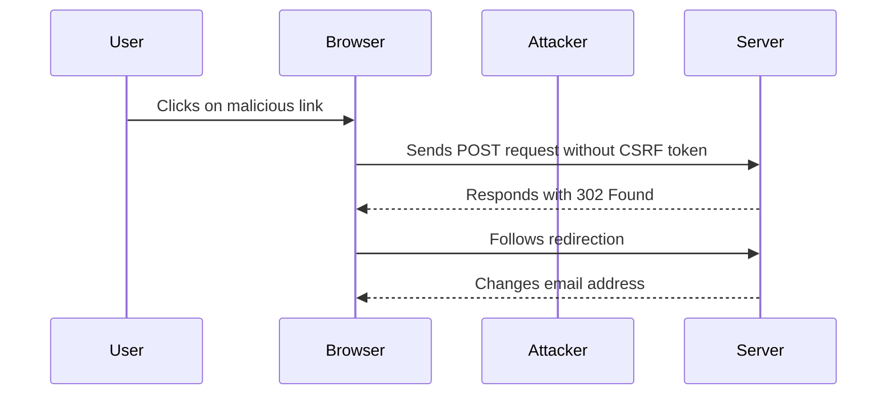

## Understanding CSRF Tokens

One of the most effective ways to mitigate CSRF attacks is by using CSRF tokens. A CSRF token is a unique, unpredictable value generated by the server and sent to the client. The client must include this token in subsequent requests to prove that the request originated from the legitimate user and not an attacker.

### Token Validation Mechanisms

There are several mechanisms for validating CSRF tokens:

1. **Token Presence Check**: The server checks if the token is present in the request.
2. **Token Validity Check**: The server verifies if the token is valid and matches the expected value.

In the given scenario, the server checks if the CSRF token is present and validates it if it is present. If the token is not present, the request is accepted without further validation.

### Detailed Explanation

Let's break down the process:

1. **Token Generation**: The server generates a unique CSRF token and includes it in the form or request.
2. **Token Submission**: The client submits the token along with the request.
3. **Token Validation**:
    - **Presence Check**: The server checks if the token is present.
    - **Validity Check**: If the token is present, the server validates it against the expected value.

### Example Code

Here is an example of how CSRF tokens can be implemented in a web application:

#### Server-Side Code (Python Flask)

```python
from flask import Flask, session, request, redirect, url_for

app = Flask(__name__)
app.secret_key = 'your_secret_key'

@app.route('/')
def index():
    session['csrf_token'] = generate_csrf_token()
    return render_template('index.html', csrf_token=session['csrf_token'])

@app.route('/submit', methods=['POST'])
def submit():
    if 'csrf_token' not in session or session['csrf_token'] != request.form['csrf_token']:
        return "Invalid CSRF token", 400
    # Process the request
    return "Request processed successfully"

def generate_csrf_token():
    import os
    return os.urandom(16).hex()

if __name__ == '__main__':
    app.run(debug=True)
```

#### Client-Side Code (HTML Form)

```html
<!DOCTYPE html>
<html>
<head>
    <title>CSRF Example</title>
</head>
<body>
    <form action="/submit" method="post">
        <input type="hidden" name="csrf_token" value="{{ csrf_token }}">
        <!-- Other form fields -->
        <button type="submit">Submit</button>
    </form>
</body>
</html>
```

### Vulnerability Analysis

The given scenario describes a situation where the server checks if the CSRF token is present and validates it if it is present. If the token is not present, the request is accepted without further validation. This is a critical flaw because an attacker can craft a request without including the CSRF token, bypassing the validation mechanism.

### Attack Scenario

Let's analyze the attack scenario described in the transcript:

1. **Initial Request**: The user makes a POST request to remove a CSRF token.
2. **Server Response**: The server responds with a 302 Found status code, indicating a successful request.
3. **Token Removal**: The attacker removes the CSRF token from the request and sends it to the server.
4. **Server Acceptance**: The server accepts the request because the token is not present, bypassing the validation mechanism.

### Example HTTP Requests and Responses

#### Initial Request with CSRF Token

```http
POST /remove_token HTTP/1.1
Host: example.com
Cookie: session=abc123
Content-Type: application/x-www-form-urlencoded

csrf_token=J
```

#### Server Response

```http
HTTP/1.1 302 Found
Location: /success
```

#### Request without CSRF Token

```http
POST /remove_token HTTP/1.1
Host: example.com
Cookie: session=abc123
Content-Type: application/x-www-form-urlencoded

csrf_token=W
```

#### Server Response

```http
HTTP/1.1 400 Bad Request
Content-Type: text/plain

Invalid CSRF token
```

### Diagram Representation



---
<!-- nav -->
[[Web Security (PortSwigger)/04-Cross-Site Request Forgery (CSRF)/04-Lab 3 CSRF where token validation depends on token being present/05-How to Prevent  Defend Against CSRF|How to Prevent  Defend Against CSRF]] | [[Web Security (PortSwigger)/04-Cross-Site Request Forgery (CSRF)/04-Lab 3 CSRF where token validation depends on token being present/00-Overview|Overview]] | [[Web Security (PortSwigger)/04-Cross-Site Request Forgery (CSRF)/04-Lab 3 CSRF where token validation depends on token being present/07-Practice Questions & Answers|Practice Questions & Answers]]
