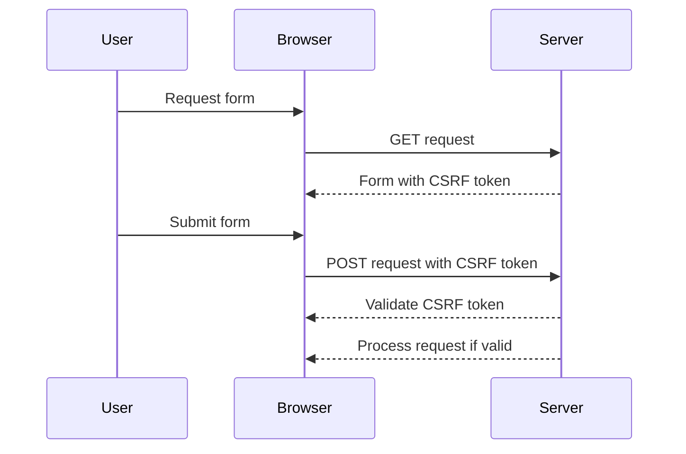

## CSRF Tokens and Their Implementation

CSRF tokens are a widely used defense mechanism against CSRF attacks. A CSRF token is a unique, unpredictable value that is generated by the server and included in requests made by the client. The server then validates the token to ensure that the request is legitimate.

### What is a CSRF Token?

A CSRF token is a random string of characters that is generated by the server and associated with a specific user session. When a user submits a form or makes a request, the CSRF token is included in the request. The server then verifies the token to ensure that the request is coming from an authenticated user and not an attacker.

### How CSRF Tokens Work

Here’s a step-by-step breakdown of how CSRF tokens work:

1. **Token Generation**: The server generates a unique CSRF token and associates it with the user's session.
2. **Token Inclusion**: The token is included in forms or requests made by the client.
3. **Token Validation**: The server validates the token to ensure that the request is legitimate.

### Example of CSRF Token Implementation

Let's look at a simple example of how CSRF tokens can be implemented in a web application using Python and Flask.

```python
from flask import Flask, session, request, redirect, url_for

app = Flask(__name__)
app.secret_key = 'your_secret_key'

@app.route('/')
def index():
    if 'csrf_token' not in session:
        session['csrf_token'] = generate_csrf_token()
    return f'<form action="/submit" method="POST"><input type="hidden" name="csrf_token" value="{session["csrf_token"]}"><input type="submit"></form>'

@app.route('/submit', methods=['POST'])
def submit():
    if request.form.get('csrf_token') != session.get('csrf_token'):
        return "Invalid CSRF token"
    # Process the form submission
    return "Form submitted successfully"

def generate_csrf_token():
    import os
    return os.urandom(16).hex()

if __name__ == '__main__':
    app.run(debug=True)
```

### Explanation of the Code

- **Session Management**: The `session` object is used to store the CSRF token.
- **Token Generation**: The `generate_csrf_token` function creates a random token using `os.urandom`.
- **Token Inclusion**: The CSRF token is included in the form as a hidden input field.
- **Token Validation**: The server checks if the token in the request matches the token stored in the session.

### Mermaid Diagram: CSRF Token Flow



### Common Pitfalls

While CSRF tokens are effective, there are several common pitfalls to avoid:

- **Token Exposure**: Ensure that the CSRF token is not exposed in URLs or other easily accessible places.
- **Token Reuse**: Avoid reusing the same token across multiple requests or sessions.
- **Token Storage**: Store the CSRF token securely, typically in a session or a secure cookie.

### Real-World Example: CVE-2021-21972

In the CVE-2021-21972 example, the lack of proper CSRF token validation allowed attackers to perform unauthorized actions. By including a CSRF token in the request and validating it on the server, the vulnerability could have been prevented.

### How to Prevent / Defend

#### Secure Coding Fixes

To prevent CSRF attacks, implement CSRF tokens and validate them on the server. Here’s an example of a vulnerable and a secure version of a form submission:

**Vulnerable Version**

```html
<form action="/submit" method="POST">
    <input type="text" name="username">
    <input type="submit">
</form>
```

**Secure Version**

```html
<form action="/submit" method="POST">
    <input type="hidden" name="csrf_token" value="{{ csrf_token }}">
    <input type="text" name="username">
    <input type="submit">
</form>
```

#### Configuration Hardening

Ensure that your web application framework is configured to use CSRF tokens. For example, in Django, enable CSRF protection by setting `CSRF_COOKIE_SECURE` and `CSRF_USE_SESSIONS`.

#### Detection

Monitor and log suspicious activity, such as unexpected requests or changes in user behavior. Implement anomaly detection systems to identify potential CSRF attacks.

---
<!-- nav -->
[[Web Security (PortSwigger)/04-Cross-Site Request Forgery (CSRF)/05-Lab 4 CSRF where token is not tied to user session/01-Introduction to Cross-Site Request Forgery (CSRF)|Introduction to Cross-Site Request Forgery (CSRF)]] | [[Web Security (PortSwigger)/04-Cross-Site Request Forgery (CSRF)/05-Lab 4 CSRF where token is not tied to user session/00-Overview|Overview]] | [[Web Security (PortSwigger)/04-Cross-Site Request Forgery (CSRF)/05-Lab 4 CSRF where token is not tied to user session/03-Cross-Site Request Forgery (CSRF)|Cross-Site Request Forgery (CSRF)]]
