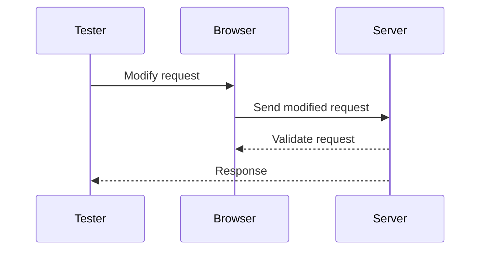

## Testing CSRF Defenses

Testing CSRF defenses is crucial to ensure that your web application is protected against these attacks. The following methodology can be used to test CSRF defenses:

### Methodology for Testing CSRF Defenses

1. **Remove the CSRF Token**: Remove the CSRF token from a request and see if the application accepts the request.
2. **Change the Request Method**: Change the request method from POST to GET and see if the application allows it.
3. **Check GET Method Requirements**: Check if the GET method requires a CSRF token.

### Step-by-Step Testing

Let's walk through the testing process using the example provided in the transcript.

#### Remove the CSRF Token

1. **Original Request**:
   ```http
   POST /submit HTTP/1.1
   Host: example.com
   Content-Type: application/x-www-form-urlencoded

   username=admin&csrf_token=abc123
   ```

2. **Modified Request**:
   ```http
   POST /submit HTTP/1.1
   Host: example.com
   Content-Type: application/x-www-form-urlencoded

   username=admin
   ```

3. **Expected Response**:
   ```http
   HTTP/1.1 400 Bad Request
   Content-Type: text/html

   Missing parameter CSRF
   ```

#### Change the Request Method

1. **Original Request**:
   ```http
   POST /submit HTTP/1.1
   Host: example.com
   Content-Type: application/x-www-form-urlencoded

   username=admin&csrf_token=abc123
   ```

2. **Modified Request**:
   ```http
   GET /submit?username=admin&csrf_token=abc123 HTTP/1.1
   Host: example.com
   ```

3. **Expected Response**:
   ```http
   HTTP/1.1 404 Not Found
   Content-Type: text/html

   Not found
   ```

#### Check GET Method Requirements

1. **Original Request**:
   ```http
   GET /submit?username=admin&csrf_token=abc123 HTTP/1.1
   Host: example.com
   ```

2. **Modified Request**:
   ```http
   GET /submit?username=admin HTTP/1.1
   Host: example.com
   ```

3. **Expected Response**:
   ```http
   HTTP/1.1 400 Bad Request
   Content-Type: text/html

   Missing parameter CSRF
   ```

### Mermaid Diagram: Testing CSRF Defenses



### Common Mistakes

- **Ignoring GET Requests**: Many applications do not use CSRF tokens for GET requests, making them vulnerable to CSRF attacks.
- **Token Exposure**: Exposing CSRF tokens in URLs or other easily accessible places can lead to token theft.
- **Token Reuse**: Reusing the same token across multiple requests or sessions can weaken the defense.

### Real-World Example: CVE-2-2021-21972

In the CVE-2021-21972 example, the lack of proper CSRF token validation allowed attackers to perform unauthorized actions. By implementing and validating CSRF tokens, the vulnerability could have been prevented.

### How to Prevent / Defend

#### Secure Coding Fixes

To prevent CSRF attacks, implement CSRF tokens and validate them on the server. Here’s an example of a vulnerable and a secure version of a form submission:

**Vulnerable Version**

```html
<form action="/submit" method="POST">
    <input type="text" name="username">
    <input type="submit">
</form>
```

**Secure Version**

```html
<form action="/submit" method="POST">
    <input type="hidden" name="csrf_token" value="{{ csrf_token }}">
    <input type="text" name="username">
    <input type="submit">
</form>
```

#### Configuration Hardening

Ensure that your web application framework is configured to use CSRF tokens. For example, in Django, enable CSRF protection by setting `CSRF_COOKIE_SECURE` and `CSRF_USE_SESSIONS`.

#### Detection

Monitor and log suspicious activity, such as unexpected requests or changes in user behavior. Implement anomaly detection systems to identify potential CSRF attacks.

---
<!-- nav -->
[[Web Security (PortSwigger)/04-Cross-Site Request Forgery (CSRF)/05-Lab 4 CSRF where token is not tied to user session/04-Hands-On Labs|Hands-On Labs]] | [[Web Security (PortSwigger)/04-Cross-Site Request Forgery (CSRF)/05-Lab 4 CSRF where token is not tied to user session/00-Overview|Overview]] | [[Web Security (PortSwigger)/04-Cross-Site Request Forgery (CSRF)/05-Lab 4 CSRF where token is not tied to user session/06-Conclusion|Conclusion]]
