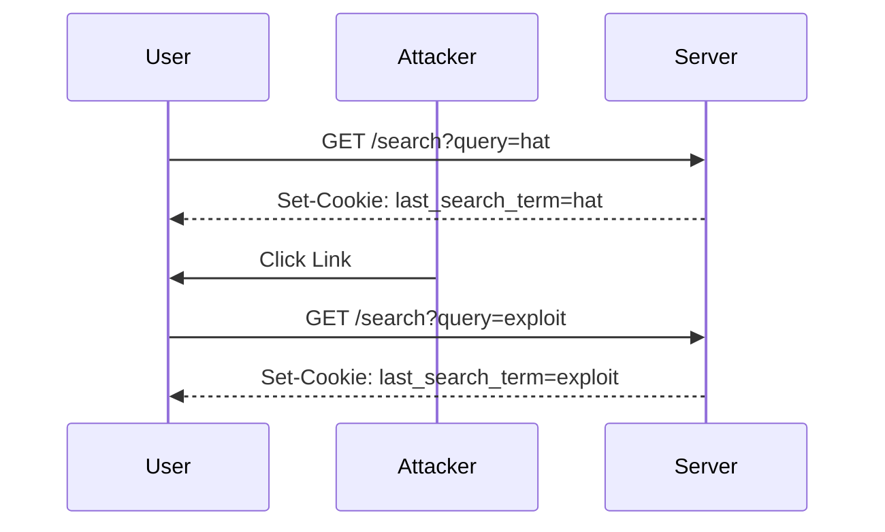
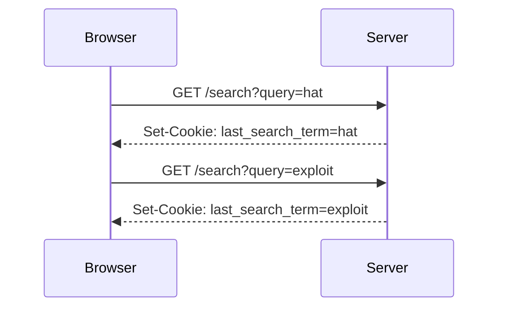

## Lab 5: CSRF Where Token is Tied to Non-Session Cookie

In this lab, we will explore a scenario where a CSRF token is tied to a non-session cookie. This setup can introduce unique challenges and vulnerabilities that need to be understood and mitigated.

### Background Theory

#### CSRF Tokens

A CSRF token is a unique identifier that is generated by the server and sent to the client. The client includes this token in subsequent requests, and the server verifies the token before processing the request. This ensures that the request comes from a legitimate source.

#### Non-Session Cookies

Non-session cookies are cookies that are not tied to the user's session. They may store information such as preferences, last search terms, or other data that is not specific to the user's session.

### Scenario Setup

In this lab, we have a web application with two types of cookies:

- **CSRF Key Cookie**: Handles the CSRF defense functionality.
- **Session Cookie**: Handles the session management.
- **Last Search Term Cookie**: Stores the last search term entered by the user.

The application allows users to search for blog posts. When a user performs a search, a new cookie called `last_search_term` is set with the value of the search term.

### Step-by-Step Analysis

#### Initial State

1. **User Logs In**: The user logs into the application and receives a session cookie and a CSRF key cookie.
2. **Initial Search**: The user performs an initial search for the term "hat". The application sets a `last_search_term` cookie with the value "hat".

```http
GET /search?query=hat HTTP/1.1
Host: example.com
Cookie: session_id=abc123; csrf_key=def456; last_search_term=hat
```

#### Crafting the Malicious Request

To exploit the CSRF vulnerability, an attacker needs to craft a malicious request that includes the necessary cookies and triggers an action on the server.

1. **Identify the Vulnerable Endpoint**: The attacker identifies the endpoint `/search` that sets the `last_search_term` cookie.
2. **Craft the Malicious Request**: The attacker crafts a request that sets the `last_search_term` cookie to a value that can be exploited.

```http
GET /search?query=exploit HTTP/1.1
Host: example.com
Cookie: session_id=abc123; csrf_key=def456; last_search_term=exploit
```

#### Exploiting the Vulnerability

The attacker can exploit the vulnerability by tricking the user into clicking a link or visiting a page that sends the malicious request to the server.

1. **Trick the User**: The attacker tricks the user into clicking a link or visiting a page that sends the malicious request.
2. **Server Execution**: The server executes the request, setting the `last_search_term` cookie to "exploit".

```http
HTTP/1.1 200 OK
Set-Cookie: last_search_term=exploit
Content-Type: text/html
```

### Detection and Prevention

#### Detection

To detect CSRF vulnerabilities, web applications should monitor for unexpected changes in cookies or unexpected requests. Tools like Burp Suite can be used to analyze traffic and identify potential CSRF attacks.

#### Prevention

To prevent CSRF attacks, web applications should implement the following measures:

1. **CSRF Tokens**: Generate unique CSRF tokens for each request and verify them on the server.
2. **SameSite Cookies**: Set the `SameSite` attribute on cookies to ensure they are only sent in first-party contexts.
3. **HTTP Headers**: Use headers like `X-Requested-With` to verify the origin of the request.

### Secure Coding Fixes

#### Vulnerable Code

```python
@app.route('/search', methods=['GET'])
def search():
    query = request.args.get('query')
    response = make_response(render_template('search_results.html', results=query))
    response.set_cookie('last_search_term', query)
    return response
```

#### Secure Code

```python
@app.route('/search', methods=['GET'])
def search():
    query = request.args.get('query')
    csrf_token = request.cookies.get('csrf_key')
    if not validate_csrf_token(csrf_token):
        abort(403)
    response = make_response(render_template('search_results.html', results=query))
    response.set_cookie('last_search_term', query, samesite='Strict')
    return response
```

### Mermaid Diagrams

#### Attack Chain



#### Request/Response Flow



### Hands-On Labs

For hands-on practice with CSRF vulnerabilities, consider the following labs:

- **PortSwigger Web Security Academy**: Offers comprehensive labs on CSRF attacks and defenses.
- **OWASP Juice Shop**: Provides a vulnerable web application for practicing various security techniques, including CSRF.
- **DVWA (Damn Vulnerable Web Application)**: A deliberately insecure web application for practicing web security concepts.

By thoroughly understanding and implementing the preventive measures discussed, web developers can significantly reduce the risk of CSRF attacks and ensure the security of their applications.

---
<!-- nav -->
[[02-Lab Overview CSRF where Token is Tied to Non-Session Cookie|Lab Overview CSRF where Token is Tied to Non-Session Cookie]] | [[Web Security (PortSwigger)/04-Cross-Site Request Forgery (CSRF)/06-Lab 5 CSRF where token is tied to non session cookie/00-Overview|Overview]] | [[04-CSRF Defense Mechanisms|CSRF Defense Mechanisms]]
