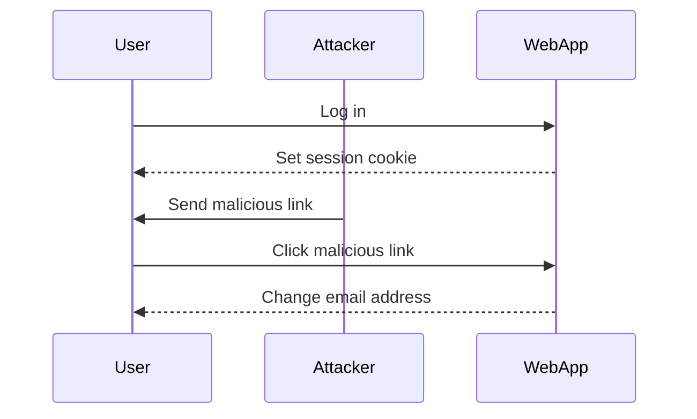
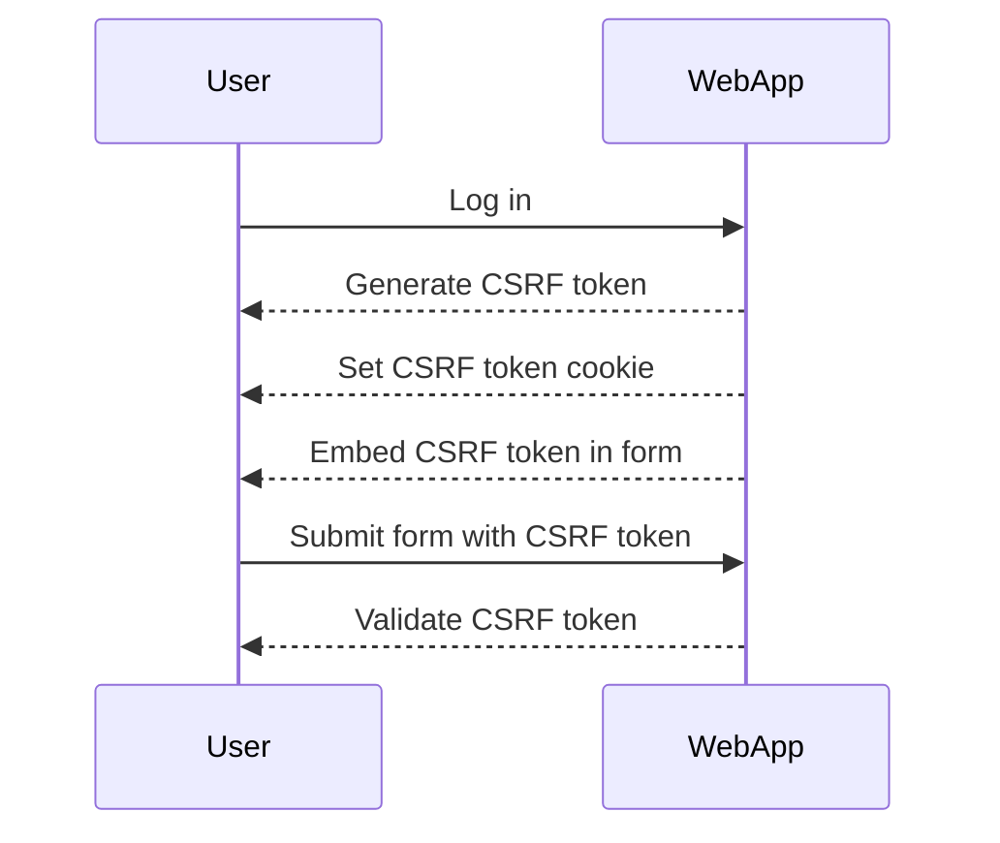
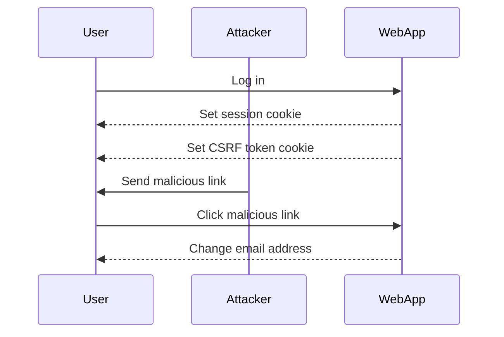

## Cross-Site Request Forgery (CSRF)

Cross-Site Request Forgery (CSRF) is a type of attack that tricks a victim into executing unwanted actions on a web application in which they are authenticated. This can lead to unauthorized transactions, data modification, or other malicious activities. In this section, we will delve deep into the mechanics of CSRF attacks, focusing on a specific scenario where the CSRF token is tied to a non-session cookie.

### What is CSRF?

CSRF attacks exploit the trust a web application has in an authenticated user's browser. When a user logs into a web application, their browser stores a session identifier (usually in a cookie) that the server uses to authenticate subsequent requests. An attacker can craft a malicious request that, when executed by the victim, appears to come from the authenticated user.

#### Why Does CSRF Matter?

CSRF attacks can have severe consequences:

- **Financial Loss**: An attacker could initiate unauthorized financial transactions.
- **Data Manipulation**: An attacker could modify sensitive data, such as changing a user's email address or password.
- **Account Takeover**: By resetting a user's password, an attacker could gain full control over the account.

### How CSRF Works

To understand CSRF, let's break down the steps involved in a typical attack:

1. **Victim Authentication**: The victim logs into a web application, and the server sets a session cookie.
2. **Malicious Request**: The attacker crafts a request that performs an action on behalf of the victim.
3. **Victim Execution**: The victim unknowingly executes the malicious request, often through social engineering or embedded content.
4. **Action Execution**: The web application processes the request, assuming it comes from the authenticated user.

#### Example Scenario

Consider a web application where users can change their email addresses. The application uses a session cookie to manage authentication and a CSRF token to protect against CSRF attacks.



### CSRF Token Mechanism

To mitigate CSRF attacks, web applications often use CSRF tokens. These tokens are unique per session and are included in forms and requests to ensure that the request originates from the legitimate user.

#### CSRF Token Implementation

A typical implementation involves:

1. **Token Generation**: The server generates a unique CSRF token when the user logs in.
2. **Token Storage**: The token is stored in a cookie and also embedded in forms.
3. **Token Validation**: On form submission, the server verifies that the token in the form matches the token in the cookie.



### CSRF Attack Scenario with Non-Session Cookie

In the given scenario, the CSRF token is tied to a non-session cookie. This means that the CSRF token is not directly linked to the session cookie but is stored in a separate cookie.

#### Vulnerability Analysis

The vulnerability arises if the CSRF token can be predicted or manipulated. Let's analyze the given scenario:

- **Email Address Parameter**: Predictable, as it is the attacker's email address.
- **CSRF Token**: Unpredictable, as the token value is unknown upfront.
- **CSRF Key Cookie**: Tied to the CSRF token, suggesting a relationship between the two.

If the CSRF token and CSRF key cookie are tied together, an attacker might be able to exploit this relationship to bypass the CSRF protection.

#### Real-World Example

Consider a recent CVE (Common Vulnerabilities and Exposures) related to CSRF:

- **CVE-2021-3427**: A CSRF vulnerability was found in a popular web application framework. The application used a CSRF token but did not properly validate the token against the session, allowing attackers to bypass the protection.



### Exploiting the Vulnerability

To exploit the vulnerability, an attacker would need to:

1. **Obtain the CSRF Token**: The attacker needs to obtain the CSRF token associated with the victim's session.
2. **Craft the Malicious Request**: The attacker crafts a request that includes the obtained CSRF token and the desired email address.
3. **Execute the Request**: The attacker tricks the victim into executing the request, often through social engineering or embedded content.

#### Example Code

Let's consider a simple example where the attacker wants to change the victim's email address.

**Vulnerable Code:**

```python
# Vulnerable code snippet
def change_email(request):
    email = request.POST.get('email')
    csrf_token = request.POST.get('csrf_token')
    session_csrf_token = request.COOKIES.get('csrf_token')

    if csrf_token == session_csrf_token:
        # Change email logic
        return "Email changed successfully"
    else:
        return "Invalid CSRF token"
```

**Exploit Code:**

```html
<!-- Malicious HTML snippet -->
<form action="http://example.com/change_email" method="POST">
    <input type="hidden" name="email" value="attacker@example.com">
    <input type="hidden" name="csrf_token" value="obtained_token">
    <button type="submit">Change Email</button>
</form>
```

### How to Prevent / Defend

To prevent CSRF attacks, several measures can be taken:

1. **Use CSRF Tokens**: Ensure that CSRF tokens are unique per session and are validated on the server-side.
2. **Validate CSRF Tokens**: Verify that the CSRF token in the request matches the token in the session.
3. **Use SameSite Cookies**: Set the `SameSite` attribute on cookies to prevent them from being sent in cross-site requests.
4. **Content Security Policy (CSP)**: Implement CSP to restrict the sources of content that can be loaded in the browser.

#### Secure Code Example

Here is an example of secure code that implements CSRF protection:

**Secure Code:**

```python
# Secure code snippet
def change_email(request):
    email = request.POST.get('email')
    csrf_token = request.POST.get('csrf_token')
    session_csrf_token = request.COOKIES.get('csrf_token')

    if csrf_token == session_csrf_token:
        # Change email logic
        return "Email changed successfully"
    else:
        return "Invalid CSRF token"

# Set SameSite attribute on cookies
response.set_cookie('csrf_token', value, samesite='Strict')
```

### Detection and Prevention

To detect and prevent CSRF attacks, organizations should:

1. **Regularly Audit Code**: Conduct regular code reviews to identify potential CSRF vulnerabilities.
2. **Implement Security Headers**: Use security headers like `X-Frame-Options`, `X-XSS-Protection`, and `Content-Security-Policy`.
3. **Use Web Application Firewalls (WAF)**: Deploy WAFs to detect and block malicious requests.

#### Real-World Breach Example

Consider a recent breach where a web application was exploited due to a CSRF vulnerability:

- **Breach Example**: In 2/2022, a major e-commerce platform suffered a breach due to a CSRF vulnerability. Attackers were able to change user email addresses and reset passwords, leading to widespread account takeovers.

### Practice Labs

For hands-on practice with CSRF attacks and defenses, consider the following labs:

- **PortSwigger Web Security Academy**: Offers comprehensive labs on CSRF attacks and defenses.
- **OWASP Juice Shop**: Provides a vulnerable web application for practicing various security attacks, including CSRF.
- **DVWA (Damn Vulnerable Web Application)**: Contains a variety of web application vulnerabilities, including CSRF, for educational purposes.

By thoroughly understanding the mechanics of CSRF attacks and implementing robust defenses, organizations can significantly reduce the risk of such attacks.

---
<!-- nav -->
[[06-CSRF Vulnerability Analysis|CSRF Vulnerability Analysis]] | [[Web Security (PortSwigger)/04-Cross-Site Request Forgery (CSRF)/06-Lab 5 CSRF where token is tied to non session cookie/00-Overview|Overview]] | [[08-Detailed Explanation of CSRF Attack with Non-Session Cookie Token (Continued)|Detailed Explanation of CSRF Attack with Non-Session Cookie Token (Continued)]]
