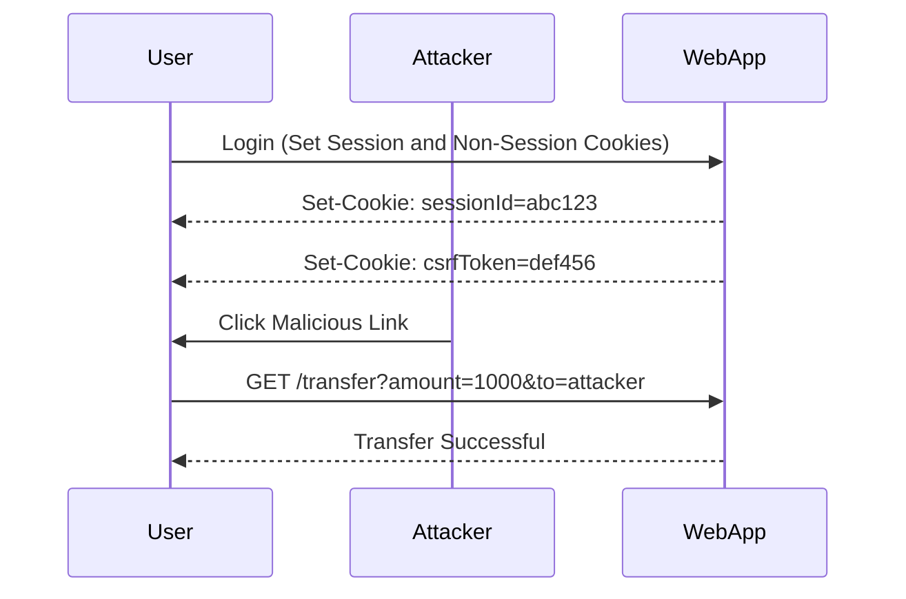

## Detailed Explanation of CSRF Attack with Non-Session Cookie Token (Continued)

In the previous sections, we covered the basics of Cross-Site Request Forgery (CSRF) and how it works when the token is tied to a non-session cookie. Now, let's delve deeper into the mechanics of the attack and the defenses against it.

### Mechanics of the Attack

When the CSRF token is tied to a non-session cookie, the attack becomes more complex. The attacker must not only craft a malicious request but also ensure that the non-session cookie containing the CSRF token is included in the request.

#### Steps Involved

1. **User Authentication**: The user logs into the web application, and the server sets a session cookie and a non-session cookie containing the CSRF token.
2. **Malicious Request**: The attacker crafts a malicious request that includes the session cookie and the non-session cookie containing the CSRF token.
3. **Execution**: The web application processes the request, including both cookies, and performs the action specified in the request.

### CSRF Attack Chain with Non-Session Cookie

Let's visualize the attack chain using a mermaid diagram:



### Prevention and Defense

To prevent CSRF attacks where the token is tied to a non-session cookie, web applications should implement robust defenses. Here are some key strategies:

1. **CSRF Tokens**: Generate a unique token for each user session and require it in every request. This ensures that even if an attacker crafts a malicious request, it will lack the required token.
2. **SameSite Cookies**: Use the `SameSite` attribute in cookies to restrict them from being sent in cross-site requests.
3. **HTTP Headers**: Implement security headers like `X-Frame-Options`, `Content-Security-Policy`, and `Referrer-Policy`.

#### Secure Coding Practices

Here’s an example of how to implement CSRF tokens securely with a non-session cookie:

**Vulnerable Code:**

```python
@app.route('/transfer', methods=['POST'])
def transfer():
    amount = request.form['amount']
    to_account = request.form['to']
    # Perform the transfer
    return "Transfer successful"
```

**Secure Code:**

```python
@app.route('/transfer', methods=['POST'])
def transfer():
    csrf_token = request.form['csrf_token']
    if csrf_token != session['csrf_token']:
        abort(_http.HTTPStatus.FORBIDDEN)
    amount = request.form['amount']
    to_account = request.form['to']
    # Perform the transfer
    return "Transfer successful"
```

### Lab Exercise: PortSwigger Web Security Academy

To practice detecting and preventing CSRF attacks with non-session cookie tokens, you can use the PortSwigger Web Security Academy. This lab provides a realistic environment to test your skills in identifying and mitigating CSRF vulnerabilities.

### Conclusion

CSRF attacks where the token is tied to a non-session cookie are a significant threat to web applications. However, they can be effectively prevented through proper implementation of security measures such as CSRF tokens, SameSite cookies, and security headers. By understanding the mechanics of CSRF and implementing robust defenses, developers can protect their applications from these types of attacks.

---

---
<!-- nav -->
[[07-Cross-Site Request Forgery (CSRF)|Cross-Site Request Forgery (CSRF)]] | [[Web Security (PortSwigger)/04-Cross-Site Request Forgery (CSRF)/06-Lab 5 CSRF where token is tied to non session cookie/00-Overview|Overview]] | [[09-Detailed Explanation of CSRF Attack with Non-Session Cookie Token (Final Section)|Detailed Explanation of CSRF Attack with Non-Session Cookie Token (Final Section)]]
