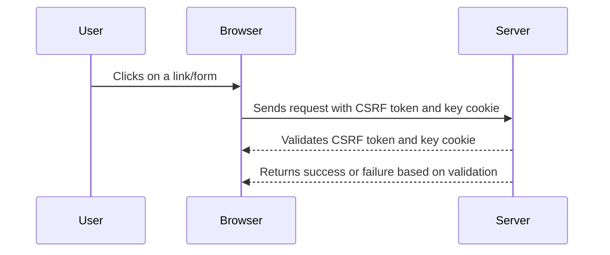

## Understanding Cross-Site Request Forgery (CSRF)

Cross-Site Request Forgery (CSRF) is a type of attack that tricks a user's browser into executing unwanted actions on a web application in which the user is currently authenticated. This attack exploits the trust that a web application places in the user's browser. The attacker does not need to steal the user's credentials; instead, they leverage the fact that the user is already logged in to the application.

### How CSRF Works

To understand CSRF, let's break down the process:

1. **User Authentication**: The user logs into a web application and receives a session cookie.
2. **Attacker's Malicious Action**: The attacker crafts a malicious request (often through a crafted link, image, or script) that will trigger an action on the web application.
3. **Browser Execution**: When the user clicks on the malicious link or visits a page containing the malicious script, their browser sends the request to the web application along with the session cookie.
4. **Action Execution**: Since the request includes the session cookie, the web application assumes the request is coming from the authenticated user and executes the action.

### Example Scenario

Consider a banking website where a user is logged in and has a session cookie. An attacker could craft a link that transfers money from the user's account to the attacker's account. If the user clicks on this link, the browser will send the request to the bank's server, including the session cookie, and the transfer will occur.

### Real-World Examples

#### CVE-2021-3116

In 2021, a CSRF vulnerability was discovered in the WordPress REST API. The vulnerability allowed attackers to perform unauthorized actions, such as deleting posts or changing user roles, by tricking authenticated users into visiting a malicious URL.

#### CVE-2022-22965

Another example is the Log4j vulnerability (CVE-2022-22965), which, although primarily a Remote Code Execution (RCE) vulnerability, could also be exploited via CSRF attacks. Attackers could craft a malicious request that would execute arbitrary code on the server, leading to further exploitation.

### CSRF Tokens and Cookies

To mitigate CSRF attacks, web applications often use CSRF tokens. These tokens are unique values generated by the server and sent to the client. The client must include these tokens in subsequent requests to prove that the request originated from the legitimate user.

#### Double Submit Cookie Pattern

One common approach is the "double submit cookie" pattern. In this method, the server generates a CSRF token and sets it as a cookie. The client must include this token in the request body or headers. The server then verifies that the token in the request matches the token in the cookie.

However, the scenario described in the lecture introduces a more complex setup involving both a CSRF token and a CSRF key cookie.

### Lecture Scenario Analysis

The lecture describes a situation where the CSRF token and the CSRF key cookie are distinct but related values. The backend checks if the CSRF key cookie is tied to the CSRF parameter and validates the values against what is stored in the backend.

#### Backend Validation Process

Here’s a detailed breakdown of the validation process:

1. **Token Generation**: The server generates a unique CSRF token and a corresponding CSRF key cookie.
2. **Token Distribution**: The CSRF token is included in the HTML form or JavaScript, while the CSRF key cookie is set in the user's browser.
3. **Request Submission**: When the user submits a form or makes an AJAX request, the CSRF token is included in the request body or headers.
4. **Backend Verification**: The server retrieves the CSRF key cookie from the request and compares it with the CSRF token in the request. If they match and the values are valid, the request is processed. Otherwise, an "invalid CSRF token" error is returned.

### Example Code

Let's illustrate this with some example code:

```python
# Server-side code to generate CSRF token and key cookie
import secrets

def generate_csrf_token():
    csrf_token = secrets.token_urlsafe(16)
    csrf_key_cookie = secrets.token_urlsafe(16)
    return csrf_token, csrf_key_cookie

csrf_token, csrf_key_cookie = generate_csrf_token()

# Set CSRF key cookie in the response
response.set_cookie('csrf_key', csrf_key_cookie)

# Include CSRF token in the form
html_form = f'''
<form method="POST">
    <input type="hidden" name="csrf_token" value="{csrf_token}">
    <!-- Other form fields -->
</form>
'''

# Client-side form submission
form_data = {
    'csrf_token': csrf_token,
    # Other form data
}

# Server-side verification
def verify_csrf(request):
    csrf_token = request.POST.get('csrf_token')
    csrf_key_cookie = request.cookies.get('csrf_key')
    
    if csrf_token == csrf_key_cookie:
        # Process the request
        pass
    else:
        return "Invalid CSRF token"

```

### Testing CSRF Tokens and Cookies

To ensure that the CSRF protection mechanism is working correctly, you need to test the following aspects:

1. **Token and Cookie Relationship**: Verify that the CSRF token and CSRF key cookie are correctly tied together.
2. **Token Uniqueness**: Ensure that the CSRF token is unique per request.
3. **Cookie Security**: Check that the CSRF key cookie is set with appropriate security flags (`HttpOnly`, `Secure`).

### Example Testing Steps

1. **Retrieve CSRF Token and Key Cookie**:
    - Make a request to the server to retrieve the CSRF token and key cookie.
    - Store these values for later use.

2. **Submit Form with Correct Token**:
    - Submit a form with the correct CSRF token and key cookie.
    - Verify that the request is accepted.

3. **Submit Form with Incorrect Token**:
    - Submit a form with an incorrect CSRF token.
    - Verify that the request is rejected with an "invalid CSRF token" message.

4. **Submit Form with Missing Token**:
    - Submit a form without the CSRF token.
    - Verify that the request is rejected.

### Mermaid Diagram

A mermaid diagram can help visualize the interaction between the client and server during the CSRF token and key cookie validation process:



### Chaining Vulnerabilities

If the CSRF token and key cookie are not properly tied together, an attacker might be able to chain multiple vulnerabilities to exploit the system. For example, if the application has a cross-site scripting (XSS) vulnerability, an attacker could use it to steal the CSRF key cookie and then craft a malicious request with the stolen token.

### How to Prevent / Defend

#### Detection

- **Logging and Monitoring**: Implement logging and monitoring to detect unusual patterns of requests that may indicate a CSRF attack.
- **Security Headers**: Use security headers like `Content-Security-Policy` to mitigate XSS attacks that could be used to steal CSRF tokens.

#### Prevention

- **Use Secure Cookies**: Ensure that the CSRF key cookie is set with `HttpOnly` and `Secure` flags to prevent it from being accessed by JavaScript.
- **Token Uniqueness**: Generate a unique CSRF token for each request to prevent replay attacks.
- **Double Submit Cookie Pattern**: Consider using the double submit cookie pattern for simpler CSRF protection.

#### Secure Coding Fixes

Compare the vulnerable and secure versions of the code:

**Vulnerable Code:**

```python
# Vulnerable code without proper CSRF protection
html_form = '''
<form method="POST">
    <!-- No CSRF token included -->
    <!-- Other form fields -->
</form>
'''

# Server-side processing without CSRF validation
def process_request(request):
    # Process the request without validating CSRF token
    pass
```

**Secure Code:**

```python
# Secure code with proper CSRF protection
csrf_token, csrf_key_cookie = generate_csrf_token()
response.set_cookie('csrf_key', csrf_key_cookie, secure=True, httponly=True)

html_form = f'''
<form method="POST">
    <input type="hidden" name="csrf_token" value="{csrf_token}">
    <!-- Other form fields -->
</form>
'''

# Server-side processing with CSRF validation
def process_request(request):
    csrf_token = request.POST.get('csrf_token')
    csrf_key_cookie = request.cookies.get('csrf_key')
    
    if csrf_token == csrf_key_cookie:
        # Process the request
        pass
    else:
        return "Invalid CSRF token"
```

### Conclusion

Understanding and implementing robust CSRF protection mechanisms is crucial for securing web applications. By ensuring that CSRF tokens and key cookies are correctly tied together and validated, you can significantly reduce the risk of CSRF attacks. Regular testing and monitoring are essential to maintain the security of your application.

### Practice Labs

For hands-on practice with CSRF and related vulnerabilities, consider the following labs:

- **PortSwigger Web Security Academy**: Offers comprehensive labs on CSRF and other web security topics.
- **OWASP Juice Shop**: A deliberately insecure web application for practicing various web security techniques.
- **DVWA (Damn Vulnerable Web Application)**: Provides a range of vulnerabilities, including CSRF, for educational purposes.

These labs provide practical experience in identifying and mitigating CSRF vulnerabilities, helping you to master the concepts discussed in this chapter.

---
<!-- nav -->
[[11-How to Prevent  Defend Against CSRF|How to Prevent  Defend Against CSRF]] | [[Web Security (PortSwigger)/04-Cross-Site Request Forgery (CSRF)/06-Lab 5 CSRF where token is tied to non session cookie/00-Overview|Overview]] | [[Web Security (PortSwigger)/04-Cross-Site Request Forgery (CSRF)/06-Lab 5 CSRF where token is tied to non session cookie/13-Conclusion|Conclusion]]
