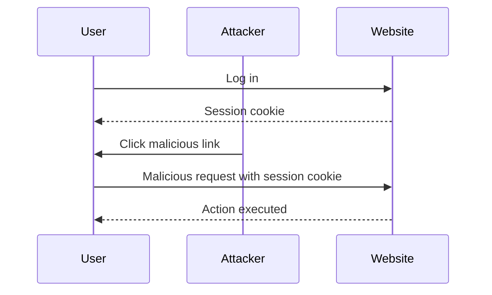
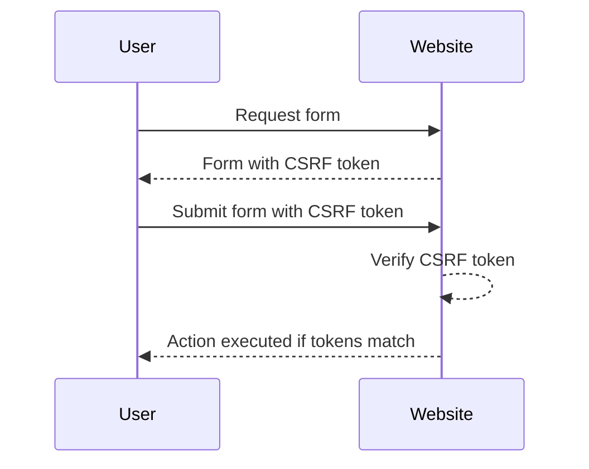

## Cross-Site Request Forgery (CSRF)

Cross-Site Request Forgery (CSRF) is a type of attack that tricks a user's browser into executing an unwanted action on a website where the user is authenticated. This attack leverages the trust that the website has in the user's browser, making it difficult to distinguish between legitimate and malicious requests.

### What is CSRF?

CSRF attacks involve an attacker crafting a malicious request that appears to come from a trusted user. The attacker does not need to know the user's credentials; instead, they rely on the fact that the user is already authenticated with the target website. The attacker then tricks the user into clicking a link or loading a webpage that contains the malicious request.

#### Example Scenario

Consider a banking website where users can transfer money to other accounts. If the website does not implement proper CSRF protection, an attacker could create a malicious link that, when clicked by the user, transfers money from the user's account to the attacker's account.

### How CSRF Works

To understand how CSRF works, let's break down the process:

1. **User Authentication**: The user logs into a website and receives a session cookie.
2. **Malicious Link**: The attacker crafts a malicious link or embeds a script in a webpage.
3. **User Interaction**: The user clicks the malicious link or loads the webpage containing the script.
4. **Request Execution**: The user's browser sends the request to the website, including the session cookie.
5. **Action Execution**: The website executes the action based on the request, assuming it came from the authenticated user.

#### Real-World Example

A notable example of a CSRF attack occurred in the context of social media platforms. In 2014, a CSRF vulnerability was discovered in Facebook, allowing attackers to post unauthorized messages on users' walls. The vulnerability was exploited through a malicious link that, when clicked, posted a predefined message on the user's wall.

### CSRF Tokens

To mitigate CSRF attacks, websites often use CSRF tokens. A CSRF token is a unique, unpredictable value that is generated by the server and sent to the client. The client includes this token in subsequent requests, and the server verifies the token to ensure that the request is legitimate.

#### Token Generation and Verification

1. **Token Generation**: When a user requests a form or a page that requires authentication, the server generates a unique CSRF token and stores it in the session.
2. **Token Storage**: The token is stored in a secure location, such as a session variable or a database.
3. **Token Transmission**: The token is included in the form or page as a hidden field or a custom header.
4. **Token Verification**: When the user submits the form or makes a request, the server checks the token against the stored value. If the tokens match, the request is considered valid.

### CSRF Tokens in Cookies

In some cases, websites store CSRF tokens in cookies. This approach can introduce additional complexities and vulnerabilities, especially if the token is duplicated in both a cookie and a form field.

#### Duplicated Tokens

When a CSRF token is duplicated in both a cookie and a form field, the website must ensure that both tokens are verified correctly. If the verification process is flawed, an attacker might be able to exploit the vulnerability.

### Lab Scenario: CSRF with Duplicated Tokens

In this lab, we encounter a scenario where both the CSRF token and the CSRF cookie are present, and they are not equal. This situation requires careful handling to prevent exploitation.

#### Steps to Exploit

1. **Identify the Tokens**: Determine the location and values of the CSRF token and the CSRF cookie.
2. **Craft the Malicious Request**: Create a request that includes the CSRF token and the CSRF cookie.
3. **Trigger the Request**: Trick the user into triggering the request, either through a link or a script.

### Full HTTP Request and Response

Let's consider a hypothetical example where a user is authenticated with a banking website. The website uses both a CSRF token and a CSRF cookie for protection.

#### Vulnerable Code

```python
# Vulnerable code snippet
def handle_transfer(request):
    csrf_token = request.POST.get('csrf_token')
    csrf_cookie = request.COOKIES.get('csrf_token')
    
    if csrf_token == csrf_cookie:
        # Process the transfer
        pass
    else:
        return HttpResponseForbidden("Invalid CSRF token")
```

#### Malicious Request

An attacker could craft a malicious request that includes both the CSRF token and the CSRF cookie. Here is an example of the full HTTP request:

```http
POST /transfer HTTP/1.1
Host: bank.example.com
Cookie: csrf_token=abc123
Content-Type: application/x-www-form-urlencoded

csrf_token=abc123&amount=1000&to_account=attacker_account
```

#### Full HTTP Response

The server would respond with a `200 OK` status if the tokens match, or a `403 Forbidden` status if they do not match.

```http
HTTP/1.1 200 OK
Date: Mon, 23 Jan 2023 12:00:00 GMT
Server: Apache/2.4.41 (Ubuntu)
Content-Length: 0
Content-Type: text/html; charset=UTF-8
```

### How to Prevent / Defend

#### Secure Coding Fixes

To prevent CSRF attacks, follow these best practices:

1. **Use Unique Tokens**: Ensure that CSRF tokens are unique and unpredictable.
2. **Store Tokens Securely**: Store CSRF tokens securely, such as in a session variable or a database.
3. **Verify Tokens Correctly**: Verify both the CSRF token and the CSRF cookie correctly.
4. **Use SameSite Attribute**: Set the `SameSite` attribute on cookies to prevent them from being sent in cross-site requests.

#### Secure Code Example

Here is an example of secure code that properly handles CSRF tokens:

```python
# Secure code snippet
def handle_transfer(request):
    csrf_token = request.POST.get('csrf_token')
    csrf_cookie = request.COOKIES.get('csrf_token')
    
    if csrf_token == csrf_cookie and validate_csrf_token(csrf_token):
        # Process the transfer
        pass
    else:
        return HttpResponseForbidden("Invalid CSRF token")
```

#### Configuration Hardening

Ensure that your web server and application configurations are hardened against CSRF attacks:

1. **Set `SameSite` Attribute**: Set the `SameSite` attribute on cookies to `Strict` or `Lax`.
2. **Use HTTPS**: Ensure that all communication with the website is encrypted using HTTPS.
3. **Validate Tokens**: Implement robust validation mechanisms for CSRF tokens.

#### Detection

To detect CSRF vulnerabilities, use automated tools and manual testing:

1. **Automated Tools**: Use tools like Burp Suite, OWASP ZAP, or CSRFTester to scan for CSRF vulnerabilities.
2. **Manual Testing**: Manually test forms and actions to ensure that CSRF tokens are properly validated.

### Practice Labs

For hands-on practice with CSRF vulnerabilities, consider the following labs:

- **PortSwigger Web Security Academy**: Offers comprehensive labs on CSRF and other web security topics.
- **OWASP Juice Shop**: Provides a vulnerable web application for practicing various web security techniques.
- **DVWA (Damn Vulnerable Web Application)**: A deliberately insecure web application for learning about web application security.

### Conclusion

CSRF attacks pose a significant threat to web applications, but they can be effectively mitigated through proper implementation of CSRF tokens and secure coding practices. By understanding the mechanics of CSRF attacks and implementing robust defenses, developers can protect their applications from these types of vulnerabilities.

### Diagrams

#### CSRF Attack Sequence Diagram



#### CSRF Token Verification Flow



By thoroughly understanding and implementing these concepts, you can significantly enhance the security of web applications against CSRF attacks.

---
<!-- nav -->
[[02-CSRF Prevention Techniques|CSRF Prevention Techniques]] | [[Web Security (PortSwigger)/04-Cross-Site Request Forgery (CSRF)/07-Lab 6 CSRF where token is duplicated in cookie/00-Overview|Overview]] | [[04-Lab Exercise CSRF Attack with Token Duplicated in Cookie|Lab Exercise CSRF Attack with Token Duplicated in Cookie]]
