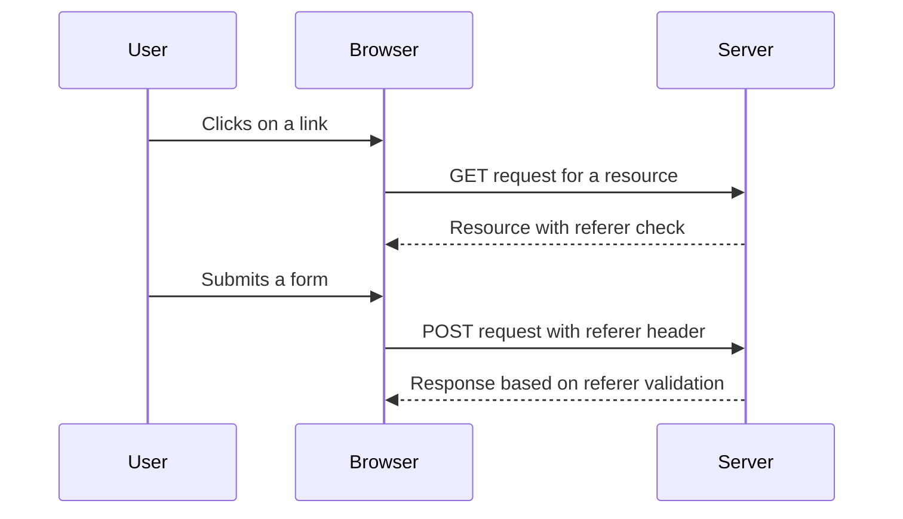

## Referer Header Checks

Referer header checks involve verifying that the request comes from the expected origin. This can help prevent CSRF attacks by ensuring that the request is not coming from a malicious site.

### How Referer Header Checks Work

1. **Header Inspection**: The server inspects the `Referer` header to determine the origin of the request.
2. **Origin Validation**: The server validates that the origin matches the expected value.

### Example Code

Here is an example of how to implement referer header checks in a Node.js application:

```javascript
const express = require('express');
const app = express();

app.use((req, res, next) => {
    const referer = req.headers.referer;
    if (!referer || !referer.includes('example.com')) {
        return res.status(403).send('Invalid referer');
    }
    next();
});

app.post('/submit', (req, res) => {
    // Process the form data
    res.send('Form processed successfully');
});

app.listen(3000, () => {
    console.log('Server listening on port 3000');
});
```

### Diagram of Referer Header Check Flow



---
<!-- nav -->
[[05-Lab Scenario CSRF Token Duplicated in Cookie|Lab Scenario CSRF Token Duplicated in Cookie]] | [[Web Security (PortSwigger)/04-Cross-Site Request Forgery (CSRF)/07-Lab 6 CSRF where token is duplicated in cookie/00-Overview|Overview]] | [[07-SameSite Cookies|SameSite Cookies]]
