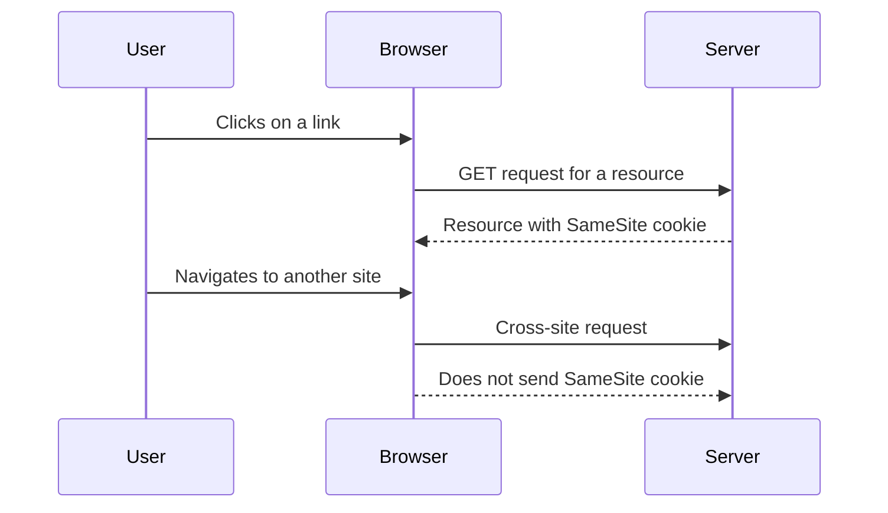

## SameSite Cookies

SameSite cookies are a security feature that helps mitigate CSRF attacks by controlling whether cookies are sent with cross-site requests.

### How SameSite Cookies Work

1. **Strict Mode**: Cookies are only sent with requests originating from the same site.
2. **Lax Mode**: Cookies are sent with top-level navigation requests and safe HTTP methods (GET, HEAD).
3. **None Mode**: Cookies are sent with all requests, but require the `Secure` flag to be set.

### Example Configuration

Here is an example of configuring SameSite cookies in an Apache server:

```apache
<VirtualHost *:80>
    ServerName example.com
    DocumentRoot /var/www/html

    <Directory "/var/www/html">
        Header always set Set-Cookie "HttpOnly; Secure; SameSite=Strict"
    </Directory>
</VirtualHost>
```

### Diagram of SameSite Cookie Flow



---
<!-- nav -->
[[06-Referer Header Checks|Referer Header Checks]] | [[Web Security (PortSwigger)/04-Cross-Site Request Forgery (CSRF)/07-Lab 6 CSRF where token is duplicated in cookie/00-Overview|Overview]] | [[08-Understanding CSRF Tokens|Understanding CSRF Tokens]]
