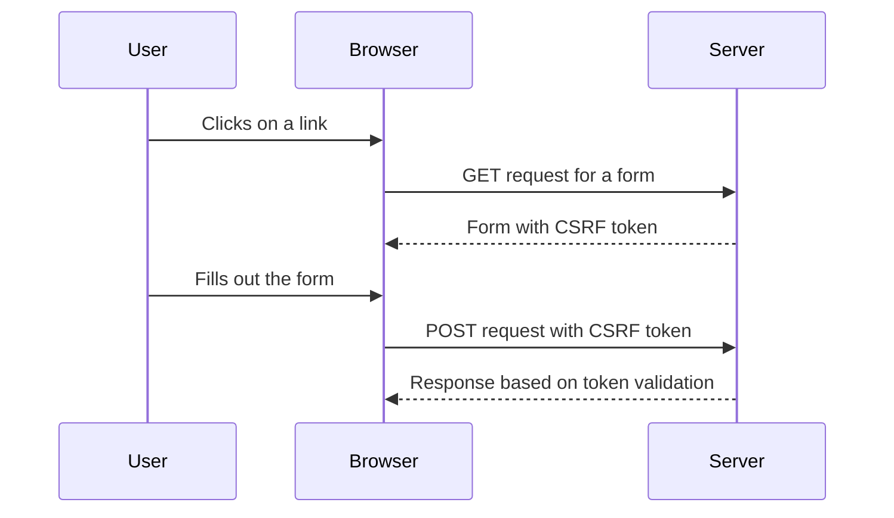

## Understanding CSRF Tokens

CSRF tokens are unique, unpredictable values that are generated for each user session and included in forms and requests. These tokens help ensure that the request is coming from the expected source and not from a malicious actor.

### How CSRF Tokens Work

1. **Token Generation**: When a user logs in, the server generates a unique CSRF token and stores it in the session.
2. **Token Inclusion**: The token is included in the form as a hidden field or in the URL as a parameter.
3. **Token Verification**: When the form is submitted, the server verifies that the token in the request matches the token stored in the session.

### Example Code

Here is an example of how CSRF tokens can be implemented in a web application using Python Flask:

```python
from flask import Flask, session, request, redirect, url_for

app = Flask(__name__)
app.secret_key = 'your_secret_key'

@app.route('/login', methods=['GET', 'POST'])
def login():
    if request.method == 'POST':
        # Generate a CSRF token
        session['csrf_token'] = generate_csrf_token()
        return redirect(url_for('protected'))
    return '''
        <form method="post">
            <input type="submit" value="Login">
        </form>
    '''

@app.route('/protected', methods=['GET', 'POST'])
def protected():
    if request.method == 'POST':
        # Verify the CSRF token
        if request.form.get('csrf_token') != session.get('csrf_token'):
            return "Invalid CSRF token", 403
        # Process the form data
        return "Form processed successfully"
    return f'''
        <form method="post">
            <input type="hidden" name="csrf_token" value="{session['csrf_token']}">
            <input type="text" name="data">
            <input type="submit" value="Submit">
        </form>
    '''

def generate_csrf_token():
    import os
    return os.urandom(16).hex()

if __name__ == '__main__':
    app.run(debug=True)
```

### Diagram of CSRF Token Flow



---
<!-- nav -->
[[07-SameSite Cookies|SameSite Cookies]] | [[Web Security (PortSwigger)/04-Cross-Site Request Forgery (CSRF)/07-Lab 6 CSRF where token is duplicated in cookie/00-Overview|Overview]] | [[Web Security (PortSwigger)/04-Cross-Site Request Forgery (CSRF)/07-Lab 6 CSRF where token is duplicated in cookie/09-Practice Questions & Answers|Practice Questions & Answers]]
