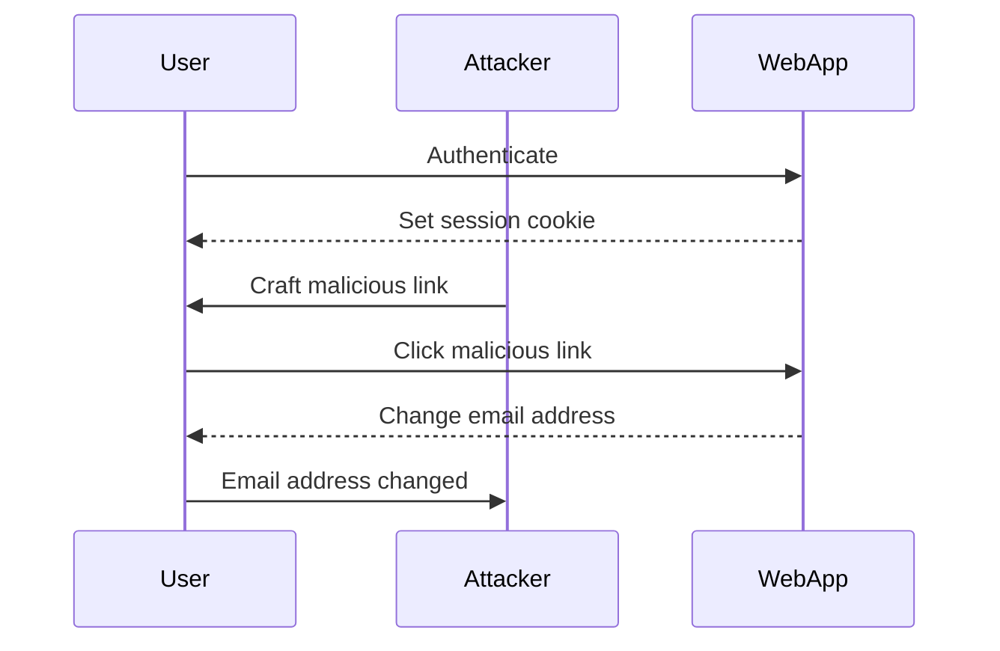
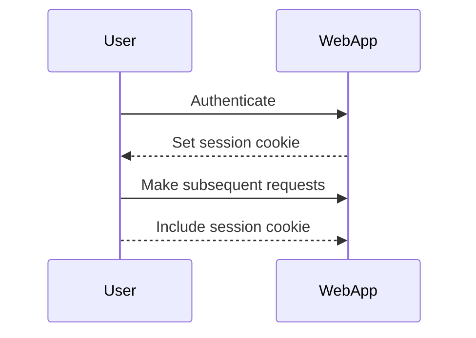
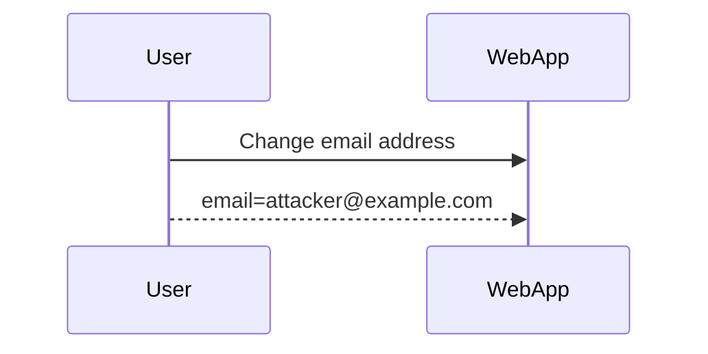
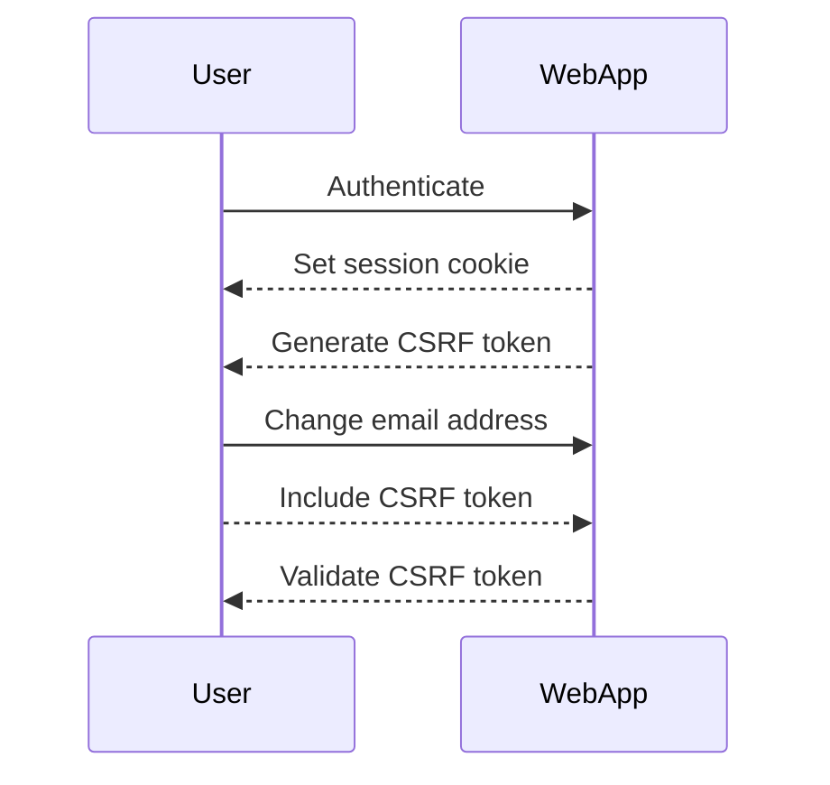
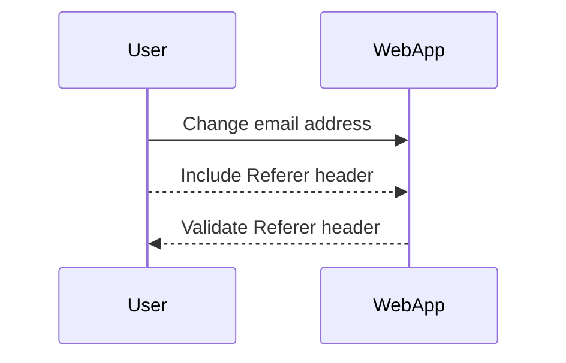
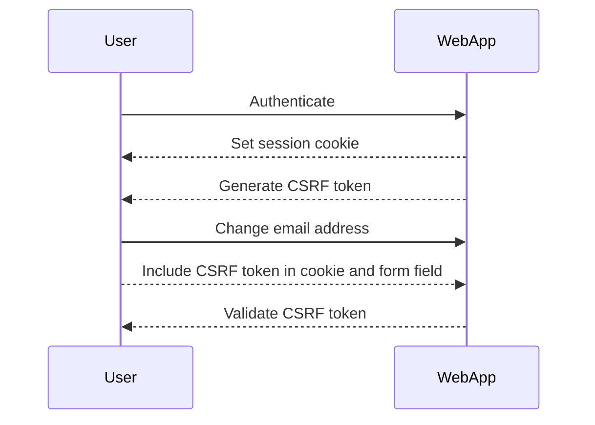

## Cross-Site Request Forgery (CSRF)

Cross-Site Request Forgery (CSRF) is a type of attack that tricks a victim into executing unwanted actions on a web application in which they are currently authenticated. This attack exploits the trust that a web application has in the user's browser cookies. To understand CSRF thoroughly, let's break down the components and mechanisms involved.

### What is CSRF?

CSRF occurs when an attacker tricks a victim into performing an unintended action on a web application where the victim is already authenticated. The attacker does this by crafting a malicious request that appears to come from the victim's browser. Since the victim is authenticated, the web application processes the request as legitimate.

#### Example Scenario

Consider a scenario where a user is logged into their bank account. An attacker crafts a malicious link or embeds a script in a webpage that the user visits. When the user clicks the link or loads the webpage, the browser sends a request to the bank's server to transfer money to the attacker's account. Because the user is already authenticated, the bank's server processes the request as if it came from the user.

### Conditions for CSRF Vulnerability

For a web application to be vulnerable to CSRF, it must satisfy three key conditions:

1. **Relevant Action**: The action performed by the request must have significant consequences. For example, changing an email address or transferring funds.
2. **Cookie-Based Session Handling**: The application must rely on cookies to maintain the user's session.
3. **Predictable Request Parameters**: The request parameters should be predictable or easily guessable.

#### Relevant Action

In the context of the provided transcript, the relevant action is changing the email address. This action is critical because it allows the attacker to gain control over the user's account by resetting the password through the new email address.



#### Cookie-Based Session Handling

The web application must use cookies to manage sessions. This means that the session information is stored in a cookie that is sent with every request made by the user's browser.



#### Predictable Request Parameters

The request parameters should be predictable or easily guessable. In the given example, the only parameter is `email`, which is predictable because the attacker knows the email address they want to set.



### Real-World Examples

Recent real-world examples of CSRF vulnerabilities include:

- **CVE-2021-21972**: A CSRF vulnerability was found in the WordPress REST API, allowing attackers to perform unauthorized actions.
- **CVE-2020-14182**: A CSRF vulnerability in the Cisco Webex Meetings Server allowed attackers to execute arbitrary commands.

These vulnerabilities highlight the importance of implementing proper CSRF protections in web applications.

### Full HTTP Request and Response

Let's look at a complete HTTP request and response for changing an email address.

#### Vulnerable Request

```http
POST /change-email HTTP/1.1
Host: example.com
Cookie: session=abc123
Content-Type: application/x-www-form-urlencoded

email=attacker@example.com
```

#### Vulnerable Response

```http
HTTP/1.1 200 OK
Date: Mon, 20 Mar 2023 12:00:00 GMT
Server: Apache/2.4.41 (Ubuntu)
Content-Length: 27
Content-Type: text/html; charset=UTF-8

Email address changed successfully.
```

### How to Prevent / Defend

To defend against CSRF attacks, several strategies can be employed:

1. **Anti-CSRF Tokens**: Generate a unique token for each session and include it in forms and AJAX requests. Validate the token on the server side.
2. **SameSite Cookies**: Use the `SameSite` attribute to restrict cookies from being sent with cross-site requests.
3. **Referer Header Validation**: Ensure that the `Referer` header is present and matches the expected origin.
4. **Double Submit Cookies**: Include a CSRF token in both a cookie and a form field, and validate them on the server side.

#### Anti-CSRF Tokens

Generate a unique token for each session and include it in forms and AJAX requests. Validate the token on the server side.



#### SameSite Cookies

Use the `SameSite` attribute to restrict cookies from being sent with cross-site requests.

```http
Set-Cookie: session=abc123; SameSite=Strict
```

#### Referer Header Validation

Ensure that the `Referer` header is present and matches the expected origin.



#### Double Submit Cookies

Include a CSRF token in both a cookie and a form field, and validate them on the server side.



### Secure Code Fix

Here is a comparison between the vulnerable and secure versions of the code.

#### Vulnerable Code

```python
@app.route('/change-email', methods=['POST'])
def change_email():
    email = request.form['email']
    # Change email logic
    return "Email address changed successfully."
```

#### Secure Code

```python
@app.route('/change-email', methods=['POST'])
def change_email():
    email = request.form['email']
    csrf_token = request.form['csrf_token']
    if csrf_token != session.get('csrf_token'):
        abort(403)
    # Change email logic
    return "Email address changed successfully."
```

### Detection and Prevention

Detection of CSRF vulnerabilities can be done through automated tools like Burp Suite, OWASP ZAP, and manual testing. Prevention involves implementing the strategies mentioned above and regularly auditing the application for vulnerabilities.

### Hands-On Labs

For hands-on practice with CSRF, consider the following labs:

- **PortSwigger Web Security Academy**: Offers comprehensive modules on CSRF and other web security topics.
- **OWASP Juice Shop**: A deliberately insecure web application for practicing various web security techniques.
- **DVWA (Damn Vulnerable Web Application)**: Provides a range of web vulnerabilities, including CSRF, for educational purposes.

By understanding the mechanics of CSRF and implementing robust defenses, developers can significantly reduce the risk of such attacks compromising their web applications.

---
<!-- nav -->
[[04-Crafting the Malicious Request|Crafting the Malicious Request]] | [[Web Security (PortSwigger)/04-Cross-Site Request Forgery (CSRF)/08-Lab 7 CSRF where Referer validation depends on header being present/00-Overview|Overview]] | [[Web Security (PortSwigger)/04-Cross-Site Request Forgery (CSRF)/08-Lab 7 CSRF where Referer validation depends on header being present/06-How to Prevent  Defend Against CSRF|How to Prevent  Defend Against CSRF]]
