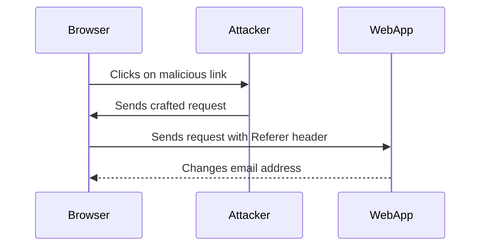

## Understanding the Lab Environment

In this lab, we will explore a CSRF vulnerability in an email change functionality. The lab environment consists of a web application where users can log in and change their email addresses. The vulnerability arises from improper validation of the `Referer` header, which allows an attacker to craft a malicious request that bypasses the validation.

### Setting Up the Lab

To begin, we need to log into the web application using the provided credentials. The credentials are typically stored in a secure location, such as a password manager or a secure note.

```plaintext
Username: user@example.com
Password: password123
```

Once logged in, navigate to the "My Account" section to access the email change functionality.

### Identifying the Vulnerability

The email change functionality is vulnerable to CSRF due to improper validation of the `Referer` header. When a user changes their email address, the request is intercepted by Burp Suite Professional, which allows us to analyze the request and craft a malicious one.

#### Intercepting the Request

To intercept the request, we need to configure Foxy Proxy to send requests to Burp Suite. This can be done by setting up Foxy Proxy to use Burp Suite as the proxy server.

```plaintext
Proxy Server: localhost
Port: 8080
```

Once configured, change the email address to `test@us.ca` and observe the request in Burp Suite. The request should be intercepted and displayed in the proxy tab.

### Analyzing the Request

The intercepted request contains the following details:

```http
POST /change-email HTTP/1.1
Host: vulnerable-app.example.com
User-Agent: Mozilla/5.0 (Windows NT 10.0; Win64; x64) AppleWebKit/537.36 (KHTML, like Gecko) Chrome/91.0.4472.124 Safari/537.36
Content-Type: application/x-www-form-urlencoded
Referer: http://vulnerable-app.example.com/my-account
Content-Length: 28

email=test%40us.ca&submit=Change+Email
```

#### Key Headers

- **Host**: Specifies the target host.
- **User-Agent**: Identifies the client making the request.
- **Content-Type**: Indicates the format of the data being sent.
- **Referer**: Contains the URL of the page that linked to the current resource.
- **Content-Length**: Specifies the length of the body in bytes.

### Crafting the Malicious Request

To exploit the vulnerability, we need to craft a malicious request that mimics the legitimate one. The key is to ensure that the `Referer` header is set correctly to bypass the validation.

```http
POST /change-email HTTP/1.1
Host: vulnerable-app.example.com
User-Agent: Mozilla/5.0 (Windows NT 10.0; Win64; x64) AppleWebKit/537.36 (KHTML, like Gecko) Chrome/91.0.4472.124 Safari/537.36
Content-Type: application/x-www-form-urlencoded
Referer: http://vulnerable-app.example.com/my-account
Content-Length: 28

email=test%40us.ca&submit=Change+Email
```

### Testing the Exploit

To test the exploit, we can use Burp Suite's Repeater tool to send the crafted request. Ensure that the `Referer` header is set correctly and that the request is sent to the correct endpoint.



### Verifying the Exploit

After sending the request, verify that the email address has been changed successfully. Navigate to the "My Account" section and check the updated email address.

---
<!-- nav -->
[[06-Lab Setup CSRF with Broken Referer Validation|Lab Setup CSRF with Broken Referer Validation]] | [[Web Security (PortSwigger)/04-Cross-Site Request Forgery (CSRF)/09-Lab 8 CSRF with broken Referer validation/00-Overview|Overview]] | [[Web Security (PortSwigger)/04-Cross-Site Request Forgery (CSRF)/09-Lab 8 CSRF with broken Referer validation/08-Practice Questions & Answers|Practice Questions & Answers]]
