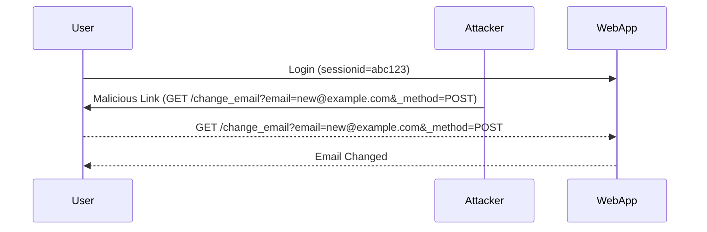

## Cross-Site Request Forgery (CSRF)

Cross-Site Request Forgery (CSRF) is a type of attack that tricks a victim into executing unwanted actions on a web application in which they are authenticated. This can happen when an attacker crafts a malicious request that appears to come from the victim, exploiting the trust that the web application has in the victim's session.

### Understanding CSRF

#### What is CSRF?

CSRF attacks leverage the trust that a web application places in a user's session. When a user logs into a web application, their browser stores a session cookie that identifies them to the server. An attacker can craft a malicious request that includes this session cookie, making the web application believe that the request is coming from the authenticated user.

#### Why Does CSRF Matter?

CSRF attacks can have severe consequences, including:

- **Financial Loss**: An attacker might trick a user into transferring money from their bank account.
- **Data Manipulation**: An attacker might change a user's email address, password, or other sensitive information.
- **Account Takeover**: An attacker might reset a user's password and take control of their account.

#### How Does CSRF Work?

To understand how CSRF works, consider the following scenario:

1. **User Authentication**: A user logs into a web application and receives a session cookie.
2. **Malicious Request**: An attacker crafts a malicious request that includes the session cookie.
3. **Execution**: The web application processes the request as if it came from the authenticated user.

### SameSite Attribute and CSRF Protection

The `SameSite` attribute is a security feature introduced to mitigate CSRF attacks. It controls whether a cookie should be sent with cross-site requests.

#### SameSite Lax

The `SameSite=Lax` attribute restricts the sending of cookies with cross-site requests, except for certain safe methods like `GET`. This means that cookies will not be sent with cross-site POST requests, which helps prevent CSRF attacks.

However, `SameSite=Lax` can be bypassed in certain scenarios, particularly when the attacker can force the user to perform a top-level navigation.

### Bypassing SameSite Lax via Method Override

In the given lecture, the attacker bypasses the `SameSite=Lax` protection by using a method override technique. This involves changing the HTTP method used in the request to bypass the restrictions imposed by `SameSite`.

#### Method Override Technique

Method override is a technique used by some web frameworks to allow the use of non-standard HTTP methods (like `PUT` or `DELETE`) over standard HTTP methods (`POST` or `GET`). This is often done by including a special parameter in the request, such as `_method=PUT`.

In the context of the lecture, the attacker uses the `_method` parameter to override the HTTP method from `GET` to `POST`, effectively bypassing the `SameSite=Lax` restriction.

#### Example of Method Override

Consider the following example where an attacker tries to change the email address of a user:

```http
GET /change_email?email=new@example.com&_method=POST HTTP/1.1
Host: vulnerableapp.com
Cookie: sessionid=abc123
```

Here, the `_method=POST` parameter overrides the `GET` method to `POST`, allowing the request to bypass the `SameSite=Lax` restriction.

### Real-World Examples

#### Recent Breaches and CVEs

Several recent breaches and CVEs have highlighted the importance of proper CSRF protection:

- **CVE-2021-21972**: A CSRF vulnerability in WordPress allowed attackers to create new users with admin privileges.
- **CVE-2022-22965**: A CSRF vulnerability in Joomla allowed attackers to execute arbitrary commands on the server.

These examples demonstrate the real-world impact of CSRF vulnerabilities and the importance of implementing robust protections.

### Detailed Walkthrough

Let's walk through the steps described in the lecture in detail:

1. **Initial Request**:
    - The attacker crafts a malicious request to change the email address.
    - The request is initially sent as a `POST` request.

    ```http
    POST /change_email HTTP/1.1
    Host: vulnerableapp.com
    Cookie: sessionid=abc123
    Content-Type: application/x-www-form-urlencoded

    email=new@example.com
    ```

2. **Bypassing SameSite Lax**:
    - The attacker changes the request method to `GET` and adds the `_method` parameter to override the method to `POST`.

    ```http
    GET /change_email?email=new@example.com&_method=POST HTTP/1.1
    Host: vulnerableapp.com
    Cookie: sessionid=abc123
    ```

3. **Verification**:
    - The attacker verifies that the email address has been changed by checking the response.

### Mermaid Diagrams

#### Attack Flow Diagram



### Pitfalls and Common Mistakes

#### Common Pitfalls

- **Ignoring Non-Standard Methods**: Some developers might not consider non-standard HTTP methods like `PUT` or `DELETE`, leading to vulnerabilities.
- **Over-reliance on SameSite**: Relying solely on `SameSite` attributes without additional protections can leave applications vulnerable to bypass techniques.

### How to Prevent / Defend

#### Detection

- **Logging and Monitoring**: Implement logging and monitoring to detect unusual activity, such as unexpected changes to user data.
- **Security Tools**: Use security tools like Burp Suite or OWASP ZAP to scan for CSRF vulnerabilities.

#### Prevention

- **CSRF Tokens**: Implement CSRF tokens to ensure that requests are legitimate. Each form submission should include a unique token that is validated on the server.
- **HTTP Headers**: Use the `X-Requested-With` header to ensure that requests are made from the same origin.
- **SameSite Strict**: Consider using `SameSite=Strict` for stricter protection against CSRF attacks.

#### Secure Coding Fixes

##### Vulnerable Code

```python
@app.route('/change_email', methods=['POST'])
def change_email():
    email = request.form['email']
    # Change email logic here
    return redirect('/my_account')
```

##### Secure Code

```python
from flask import Flask, request, redirect, session

app = Flask(__name__)
app.secret_key = 'your_secret_key'

@app.route('/change_email', methods=['POST'])
def change_email():
    csrf_token = session.pop('csrf_token', None)
    if not csrf_token or csrf_token != request.form.get('csrf_token'):
        abort(403)
    
    email = request.form['email']
    # Change email logic here
    return redirect('/my_account')

@app.before_request
def generate_csrf_token():
    if 'csrf_token' not in session:
        session['csrf_token'] = str(uuid.uuid4())
```

### Complete Example

#### Full HTTP Request and Response

##### Vulnerable Request

```http
GET /change_email?email=new@example.com&_method=POST HTTP/1.1
Host: vulnerableapp.com
Cookie: sessionid=abc123
```

##### Vulnerable Response

```http
HTTP/1.1 302 Found
Location: /my_account
Set-Cookie: sessionid=abc123; Path=/; SameSite=Lax
Content-Length: 0
```

##### Secure Request

```http
POST /change_email HTTP/1.1
Host: secureapp.com
Cookie: sessionid=abc123
Content-Type: application/x-www-form-urlencoded

email=new@example.com&csrf_token=unique_token_value
```

##### Secure Response

```http
HTTP/1.1 302 Found
Location: /my_account
Set-Cookie: sessionid=abc123; Path=/; SameSite=Lax
Content-Length: 0
```

### Hands-On Labs

For hands-on practice with CSRF and SameSite Lax bypass, consider the following labs:

- **PortSwigger Web Security Academy**: Offers detailed labs on CSRF and SameSite attributes.
- **OWASP Juice Shop**: Provides a vulnerable web application for practicing various security attacks, including CSRF.
- **DVWA (Damn Vulnerable Web Application)**: Contains a variety of web application vulnerabilities, including CSRF.

### Conclusion

Understanding and preventing CSRF attacks is crucial for maintaining the security of web applications. By implementing robust protections like CSRF tokens and using the `SameSite` attribute correctly, developers can significantly reduce the risk of these attacks. Regularly testing and monitoring applications can help detect and mitigate potential vulnerabilities.

---
<!-- nav -->
[[Web Security (PortSwigger)/04-Cross-Site Request Forgery (CSRF)/10-Lab 9 SameSite Lax bypass via method override/01-Introduction to Cross-Site Request Forgery (CSRF)|Introduction to Cross-Site Request Forgery (CSRF)]] | [[Web Security (PortSwigger)/04-Cross-Site Request Forgery (CSRF)/10-Lab 9 SameSite Lax bypass via method override/00-Overview|Overview]] | [[03-SameSite Lax Configuration|SameSite Lax Configuration]]
