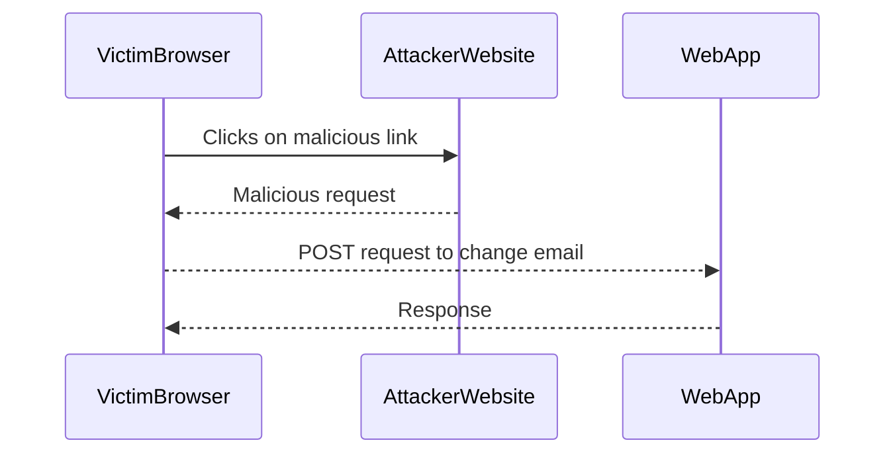

## Introduction to Cross-Site Request Forgery (CSRF)

Cross-Site Request Forgery (CSRF) is a type of attack that tricks a user's browser into executing unwanted actions on a web application in which the user is currently authenticated. This attack exploits the trust that a web application places in the user's browser. The attacker does not need to steal the user's session cookie; instead, they leverage the fact that the user is already authenticated to the web application.

### What is CSRF?

CSRF attacks involve an attacker crafting a malicious request that will be executed by the victim's browser. The request is typically embedded in a link, image, or script that the victim clicks on or loads. Since the victim is already authenticated to the web application, the web application will execute the request as if it came from the victim.

### Why Does CSRF Matter?

CSRF attacks can lead to unauthorized actions such as changing passwords, transferring funds, or posting messages. These actions can have serious consequences, especially if the web application handles sensitive data or financial transactions.

### How Does CSRF Work Under the Hood?

To understand how CSRF works, consider the following scenario:

1. **Victim Authentication**: The victim logs into a web application and receives a session cookie.
2. **Malicious Request**: The attacker crafts a malicious request that will be executed by the victim's browser.
3. **Victim Interaction**: The victim interacts with the malicious request, either by clicking on a link or loading an image.
4. **Request Execution**: The victim's browser sends the malicious request to the web application, which executes the request because the victim is authenticated.

### Real-World Example: CVE-2021-21972

In 2021, a CSRF vulnerability was discovered in the WordPress REST API (CVE-2021-21972). This vulnerability allowed attackers to create new users or modify existing ones without needing to know the user's password. The attack could be executed by tricking a logged-in administrator into clicking on a malicious link.

### Common Mistakes and Pitfalls

One common mistake is assuming that HTTPS alone protects against CSRF. While HTTPS encrypts the communication between the browser and the server, it does not prevent the browser from sending malicious requests. Another pitfall is relying solely on user education to prevent CSRF attacks. Users may inadvertently interact with malicious requests, making technical defenses essential.

---
<!-- nav -->
[[Web Security (PortSwigger)/04-Cross-Site Request Forgery (CSRF)/11-Lab 10 SameSite Strict bypass via client side redirect/00-Overview|Overview]] | [[02-Lab 10 SameSite Strict Bypass via Client-Side Redirect|Lab 10 SameSite Strict Bypass via Client-Side Redirect]]
