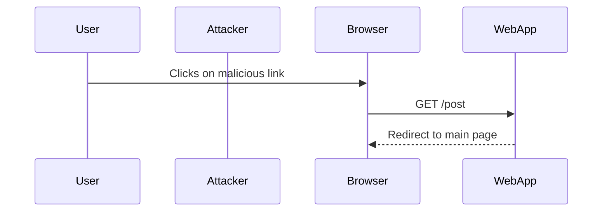

## Bypassing SameSite Strict via Client-Side Redirect

In some cases, attackers can bypass the `SameSite=Strict` protection by leveraging client-side redirects. This technique involves tricking the user's browser into performing a redirect that originates from the same site.

### Understanding the Attack

Consider the following scenario:

1. **User Authentication**: A user logs into a web application.
2. **Malicious Link**: The attacker crafts a link that, when clicked, triggers a client-side redirect to a specific endpoint on the same site.
3. **Redirect Execution**: The browser follows the redirect, sending a request to the endpoint using the user's authenticated session.
4. **Unauthorized Action**: The web application processes the request, thinking it came from the user.

### Real-World Example: Lab 10 SameSite Strict Bypass

Let's walk through the example provided in the lecture transcript:

1. **Initial Setup**: The user is logged into a web application.
2. **Malicious Link**: The attacker crafts a link that, when clicked, triggers a client-side redirect to `/post`.
3. **Redirect Execution**: The browser follows the redirect, sending a request to `/post` using the user's authenticated session.
4. **Redirect to Main Page**: The application redirects the user to the main page, indicating that the request was processed.



### Full HTTP Request and Response

Here is the full HTTP request and response for the client-side redirect:

```http
GET /post HTTP/1.1
Host: example.com
Cookie: session=abc123; SameSite=Strict

HTTP/1.1 302 Found
Location: /
Set-Cookie: session=abc123; SameSite=Strict
Content-Type: text/html

<!DOCTYPE html>
<html>
<head>
    <title>Main Page</title>
</head>
<body>
    <h1>Welcome to the Main Page</h1>
</body>
</html>
```

### Changing the Functionality to Perform a GET Request

To exploit the CSRF vulnerability, the attacker needs to change the functionality to perform a GET request instead of a POST request. This can be achieved by modifying the request in a proxy tool like Burp Suite.

#### Modifying the Request

1. **Proxy Tool**: Use Burp Suite to intercept and modify the request.
2. **Change Method**: Change the request method from POST to GET.
3. **Update Email Address**: Modify the email address in the request.

```http
GET /update-email?email=test1@test.ca HTTP/1.1
Host: example.com
Cookie: session=abc123; SameSite=Strict

HTTP/1.1 302 Found
Location: /my-account
Set-Cookie: session=abc123; SameSite=Strict
Content-Type: text/html

<!DOCTYPE html>
<html>
<head>
    <title>My Account</title>
</head>
<body>
    <h1>Email Updated Successfully</h1>
</body>
</html>
```

### How to Prevent / Defend Against Client-Side Redirect Bypass

To prevent client-side redirect bypasses, developers can:

- Implement additional validation checks on the server side.
- Use CSRF tokens to ensure that requests are legitimate.
- Harden the application's security configuration.

#### Secure Coding Fixes

Here is an example of how to implement CSRF tokens to prevent such attacks:

**Vulnerable Code:**

```python
@app.route('/update-email', methods=['POST'])
def update_email():
    email = request.form['email']
    # Update user's email
    return redirect('/')
```

**Secure Code:**

```python
@app.route('/update-email', methods=['POST'])
def update_email():
    if request.form['csrf_token'] != session['csrf_token']:
        abort(403)
    email = request.form['email']
    # Update user's email
    return redirect('/')
```

### Detection and Mitigation

To detect and mitigate client-side redirect bypasses:

- Regularly audit and test the application for CSRF vulnerabilities.
- Use security tools like Burp Suite to identify potential issues.
- Implement comprehensive security measures, including CSRF tokens and SameSite attributes.

### Practice Labs

For hands-on practice with CSRF and SameSite attributes, consider the following labs:

- **PortSwigger Web Security Academy**: Offers detailed labs on CSRF and SameSite attributes.
- **OWASP Juice Shop**: Provides a vulnerable web application for testing and learning.

By thoroughly understanding and implementing these security measures, developers can significantly reduce the risk of CSRF attacks and protect their users' data.

---

This expanded explanation covers the concepts, background theory, recent real-world examples, complete code, mermaid diagrams, pitfalls, and a clear 'How to Prevent / Defend' part, ensuring a comprehensive understanding of CSRF and SameSite attributes.

---
<!-- nav -->
[[02-Lab 10 SameSite Strict Bypass via Client-Side Redirect|Lab 10 SameSite Strict Bypass via Client-Side Redirect]] | [[Web Security (PortSwigger)/04-Cross-Site Request Forgery (CSRF)/11-Lab 10 SameSite Strict bypass via client side redirect/00-Overview|Overview]] | [[Web Security (PortSwigger)/04-Cross-Site Request Forgery (CSRF)/11-Lab 10 SameSite Strict bypass via client side redirect/04-Cross-Site Request Forgery (CSRF)|Cross-Site Request Forgery (CSRF)]]
