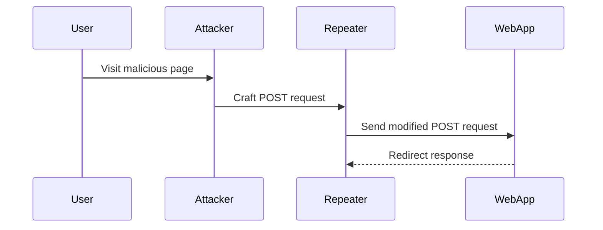
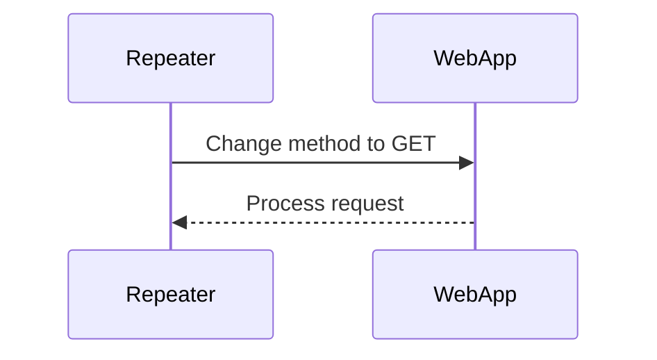

## Cross-Site Request Forgery (CSRF)

### Introduction to CSRF

Cross-Site Request Forgery (CSRF) is a type of attack that tricks a user's browser into executing an unwanted action on a web application in which the user is currently authenticated. This can lead to unauthorized actions being performed on behalf of the user, such as changing their password, transferring funds, or posting content.

#### How CSRF Works

To understand CSRF, let's break down the process:

1. **User Authentication**: The user logs into a web application and receives a session cookie.
2. **Malicious Action**: An attacker crafts a malicious request that performs an action on the web application.
3. **Triggering the Request**: The attacker convinces the user to visit a page controlled by the attacker. This page contains a hidden form or JavaScript that triggers the malicious request.
4. **Browser Execution**: The user's browser sends the request to the web application, including the session cookie, which authenticates the request.

#### Example Scenario

Consider a banking application where a user is logged in and has a session cookie. An attacker creates a webpage with a hidden form that submits a transfer request to the bank's server. If the user visits this page, the browser will automatically submit the form, transferring money from the user's account.

### SameSite Attribute and CSRF Mitigation

The `SameSite` attribute is a security feature introduced to mitigate CSRF attacks. It controls whether a cookie is sent with cross-site requests. There are three possible values for the `SameSite` attribute:

- **Strict**: The cookie is only sent with requests initiated from the same site. This effectively prevents CSRF attacks.
- **Lax**: The cookie is sent with top-level navigation, but not with subresource requests. This provides some protection against CSRF while allowing certain legitimate uses.
- **None**: The cookie is sent with all requests, regardless of origin. This value requires the `Secure` attribute to ensure the cookie is only sent over HTTPS.

#### SameSite Strict Bypass via Client-Side Redirect

In the given scenario, the web application uses the `SameSite=Strict` attribute for its cookies. However, the attacker can bypass this protection using a client-side redirect. Here’s how it works:

1. **Initial Request**: The attacker crafts a POST request to the web application.
2. **Client-Side Redirect**: Instead of sending the request directly, the attacker uses JavaScript to perform a client-side redirect to the web application.
3. **Application Response**: The web application processes the request and redirects the user back to the attacker's page.

By using a client-side redirect, the request originates from the same site, bypassing the `SameSite=Strict` restriction.

### Detailed Walkthrough

Let's walk through the steps described in the lecture transcript:

1. **Identify the POST Request**:
    - The initial request is a POST method.
    - The request is sent to the repeater tool to analyze and modify it.



2. **Modify the Request Method**:
    - Right-click the request in the repeater tool and change the method to GET.
    - Ensure the email is unique to avoid conflicts.



3. **Perform the Client-Side Redirect**:
    - Copy the modified request URL.
    - Use JavaScript to perform a client-side redirect.

```javascript
<script>
document.location = "https://example.com/change-email?email=test2@test.com";
</script>
```

4. **URL Encoding**:
    - Ensure the URL is properly encoded, especially for special characters like `&`.

```javascript
<script>
document.location = "https://example.com/change-email?email=test2@test.com%26action=submit";
</script>
```

### Full HTTP Request and Response

Here is the complete HTTP request and response for the client-side redirect:

#### HTTP Request

```http
GET /change-email?email=test2@test.com&action=submit HTTP/1.1
Host: example.com
Cookie: session=abc123
```

#### HTTP Response

```http
HTTP/1.1 302 Found
Location: https://example.com/profile
Content-Type: text/html; charset=UTF-8

<!DOCTYPE html>
<html>
<head>
<title>Redirecting...</title>
</head>
<body>
<p>You are being redirected to <a href="https://example.com/profile">your profile</a>.</p>
</body>
</html>
```

### Real-World Examples

#### Recent CVEs and Breaches

- **CVE-2021-31166**: A CSRF vulnerability was found in the WordPress plugin "WP Simple Pay." Attackers could trick users into making unauthorized payments.
- **Breaches**: In 2022, a CSRF vulnerability in a popular e-commerce platform allowed attackers to manipulate user orders.

### How to Prevent / Defend Against CSRF

#### Detection

- **Logging and Monitoring**: Implement logging and monitoring to detect unusual activity patterns.
- **Security Tools**: Use security tools like Burp Suite or OWASP ZAP to identify potential CSRF vulnerabilities.

#### Prevention

- **Token-Based Protection**: Use anti-CSRF tokens to ensure that requests are legitimate.
- **SameSite Attribute**: Set the `SameSite` attribute to `Strict` or `Lax` to prevent cross-site requests.

#### Secure Coding Fixes

##### Vulnerable Code

```python
@app.route('/change-email', methods=['POST'])
def change_email():
    new_email = request.form['email']
    # Update user's email
    return redirect('/profile')
```

##### Fixed Code

```python
from flask import session, request, redirect, url_for

@app.route('/change-email', methods=['POST'])
def change_email():
    token = session.pop('csrf_token', None)
    if not token or token != request.form.get('csrf_token'):
        abort(403)
    new_email = request.form['email']
    # Update user's email
    return redirect(url_for('profile'))
```

### Configuration Hardening

#### Web Server Configuration

Ensure your web server is configured to set the `SameSite` attribute correctly.

```nginx
server {
    listen 443 ssl;
    server_name example.com;

    location / {
        add_header Set-Cookie "session=abc123; SameSite=Strict";
    }
}
```

### Practice Labs

For hands-on practice with CSRF and SameSite attributes, consider the following labs:

- **PortSwigger Web Security Academy**: Offers comprehensive labs on CSRF and SameSite attributes.
- **OWASP Juice Shop**: Provides a vulnerable web application for testing and learning about CSRF.

### Conclusion

Cross-Site Request Forgery (CSRF) is a significant security threat that can be mitigated through proper implementation of security measures like the `SameSite` attribute and anti-CSRF tokens. Understanding the mechanics of these attacks and how to defend against them is crucial for securing web applications.

---
<!-- nav -->
[[03-Bypassing SameSite Strict via Client-Side Redirect|Bypassing SameSite Strict via Client-Side Redirect]] | [[Web Security (PortSwigger)/04-Cross-Site Request Forgery (CSRF)/11-Lab 10 SameSite Strict bypass via client side redirect/00-Overview|Overview]] | [[Web Security (PortSwigger)/04-Cross-Site Request Forgery (CSRF)/11-Lab 10 SameSite Strict bypass via client side redirect/05-How to Prevent  Defend Against CSRF Attacks|How to Prevent  Defend Against CSRF Attacks]]
