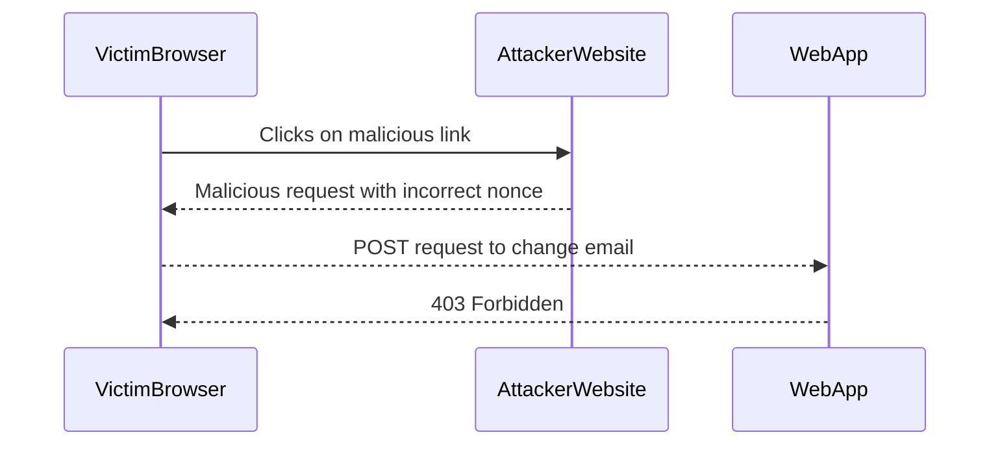

## How to Prevent / Defend Against CSRF Attacks

### Detection

To detect CSRF attacks, web applications can implement logging and monitoring of suspicious activities. For example, if a user's account suddenly changes email addresses or performs other unusual actions, this could indicate a CSRF attack.

### Prevention

To prevent CSRF attacks, web applications should implement the following measures:

1. **Use Anti-CSRF Tokens**: Generate unique tokens for each user session and validate them on the server side.
2. **Set Secure Headers**: Ensure that cookies are marked with `SameSite=Strict` and `Secure`.
3. **Validate Origin**: Check the origin of requests to ensure they come from trusted sources.
4. **Educate Users**: Inform users about the risks of clicking on suspicious links and encourage them to report any unusual activity.

### Secure Coding Fixes

Here is an example of how to implement anti-CSRF tokens in a web application.

#### Vulnerable Code

```python
@app.route('/change-email', methods=['POST'])
def change_email():
    new_email = request.form['new_email']
    # Change email logic here
    return "Email changed successfully"
```

#### Secure Code

```python
import secrets

@app.route('/change-email', methods=['POST'])
def change_email():
    new_email = request.form['new_email']
    csrf_token = request.form['csrf_token']
    
    if csrf_token != session.get('csrf_token'):
        abort(403)
    
    # Change email logic here
    return "Email changed successfully"

@app.before_request
def generate_csrf_token():
    if 'csrf_token' not in session:
        session['csrf_token'] = secrets.token_hex(16)
```

### Configuration Hardening

Ensure that your web server and application configurations are hardened against CSRF attacks. For example, configure your web server to enforce `SameSite=Strict` and `Secure` attributes for cookies.

```nginx
server {
    listen 443 ssl;
    server_name webapp.example.com;

    ssl_certificate /etc/ssl/certs/webapp.crt;
    ssl_certificate_key /etc/ssl/private/webapp.key;

    location / {
        add_header Set-Cookie "session=$cookie_value; SameSite=Strict; Secure";
    }
}
```

### Mitigations

Implement additional mitigations such as rate limiting and IP blocking to prevent automated CSRF attacks.

### Real-World Example: CVE-2021-21972

In the case of CVE-2021-21972, WordPress implemented additional CSRF protections by requiring nonce validation for certain actions. This ensured that even if an attacker crafted a malicious request, it would fail without the correct nonce.



---
<!-- nav -->
[[Web Security (PortSwigger)/04-Cross-Site Request Forgery (CSRF)/11-Lab 10 SameSite Strict bypass via client side redirect/04-Cross-Site Request Forgery (CSRF)|Cross-Site Request Forgery (CSRF)]] | [[Web Security (PortSwigger)/04-Cross-Site Request Forgery (CSRF)/11-Lab 10 SameSite Strict bypass via client side redirect/00-Overview|Overview]] | [[Web Security (PortSwigger)/04-Cross-Site Request Forgery (CSRF)/11-Lab 10 SameSite Strict bypass via client side redirect/06-Practice Labs|Practice Labs]]
