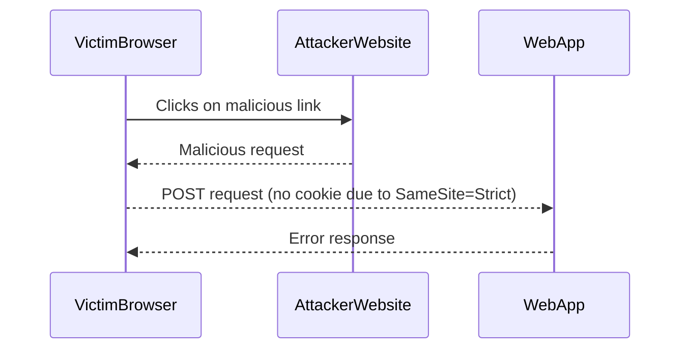

## SameSite Attribute and CSRF Protection

The SameSite attribute is a security feature introduced by browsers to mitigate CSRF attacks. It controls whether cookies should be sent along with cross-origin requests.

### What is the SameSite Attribute?

The SameSite attribute can have three values: `Strict`, `Lax`, and `None`.

- **Strict**: Cookies are only sent with first-party requests. Cross-origin requests do not send these cookies.
- **Lax**: Cookies are sent with first-party requests and some cross-origin requests, such as GET requests that could be initiated by links.
- **None**: Cookies are sent with all requests, both first-party and cross-origin.

### How Does SameSite Work?

When a cookie is marked with the `SameSite=Strict` attribute, it will only be sent with requests originating from the same site. This means that if an attacker tries to craft a malicious request from a different domain, the cookie will not be included, and the request will fail.

### Real-World Example: Google's SameSite Update

In 2019, Google announced that Chrome would default to `SameSite=Lax` for cookies. This change significantly reduced the effectiveness of CSRF attacks but did not eliminate them entirely. Some applications still needed to set `SameSite=None` for certain functionalities, which required additional security measures.

### Common Mistakes and Pitfalls

One common mistake is setting `SameSite=None` without also requiring the `Secure` attribute. This combination allows cookies to be sent over HTTP, which can be intercepted by attackers. Another pitfall is not testing the impact of `SameSite` settings on legitimate cross-origin requests, such as those used by Single Sign-On (SSO) systems.

---
<!-- nav -->
[[Web Security (PortSwigger)/04-Cross-Site Request Forgery (CSRF)/11-Lab 10 SameSite Strict bypass via client side redirect/06-Practice Labs|Practice Labs]] | [[Web Security (PortSwigger)/04-Cross-Site Request Forgery (CSRF)/11-Lab 10 SameSite Strict bypass via client side redirect/00-Overview|Overview]] | [[08-SameSite Strict Bypass via Client-Side Redirect|SameSite Strict Bypass via Client-Side Redirect]]
