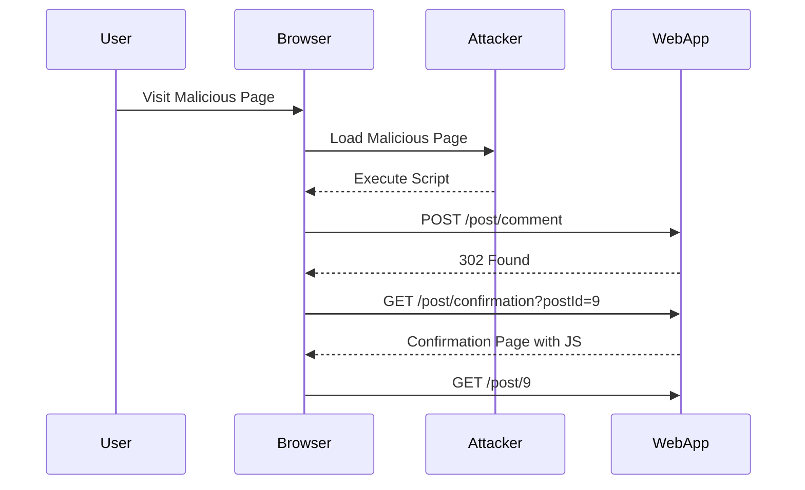

## SameSite Strict Bypass via Client-Side Redirect

In this section, we delve into a specific technique used to bypass the SameSite strict cookie attribute, which is designed to mitigate CSRF attacks. The technique involves leveraging client-side redirects to manipulate the browser's behavior.

### Background Theory

The SameSite attribute is a security feature introduced to prevent CSRF attacks. It controls whether a cookie is sent with cross-site requests. There are three values for the SameSite attribute:

- **Strict**: The cookie is only sent with first-party requests.
- **Lax**: The cookie is sent with first-party requests and some cross-site requests (e.g., top-level navigations).
- **None**: The cookie is sent with all requests, but requires the Secure flag.

### Client-Side Redirects

A client-side redirect is a mechanism where JavaScript is used to change the browser's location. This can be achieved using `window.location` or `document.location`.

#### Example Code

```javascript
// Example of a client-side redirect
window.location = "https://example.com/new-page";
```

### Lab Setup

Consider a web application that allows users to post comments. The application uses SameSite strict cookies to prevent CSRF attacks. However, the application also uses client-side redirects to navigate between pages.

#### HTTP Request and Response

Let's examine the HTTP request and response involved in posting a comment.

```http
POST /post/comment HTTP/1.1
Host: example.com
Content-Type: application/x-www-form-urlencoded
Cookie: session=abc123

postId=9&comment=Hello%20World
```

```http
HTTP/1.1 302 Found
Location: /post/confirmation?postId=9
Set-Cookie: session=abc123; SameSite=Strict; Secure
```

### JavaScript Analysis

Upon receiving the 302 response, the browser navigates to the confirmation page. The confirmation page contains JavaScript that performs a client-side redirect.

#### JavaScript Code

```html
<script>
    setTimeout(function() {
        var postId = new URLSearchParams(window.location.search).get('postId');
        window.location = '/post/' + postId;
    }, 1000);
</script>
```

### Exploitation Technique

An attacker can exploit this client-side redirect to bypass the SameSite strict cookie protection. By crafting a malicious page that mimics the client-side redirect, the attacker can trick the browser into sending a cross-site request with the SameSite strict cookie.

#### Malicious Page

```html
<!DOCTYPE html>
<html>
<head>
    <title>Malicious Page</title>
</head>
<body>
    <script>
        setTimeout(function() {
            var postId = new URLSearchParams(window.location.search).get('postId');
            window.location = 'https://example.com/post/' + postId;
        }, 1000);
    </script>
</body>
</html>
```

### Attack Chain Diagram



### Detection and Prevention

#### Detection

To detect potential CSRF vulnerabilities, web applications should monitor for unexpected requests and validate the origin of requests.

#### Prevention

1. **CSRF Tokens**: Include unique, unpredictable tokens in forms and verify them on the server.
2. **SameSite Lax**: Use SameSite Lax instead of Strict to allow some cross-site requests.
3. **Referer Header Checks**: Ensure that requests come from the expected origin.

#### Secure Coding Practices

Here is an example of how to implement CSRF tokens securely:

```python
# Vulnerable code
@app.route('/post/comment', methods=['POST'])
def post_comment():
    comment = request.form['comment']
    # Process comment
    return redirect('/post/confirmation')

# Secure code
@app.route('/post/comment', methods=['POST'])
def post_comment():
    if request.form['csrf_token'] != session['csrf_token']:
        abort(403)
    comment = request.form['comment']
    # Process comment
    return redirect('/post/confirmation')
```

### Hands-On Labs

For hands-on practice, consider the following labs:

- **PortSwigger Web Security Academy**: Offers a comprehensive set of labs covering various web security topics, including CSRF.
- **OWASP Juice Shop**: A deliberately insecure web application for practicing web security skills.
- **DVWA (Damn Vulnerable Web Application)**: A PHP/MySQL web application that contains numerous security vulnerabilities.

### Conclusion

Understanding and preventing CSRF attacks is crucial for securing web applications. By implementing robust security measures such as CSRF tokens, SameSite cookies, and referer header checks, developers can significantly reduce the risk of CSRF attacks. Regularly testing and monitoring applications can help detect and mitigate potential vulnerabilities.

---
<!-- nav -->
[[07-SameSite Attribute and CSRF Protection|SameSite Attribute and CSRF Protection]] | [[Web Security (PortSwigger)/04-Cross-Site Request Forgery (CSRF)/11-Lab 10 SameSite Strict bypass via client side redirect/00-Overview|Overview]] | [[Web Security (PortSwigger)/04-Cross-Site Request Forgery (CSRF)/11-Lab 10 SameSite Strict bypass via client side redirect/09-Practice Questions & Answers|Practice Questions & Answers]]
