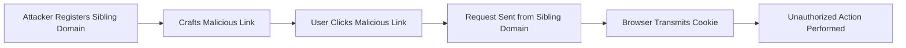

## Bypassing SameSite=Strict via Sibling Domain

Despite the effectiveness of the `SameSite=Strict` attribute, there are still ways to bypass it. One such method involves using a sibling domain to trick the browser into sending the cookie.

### What is a Sibling Domain?

A sibling domain is a domain that shares the same second-level domain as the target domain. For example, if the target domain is `example.com`, a sibling domain could be `sub.example.com`.

### How Does the Bypass Work?

The bypass works by exploiting the fact that the `SameSite` attribute is only enforced within the same top-level domain. By using a sibling domain, an attacker can trick the browser into sending the cookie in a cross-site context.

#### Step-by-Step Explanation

1. **Attacker Registers Sibling Domain**: The attacker registers a domain that is a sibling of the target domain, such as `sub.example.com`.
2. **Crafts Malicious Link**: The attacker crafts a malicious link that, when clicked, sends a request to the target domain.
3. **Tricks Browser**: When the user clicks the link, the browser sends the request from the sibling domain, which is considered a first-party context due to the shared top-level domain.
4. **Cookie Transmission**: The browser transmits the session cookie with the request, allowing the attacker to perform unauthorized actions.

### Real-World Example: CVE-2021-21972

CVE-2021-21972, affecting the WordPress REST API, could potentially be exploited using a sibling domain bypass. An attacker could register a sibling domain and craft a malicious link to trick authenticated users into performing unauthorized actions.

### How to Prevent / Defend Against Sibling Domain Bypass

To defend against the sibling domain bypass, web applications should implement additional security measures:

1. **Strict Content Security Policy (CSP)**: Use CSP to restrict the sources of content that can be loaded on the page.
2. **Subresource Integrity (SRI)**: Ensure that external resources are loaded securely and cannot be tampered with.
3. **Server-Side Validation**: Validate all inputs on the server-side to prevent unauthorized actions.

---
<!-- nav -->
[[02-Lab 11 SameSite Strict Bypass via Sibling Domain|Lab 11 SameSite Strict Bypass via Sibling Domain]] | [[Web Security (PortSwigger)/04-Cross-Site Request Forgery (CSRF)/12-Lab 11 SameSite Strict bypass via sibling domain/00-Overview|Overview]] | [[Web Security (PortSwigger)/04-Cross-Site Request Forgery (CSRF)/12-Lab 11 SameSite Strict bypass via sibling domain/04-Cross-Site Request Forgery (CSRF)|Cross-Site Request Forgery (CSRF)]]
