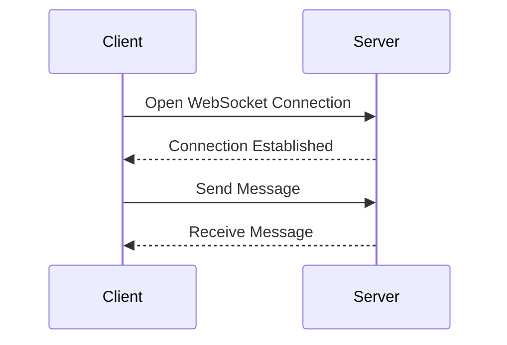

## Cross-Site Request Forgery (CSRF)

### Introduction to CSRF

Cross-Site Request Forgery (CSRF) is a type of attack that tricks a victim into executing unwanted actions on a web application in which they are authenticated. This attack exploits the trust that a web application has in the user's browser. The attacker crafts a malicious request that, when executed by the victim, performs an action on their behalf. The key aspect of CSRF is that the attacker does not need to see the response to the request; they simply need to ensure that the request is made.

#### Example Scenario

Consider a scenario where a user is logged into a banking website. An attacker sends the user a phishing email containing a link to a malicious webpage. When the user clicks on the link, the malicious webpage triggers a hidden form submission to the banking website, transferring funds from the user's account to the attacker's account. Since the user is already authenticated with the banking website, the request is processed as if it came from the user.

### Same-Origin Policy and CORS

The Same-Origin Policy is a critical security measure implemented by web browsers to restrict how documents or scripts loaded from one origin can interact with resources from another origin. An origin is defined by the scheme (protocol), hostname (domain), and port number of the URL. For example, `https://example.com` and `http://example.com` are considered different origins due to the difference in the scheme.

#### Cross-Origin Resource Sharing (CORS)

Cross-Origin Resource Sharing (CORS) is a mechanism that uses additional HTTP headers to tell browsers to give a web application running at one origin, access to selected resources from a different origin. A web application makes a cross-origin HTTP request when it requests a resource from a different origin than the one that served the web application.

#### Impact on CSRF

In a classic CSRF attack, the attacker cannot view the response of the forged request due to the Same-Origin Policy and CORS restrictions. This means that the attacker can only trigger actions but cannot read the results of those actions.

### WebSockets and Bidirectional Communication

WebSockets provide a full-duplex communication channel over a single TCP connection. Unlike traditional HTTP requests, which are unidirectional (the client sends a request, and the server responds), WebSockets allow both the client and the server to send data at any time.

#### Example of WebSocket Usage

Consider a chat application that uses WebSockets to maintain a persistent connection between the client and the server. When a user sends a message, the WebSocket connection allows the server to immediately send the message to other connected clients. Similarly, when a new message arrives, the server can push it to the client through the WebSocket connection.



### Bypassing Same-Origin Policy with WebSockets

Since WebSockets are bidirectional, an attacker can use them to both trigger actions and receive responses. This bypasses the limitations imposed by the Same-Origin Policy and CORS.

#### Example Scenario

Suppose a web application uses WebSockets to allow users to view their chat history. An attacker can craft a malicious script that initiates a WebSocket connection in the context of the victim's session and reads the chat history.

```html
<script>
    var ws = new WebSocket('wss://vulnerable-app.example/chat');
    ws.onopen = function() {
        ws.send('get_history');
    };
    ws.onmessage = function(event) {
        console.log('Chat history:', event.data);
    };
</script>
```

### SameSite Attribute and CSRF Protection

The SameSite attribute is used to mitigate CSRF attacks by controlling whether cookies should be sent with cross-site requests. There are three values for the SameSite attribute:

- **Strict**: Cookies are only sent with first-party requests. This provides strong protection against CSRF attacks.
- **Lax**: Cookies are sent with top-level navigation, but not with subresource requests. This provides a balance between security and usability.
- **None**: Cookies are sent with all requests, including cross-site requests. This value requires the Secure attribute to be set.

#### Example of Setting SameSite Attribute

To set the SameSite attribute for a cookie, the following HTTP response header is used:

```http
Set-Cookie: sessionId=abc123; SameSite=Strict; Secure
```

### Bypassing SameSite Strict via Sibling Domain

Even with the SameSite attribute set to `Strict`, an attacker can potentially bypass this protection by using a sibling domain. A sibling domain shares the same second-level domain but has a different subdomain. For example, `sub1.example.com` and `sub2.example.com` are sibling domains.

#### Example Scenario

Suppose a web application sets a cookie with `SameSite=Strict` and `Secure`. An attacker can register a sibling domain (e.g., `evil.example.com`) and use it to perform a CSRF attack.

```http
GET /csrf-attack HTTP/1.1
Host: evil.example.com
Cookie: sessionId=abc123
```

### Exploiting WebSockets for CSRF

By combining the bidirectional nature of WebSockets with the sibling domain technique, an attacker can perform a CSRF attack and read the response.

#### Example Script

The attacker crafts a script that initiates a WebSocket connection in the context of the victim's session and reads the response.

```html
<script>
    var ws = new WebSocket('wss://vulnerable-app.example/chat');
    ws.onopen = function() {
        ws.send('get_history');
    };
    ws.onmessage = function(event) {
        console.log('Chat history:', event.data);
    };
</script>
```

### Real-World Examples

#### Recent CVEs and Breaches

- **CVE-2021-23277**: A vulnerability in the WordPress REST API allowed attackers to perform CSRF attacks and execute arbitrary code.
- **CVE-2020-14182**: A vulnerability in the Atlassian Jira Software allowed attackers to perform CSRF attacks and gain unauthorized access to sensitive information.

### How to Prevent / Defend Against CSRF

#### Detection

- **Logging and Monitoring**: Implement logging and monitoring to detect unusual activity patterns that may indicate a CSRF attack.
- **Security Tools**: Use security tools like Burp Suite or OWASP ZAP to scan for vulnerabilities and test for CSRF.

#### Prevention

- **Token-Based CSRF Protection**: Use anti-CSRF tokens to ensure that requests are legitimate. Each form or AJAX request should include a unique token that is validated on the server-side.
- **SameSite Attribute**: Set the `SameSite` attribute to `Strict` or `Lax` to prevent cookies from being sent with cross-site requests.
- **Content Security Policy (CSP)**: Implement a Content Security Policy to restrict the sources of content that can be loaded and executed.

#### Secure Coding Fixes

##### Vulnerable Code

```html
<form action="https://vulnerable-app.example/transfer" method="POST">
    <input type="hidden" name="amount" value="1000">
    <input type="submit" value="Transfer">
</form>
```

##### Fixed Code

```html
<form action="https://secure-app.example/transfer" method="POST">
    <input type="hidden" name="amount" value="1000">
    <input type="hidden" name="csrf_token" value="unique_token">
    <input type="submit" value="Transfer">
</form>
```

#### Configuration Hardening

- **HTTP Headers**: Ensure that the `Set-Cookie` header includes the `SameSite` attribute and the `Secure` flag.
- **Content Security Policy (CSP)**: Configure the CSP to restrict the sources of content that can be loaded and executed.

```http
Content-Security-Policy: default-src 'self'; frame-ancestors 'none'
```

### Practice Labs

For hands-on practice with CSRF and related vulnerabilities, consider the following labs:

- **PortSwigger Web Security Academy**: Offers comprehensive labs on CSRF and other web security topics.
- **OWASP Juice Shop**: A deliberately insecure web application for practicing web security skills.
- **DVWA (Damn Vulnerable Web Application)**: A PHP/MySQL web application that contains numerous security vulnerabilities.

### Conclusion

Cross-Site Request Forgery (CSRF) is a serious threat to web applications. By understanding the underlying mechanisms and implementing robust defenses, developers can protect their applications from these attacks. The combination of token-based protection, proper use of the SameSite attribute, and strict security policies can significantly reduce the risk of CSRF attacks.

---
<!-- nav -->
[[03-Bypassing SameSite=Strict via Sibling Domain|Bypassing SameSite=Strict via Sibling Domain]] | [[Web Security (PortSwigger)/04-Cross-Site Request Forgery (CSRF)/12-Lab 11 SameSite Strict bypass via sibling domain/00-Overview|Overview]] | [[Web Security (PortSwigger)/04-Cross-Site Request Forgery (CSRF)/12-Lab 11 SameSite Strict bypass via sibling domain/05-How to Prevent  Defend Against CSRF Attacks|How to Prevent  Defend Against CSRF Attacks]]
