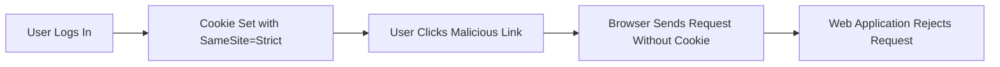

## SameSite Attribute and Its Importance

The `SameSite` attribute is a crucial feature of cookies designed to mitigate CSRF attacks. It controls whether a cookie should be sent with cross-site requests.

### What is the SameSite Attribute?

The `SameSite` attribute specifies whether a cookie should be restricted to first-party contexts or allowed in cross-site contexts. There are three possible values for the `SameSite` attribute:

1. **Strict**: The cookie is only sent in a first-party context. It is not sent with cross-site requests.
2. **Lax**: The cookie is sent with cross-site requests, but only for safe HTTP methods (GET, HEAD, OPTIONS). It is not sent with unsafe methods (POST, PUT, DELETE).
3. **None**: The cookie is sent with all requests, both first-party and cross-site. This value requires the `Secure` attribute to be set.

### Why is the SameSite Attribute Important?

The `SameSite` attribute helps prevent CSRF attacks by ensuring that cookies are only sent in contexts where they are intended to be used. By setting the `SameSite` attribute to `Strict`, web applications can significantly reduce the risk of CSRF attacks.

### Real-World Example: Google's Implementation

Google implemented the `SameSite=Strict` attribute for its cookies in 2019. This change helped protect users from CSRF attacks by ensuring that cookies were only sent in first-party contexts.

### Potential Pitfalls

While the `SameSite` attribute is effective in preventing CSRF attacks, it can also introduce usability issues. For example, if a user is logged into a service and tries to access it through a link from another site, the `SameSite=Strict` attribute may prevent the cookie from being sent, resulting in the user being prompted to log in again.

### How to Prevent / Defend Against CSRF Using SameSite

To effectively use the `SameSite` attribute to prevent CSRF attacks, follow these steps:

1. **Set the `SameSite` Attribute**: Ensure that all session cookies have the `SameSite=Strict` attribute.
2. **Test Usability**: Verify that the `SameSite=Strict` attribute does not negatively impact user experience.
3. **Monitor Logs**: Regularly review server logs to detect any unusual activity that might indicate a CSRF attempt.

---
<!-- nav -->
[[Web Security (PortSwigger)/04-Cross-Site Request Forgery (CSRF)/12-Lab 11 SameSite Strict bypass via sibling domain/07-Practice Labs|Practice Labs]] | [[Web Security (PortSwigger)/04-Cross-Site Request Forgery (CSRF)/12-Lab 11 SameSite Strict bypass via sibling domain/00-Overview|Overview]] | [[09-SameSite Strict Bypass via Sibling Domain|SameSite Strict Bypass via Sibling Domain]]
