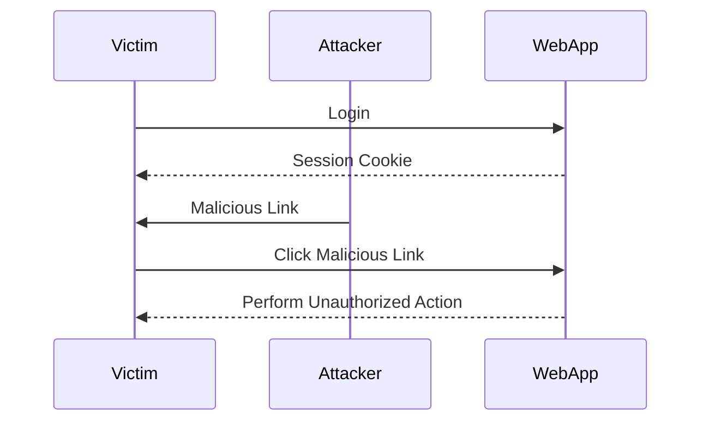
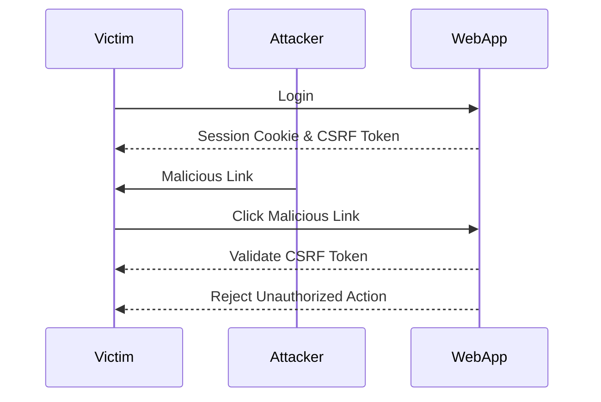

## Cross-Site Request Forgery (CSRF)

Cross-Site Request Forgery (CSRF) is a type of attack that tricks a victim into executing unwanted actions on a web application in which they are authenticated. This attack exploits the trust that a web application has in the user's browser. To understand CSRF, we need to delve into the underlying principles of web security and the mechanisms that can be exploited.

### What is CSRF?

CSRF attacks occur when an attacker tricks a victim into performing unintended actions on a web application where the victim is already authenticated. The attacker typically achieves this by crafting a malicious link or script that, when executed by the victim, performs an action on behalf of the victim. Since the victim is already authenticated, the web application trusts the request and executes it.

#### Example Scenario

Consider a banking website where a user is logged in. An attacker could craft a URL that transfers money from the user's account to the attacker's account. If the user clicks on this URL, the bank's server would execute the transfer because the user is already authenticated.

### How Does CSRF Work?

To understand how CSRF works, let's break down the process:

1. **Victim Authentication**: The victim logs into a web application.
2. **Attacker's Malicious Action**: The attacker crafts a URL or script that performs an action on the web application.
3. **Victim Execution**: The victim unknowingly executes the attacker's crafted URL or script.
4. **Action Execution**: The web application, trusting the victim's session, executes the action.

#### Example Code

Let's consider a simple example where a user is authenticated on a banking website. The attacker wants to transfer $1000 from the user's account to their own.

```html
<!-- Attacker's malicious HTML -->
<a href="https://bank.example.com/transfer?to=attacker&amount=1000">Click here</a>
```

If the victim clicks on this link, the bank's server will execute the transfer because the victim is already authenticated.

### SameSite Attribute

The SameSite attribute is a security feature introduced to mitigate CSRF attacks. It controls whether cookies should be sent with cross-site requests. There are three values for the SameSite attribute:

- **Strict**: Cookies are only sent with requests originating from the same site.
- **Lax**: Cookies are sent with top-level navigation requests but not with subresource requests (like images, scripts, etc.). This provides a balance between security and usability.
- **None**: Cookies are sent with all requests, regardless of origin. This value requires the `Secure` flag to be set.

#### SameSite Lax Configuration

The SameSite Lax configuration is designed to provide a balance between security and usability. It ensures that cookies are not sent with subresource requests, which helps prevent CSRF attacks. However, it still allows cookies to be sent with top-level navigation requests, which can be exploited in certain scenarios.

### Exploiting SameSite Lax Configuration

Despite the SameSite Lax configuration, there are still ways to exploit CSRF vulnerabilities. One such method is exploiting the behavior of single sign-on mechanisms.

#### Single Sign-On Mechanisms

Single sign-on (SSO) mechanisms allow users to authenticate once and access multiple applications without re-entering their credentials. However, browsers do not enforce the SameSite Lax restriction for the first 120 seconds on top-level POST requests. This window can be exploited to perform CSRF attacks.

### Demonstration of CSRF Exploit

Let's demonstrate how to exploit the SameSite Lax configuration using a CSRF attack. We'll create a form element that simulates a POST request to a web application.

#### Creating the Form Element

First, we need to create a form element that simulates a POST request. This form will be embedded in a malicious webpage that the victim visits.

```html
<!-- Malicious HTML page -->
<!DOCTYPE html>
<html>
<head>
    <title>Malicious Page</title>
</head>
<body>
    <form id="csrfForm" action="https://vulnerable.example.com/action" method="POST">
        <input type="hidden" name="param1" value="value1">
        <input type="hidden" name="param2" value="value2">
    </form>
    <script>
        // Automatically submit the form when the page loads
        document.getElementById('csrfForm').submit();
    </script>
</body>
</html>
```

In this example, the form is automatically submitted when the page loads. If the victim visits this page within 120 seconds of logging in, the CSRF attack will succeed.

### Full HTTP Request and Response

Let's look at the full HTTP request and response for this scenario.

#### HTTP Request

```http
POST /action HTTP/1.1
Host: vulnerable.example.com
Cookie: sessionid=abc123
Content-Type: application/x-www-form-urlencoded

param1=value1&param2=value2
```

#### HTTP Response

```http
HTTP/1.1 200 OK
Date: Tue, 01 Jan 2024 12:00:00 GMT
Server: Apache/2.4.41 (Ubuntu)
Content-Length: 34
Content-Type: text/html; charset=UTF-8

Action successfully performed.
```

### Real-World Examples

Recent real-world examples of CSRF vulnerabilities include:

- **CVE-2021-30116**: A CSRF vulnerability in WordPress plugins that allowed attackers to perform unauthorized actions.
- **CVE-2022-22965**: A CSRF vulnerability in the Atlassian Jira software that allowed attackers to perform unauthorized actions.

These vulnerabilities highlight the importance of implementing robust CSRF protections.

### How to Prevent / Defend Against CSRF

#### Detection

To detect CSRF vulnerabilities, you can use automated tools like:

- **OWASP ZAP**: A free, open-source web application security scanner.
- **Burp Suite**: A comprehensive toolkit for web application security testing.

#### Prevention

To prevent CSRF attacks, implement the following measures:

1. **Use CSRF Tokens**: Generate unique tokens for each session and validate them on the server-side.
2. **Set Secure Headers**: Ensure that cookies have the `SameSite` attribute set to `Lax` or `Strict`.
3. **Validate User Input**: Ensure that all user inputs are validated and sanitized.
4. **Educate Users**: Educate users about the risks of clicking on suspicious links or visiting untrusted websites.

#### Secure Coding Fixes

Here is an example of how to implement CSRF protection using CSRF tokens:

##### Vulnerable Code

```python
# Vulnerable Flask app
from flask import Flask, request

app = Flask(__name__)

@app.route('/transfer', methods=['POST'])
def transfer():
    amount = request.form['amount']
    to_account = request.form['to_account']
    # Perform transfer logic
    return "Transfer successful"
```

##### Secure Code

```python
# Secure Flask app with CSRF protection
from flask import Flask, request, session
import secrets

app = Flask(__name__)
app.secret_key = 'your_secret_key'

@app.before_request
def csrf_protect():
    if request.method == "POST":
        token = session.pop('_csrf_token', None)
        if not token or token != request.form.get('_csrf_token'):
            abort(403)

def generate_csrf_token():
    if '_csrf_token' not in session:
        session['_csrf_token'] = secrets.token_hex(16)
    return session['_csrf_token']

app.jinja_env.globals['csrf_token'] = generate_csrf_token

@app.route('/transfer', methods=['POST'])
def transfer():
    if request.form.get('_csrf_token') == session.get('_csrf_token'):
        amount = request.form['amount']
        to_account = request.form['to_account']
        # Perform transfer logic
        return "Transfer successful"
    else:
        return "Invalid CSRF token", 403
```

### Mermaid Diagrams

#### CSRF Attack Flow



#### CSRF Protection Flow



### Hands-On Labs

For hands-on practice with CSRF attacks and defenses, consider the following labs:

- **PortSwigger Web Security Academy**: Offers detailed labs on CSRF attacks and defenses.
- **OWASP Juice Shop**: Provides a vulnerable web application for practicing various web security attacks, including CSRF.
- **DVWA (Damn Vulnerable Web Application)**: A deliberately insecure web application for practicing web security attacks and defenses.

By thoroughly understanding the concepts, mechanisms, and defenses against CSRF attacks, you can better protect web applications from these types of vulnerabilities.

---
<!-- nav -->
[[02-Lab 12 SameSite Lax Bypass via Cookie Refresh|Lab 12 SameSite Lax Bypass via Cookie Refresh]] | [[Web Security (PortSwigger)/04-Cross-Site Request Forgery (CSRF)/13-Lab 12 SameSite Lax bypass via cookie refresh/00-Overview|Overview]] | [[04-Detecting and Exploiting CSRF Vulnerabilities|Detecting and Exploiting CSRF Vulnerabilities]]
